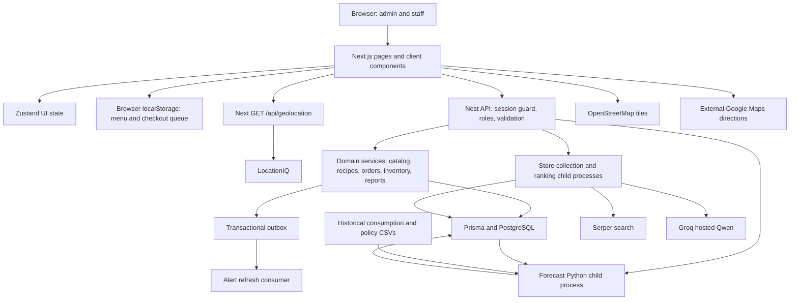

# SYSTEM AUDIT REPORT
## Café Salvacion Inventory Management System

**Audit date:** 20 September 2026
**Scope:** Current working tree at `C:\Users\Deej\Desktop\salvacion`, as present during this audit; no implementation edits were made.
**Method:** Repository inspection, controller/DTO/schema enumeration, transaction tracing, TypeScript checks, existing isolated tests and non-fixing lint. Only this requested report is updated. The prior report was used as an index; endpoint coverage was compared against every registered controller and all entity field declarations were compared against the current Prisma schema. No application edits, migrations, seeds, business transactions, provider requests or dependency installations were performed.

**Evidence limits:** “Implemented” means the relevant code and connections exist; it does not certify a successful production workflow. Findings based on concurrency interleavings are static analyses, not reproduced database races. The live schema, deployed configuration, real external-provider responses, browser appearance/accessibility and forecast accuracy were not verified. Existing documentation is background evidence, not proof of current behavior. Environment configuration source and variable names were inspected without reading or reproducing secret values. Current deployment environment values were not verified. This is a repository audit, not a penetration test or a live database certification.

## 1. Executive Summary

The system is a substantial modular application, with implemented inventory operations, purchasing/stock runs, recipe-driven POS, sales reports, administrator/staff access, SARIMA forecasting and AI-assisted supplier/store ranking. It is not a scaffold, but it should not yet be treated as ready for reliable production operations.

The strongest foundation is checkout: server-side pricing, recipe/modifier resolution, first-expiring-first-out (FEFO) allocation with PostgreSQL row locks, inventory ledger entries, cost snapshots and availability updates occur in one database transaction. Authentication uses revocable opaque cookie sessions, not JWTs.

**Highest-priority findings:**

1. **Stock can diverge from its ledger under concurrent waste operations.** Waste reads a balance without a row lock and later writes an absolute replacement.
2. **Archived products can still be checked out by ID.** Menu filtering excludes them, but checkout checks only enable flags and recipes.
3. **Changing a material’s unit reinterprets existing stock and recipes without conversion or a usage restriction.**
4. **Refunds always return ingredients to their original batches**, even for already-prepared food/drinks.
5. **Expired stock cannot be recorded as waste.**
6. **Password-reset/account-setup delivery is a production no-op.**
7. **The public Next.js geocoding route can consume the server’s LocationIQ quota without authentication or throttling.**
8. **Production packaging is incomplete:** the start path differs from existing output, Prisma Client is a development dependency, and the default Python environment cannot load worker dependencies.

Current checks: backend TypeScript passes; frontend TypeScript fails with three product-filter errors. All 52 backend unit tests pass. HTTP tests pass 38/40; two outdated settings-access expectations fail. Python discovery fails because the default interpreter lacks pandas and requests. Frontend lint has 19 warnings; backend lint has 272 errors and 16 warnings. See Section 12.

### Target capability comparison

| Target | Repository status | Evidence / limitation |
| --- | --- | --- |
| Inventory management | Implemented with correctness gaps | `inventory-actions.service.ts`, `inventory.service.ts`, admin inventory workspace; concurrency, units and expired-waste findings |
| POS and sales processing | Implemented with partial payment/receipt workflow | `orders.service.ts`, `StaffPOSPage.tsx`; payments are recorded manually, Print Receipt is inert |
| Supplier management | Implemented | Inventory controller/service and standalone supplier page; deletion removes supplier attribution from linked historical records |
| AI-driven store recommendations | Implemented within inventory | Python store workers and StoreAvailabilityModal; dedicated recommendations route remains a placeholder |
| Inventory forecasting | Implemented integration; runtime blocked in checked Python environments | Forecasting module, SARIMA, live POS history, stored series and admin visualization |
| Geolocation | Partially meets broad target | Leaflet map, geocoding, coordinates, straight-line distance and external directions; no in-app road routing/travel-time service |
| Reports and analytics | Implemented | 17 report endpoints, inventory/POS sections, CSV and print-to-PDF helpers; reconciliation/export risks remain |
| Role-based access | Implemented with inconsistent legacy MANAGER behavior | Global session/role guards, role-based layouts; several APIs have no role restriction |
| Deployment/release automation | Incomplete | Separate package scripts and historical documentation; no checked-in CI/container/orchestration pipeline found |

## 2. Current Architecture

### Repository map

| Location | Responsibility |
| --- | --- |
| `ims-frontend/src/app` | Next.js App Router pages, role layouts, public auth pages and geolocation server route |
| `ims-frontend/src/components` | Admin inventory/products/reports/users/settings, staff POS and shared UI |
| `ims-frontend/src/lib` | Fetch clients, DTO/view-model mappings, report exports, local POS queue |
| `ims-frontend/src/store` | Zustand authentication state and inventory workspace state |
| `ims-backend/src` | Nest modules, controllers, validation DTOs, business services and background jobs |
| `ims-backend/prisma` | PostgreSQL schema, 16 migration directories and seed importer |
| `ims-backend/test` | HTTP integration tests with a mocked Prisma provider |
| `ims-backend/scripts` | Store-data refresh, summary repair and historical validation/seed runners |
| `python` | SARIMA model, forecast bridge, policy interpretation, historical CSVs and tests |
| `AI-Store Reco` | Serper collection, Groq/Qwen classification/ranking, tests and requirements |
| `docs/architecture`, `md files` | Historical reviews, planning and implementation reports |
| Root/backend SQL files and seed caches | Database exports/import aids; not the authoritative migration chain |

The working tree was clean at the initial git-status check. Current maps/geocoding live in Next.js and store distance logic lives in the Python workers. Existing SQL exports and historical audit documents are not proof of live database state.

### System map



The diagram’s database/worker arrows describe application-mediated data flow: Nest exports forecast input and persists output; the Python forecast worker does not independently manage the PostgreSQL connection. Store evidence is committed before the ranking phase receives saved rows.

The backend is a modular monolith, not a microservice deployment. Python runs as child processes on the backend host. Reports read the same operational database. Outbox processing, snapshots and alert reevaluation run in the API process. This is reasonable for a single café, but worker reliability and multi-instance coordination need explicit treatment.

## 3. Technology Stack

| Layer | Declared stack | Configuration observations |
| --- | --- | --- |
| Frontend | Next **16.2.1**, React/React DOM **19.2.4**, TypeScript **^5** | React Compiler enabled; strict TS, bundler resolution, `@/*` alias |
| UI | Tailwind **^4**, Bootstrap **^5.3.8**, Sass **^1.98.0**, lucide-react **^1.0.1**, react-icons **^5.6.0** | Global Bootstrap plus Tailwind/custom CSS; forecast CSS module and custom SVG charts |
| State/maps | Zustand **^5.0.12**, Leaflet **^1.9.4** | No dedicated server-query cache dependency |
| API | NestJS **^11.0.1**, Express platform adapter | Controllers/services/modules; global ValidationPipe |
| Persistence | Prisma/Prisma Client **^6.19.2**, PostgreSQL | Client is incorrectly categorized under devDependencies for production-only installation |
| Auth/images | bcrypt **^6.0.0**, Sharp **^0.35.4** | JWT/Passport dependencies declared, but active guards use opaque sessions |
| Testing | Jest **^30**, ts-jest **^29.2.5**, Supertest **^7** | Unit suites pass; two HTTP authorization expectations are stale |
| Forecasting | NumPy, pandas, SciPy, statsmodels, scikit-learn, holidays, Plotly | Version ranges in `python/requirements.txt`; no Python lockfile |
| Store AI | requests, python-dotenv, Groq SDK | `AI-Store Reco/requirements.txt`; model ID configured in source |

Versions above come from package manifests, not assertions about every installed transitive package. Both Node projects have package-lock files. No current CVE/dependency-advisory assessment was performed.

### Environment and deployment

- `ims-backend/src/config/env.validation.ts` loads `.env`, requires database/session secrets, configures origins, cookies, TTLs and background jobs. It does not enforce production HTTPS, secret entropy, or valid combinations such as SameSite=None with Secure.
- Frontend `NEXT_PUBLIC_API_BASE_URL` defaults to `http://localhost:4000`. `LOCATIONIQ_API_KEY` is server-only in the route implementation.
- Python executable/script overrides are read directly from environment in the services, outside central validation. When overrides are unset, the code defaults to `python`; that executable failed the dependency checks in this audit. The deployed override values were not inspected.
- `ims-backend/package.json` uses `node dist/main` for production. Existing build output is under `dist/src`, and `tsconfig.build.json` also includes non-src TypeScript such as seed/scripts. Existing output is evidence, not a fresh build result.
- `prisma/seed.ts:29` expects a seed ZIP/CSV under the operator’s Downloads directory unless overridden. This is not a self-contained clean-clone setup.
- Profile pictures use a local directory relative to process.cwd(); Python defaults require sibling directories. Production requires the correct working directory, Python dependencies, CSV inputs and persistent upload storage.
- No repository Dockerfile, Compose file, CI workflow, process-manager config, production reverse-proxy/TLS config, backup/restore runbook or monitoring configuration was found in the file inventory. External infrastructure may exist but is unverified.
- `AppController` contains a sample root GET, but `AppModule` registers neither that controller nor its service. It is not an active health endpoint.
- Backend `lint` includes `--fix`; it was deliberately not used. Checks used ESLint without fixes. Builds were not rerun because they generate files.

## 4. Frontend Audit

### Routing, state and communication

`src/app/layout.tsx` imports Bootstrap/global CSS and mounts AuthBootstrap. Public routes are `/`, `/login`, `/forgot-password`, and `/reset-password`. Admin routes include dashboard, products, inventory, reports (inventory/POS), alerts, users, settings, recommendations and forecasting. Staff dashboard and POS both render the POS workspace.

`src/app/admin/layout.tsx` allows ADMINISTRATOR; staff layout allows STAFF. These guards are client-side navigation/display controls. Backend guards provide the actual data boundary. `AuthBootstrap.tsx` calls `/auth/me`; `authStore.ts` keeps only user/auth state in memory. It does not store the session token in localStorage. MANAGER is typed but routes to an unsupported-role login message.

`src/lib/api.ts` sends cookies with `credentials: include`, defaults JSON headers and extracts string error messages. Validation arrays from Nest fall back to “Request failed”; there is no central response schema validation, timeout policy or global 401/session-expiry recovery. Products have a more structured client/mapping layer under `lib/products`; other modules mix API and view-model responsibilities.

### Feature assessment

| Area | Implemented UI | Problems / gaps |
| --- | --- | --- |
| Authentication | Login, forgot/reset forms, bootstrap, protected role layouts, logout | Production delivery gap; failed logout still clears UI while server session may survive; manager routing incomplete; staff settings now exists |
| Products | Search/filter list, create/edit, variants, recipe editor, availability, archive/restore/delete eligibility, usage drilldowns | No equivalent full CRUD UI/API for categories, modifier groups, modifiers or units |
| Inventory | Material CRUD/archive, summary, batches, transaction history, stock-run drafts/posting and waste; suppliers have a separate page | Underlying expired-waste/unit/concurrency defects; archive has no restore endpoint |
| POS | Live menu, categories/search, variant/modifier configuration, cart, discount selection, split payments, checkout, history, receipts and approved reversals | Inert print button; change is displayed but not modeled in persistence; queue ownership and retry concerns |
| Dashboard | Server-derived sales/margins, inventory value, low stock, expiry, waste, stock-run spend and recent orders | Error paths can leave default zero metrics; not all fetched state is displayed |
| Reports | Inventory/POS workspaces, date filters, charts, transaction drilldown and CSV/print-to-PDF export code | Expensive data loading; payment reconciliation; print export API assumptions require browser verification |
| Forecasting | Product filter, generation/polling, seven-day chart/bounds, per-material table, purchase recommendations and model notes | Product filter is store-wide ingredient demand; no verified model accuracy or automatic checkout-triggered retraining |
| Recommendations | StoreAvailabilityModal is connected to persistent backend searches | `app/admin/recommendations/page.tsx` only displays “coming next” |
| Geolocation | Leaflet map pin/drag, coordinate fields, forward/reverse search, directions link/copy | No current-device geolocation call found in the location picker; fixed café origin in Python |

Evidence: `components/staff-pos/StaffPOSPage.tsx`; `components/admin/inventory/*`; `components/admin/products/ProductsWorkspace.tsx`; `components/admin/reports/*`; `app/admin/forecasting/page.tsx`.

### Specific frontend findings

- **F-01: Receipt printing is not connected.** `components/staff-pos/modals/ReceiptModal.tsx` renders “Print Receipt” without onClick, form action or other print behavior. Receipt viewing works in code; printing is not implemented.
- **F-02: Offline storage is shared across accounts.** `lib/pos-offline.ts` uses global `ims-pos-menu-cache` and `ims-pos-checkout-queue` keys. Queue entries lack user/store ownership. `StaffPOSPage.tsx:167` submits entries under the current session; `useLogout.ts` does not clear or quarantine them. A queued sale by A can be attributed to B after login.
- **F-03: “Offline” is limited to an already-loaded client/cache.** No service-worker/PWA asset cache was found. Auth bootstrap requires the backend after reload. Queued sales may fail later because stock/prices/recipes changed; local queue time is not submitted as sale time, so reports/forecast training use synchronization time.
- **F-04: Multiple submissions need protection.** The confirm handler creates a new idempotency key for each invocation. PaymentModal disables confirmation only for an empty cart/insufficient payment, and receives no checkoutLoading/submitting prop. Rapid repeated confirmations can therefore issue different keys; server idempotency cannot deduplicate distinct keys. This static finding is not covered by browser tests.
- **F-05: Export printing needs browser validation.** `lib/report-exports.ts` opens a window with `noopener,noreferrer` and then relies on the returned window object for document.write/print. That handle is not reliable with noopener. The code reports this as a popup failure. Validate the behavior in supported browsers before claiming PDF export works.
- **F-06: UI architecture has legacy duplication.** Generic `components/inventory`, `src/data/products.ts`, `lib/staff-pos/data.ts`, and older modals coexist with the live admin/POS implementation. Their presence does not prove they are active features. Establish reachability before removing them.
- **F-07: Accessibility remains unverified.** Custom dialogs/dropdowns/chart controls exist. No automated keyboard, focus-trap, screen-reader or browser-layout checks were found. Do not infer accessible behavior from component names.

### Findings from the current redesign

- **F-08 / High, release blocker ? Frontend type check fails.** `ims-frontend/src/components/admin/products/ProductsWorkspace.tsx:254` builds an unannotated baseFilters object. Its string properties widen before three listProducts calls (270?272), producing TS2345. Type the shared filter object against the client contract and verify sort fields as well; no fix was made during audit.
- **F-09 / Medium ? Alert removal timer is cancelled by its own state update.** `ims-frontend/src/components/feedback/ActionAlert.tsx:17` sets closing=true and schedules onDismiss after 400ms. closing changes the dismiss callback identity, triggering effect cleanup (26?28), which clears closeTimer. This leaves the parent message set even if CSS hides the alert. Inline parent onDismiss functions also restart the five-second effect on unrelated renders while the CSS timer continues. Separate lifecycle timers from changing callback identities and test actual removal, repeat alerts and manual close with fake timers and a browser.
- **F-10 / Medium ? Notification migration is incomplete and alerts overlap.** ActionAlert is used by products, users, settings, inventory and POS. SupplierWorkspace, forecasting, authentication and report actions still have separate feedback. Multiple ActionAlert instances share one fixed top-center position without a stack; title/message updates do not reset closing/animation state. Instances without onDismiss cannot auto-remove. The demo's maximum-three queue is not implemented. A shared notification host with IDs, queue and independent lifetimes is the recommended future fix. Keep field validation and persistent operational stock alerts distinguishable from transient action feedback.
- **F-11 / Medium ? Staff sidebar has dead links.** `ims-frontend/src/components/staff-pos/StaffDashboardLayout.tsx:24` links to `/staff/transactions` and `/staff/alerts`, but neither route exists in src/app. History currently works through the POS modal. AlertsController permits ADMINISTRATOR only; adding a staff page alone would not complete this workflow. Agree staff visibility before changing API roles.
- **F-12 / Medium ? Manager settings lacks a route-level guard.** `/manager/settings/page.tsx` renders AdminDashboardLayout and SettingsWorkspace, but there is no manager layout/AuthGuard. AdminDashboardLayout is presentation only. Backend session guards still protect settings data, so this is an unguarded shell/navigation problem rather than anonymous account data exposure. `lib/auth.ts:34` still routes managers to unsupportedRole=MANAGER. Add an intentional manager entry route/guard and appropriate navigation in a later phase.
- **F-13 / Low ? Collapsing admin navigation changes vertical positions.** AdminSidebar removes group headings and brand subtitle conditionally; centering icons alone does not preserve section heights. Inventory hover links are hidden when collapsed, so the collapsed inventory icon cannot expose the new section shortcuts. Validate keyboard/touch behavior and keep reserved heading space if stable positions are required.
- **F-14 / Medium ? ?All Products? still requests ACTIVE records.** ProductsWorkspace list query maps every non-archived view to archiveState=ACTIVE. The active count is fetched separately but excludes archived products. If ?All Products? means all lifecycle states, label, count and request semantics disagree; define this before adjusting queries.

### Current page responsibilities

`/admin/inventory` composes InventorySummaryPanel (filters/master list), MaterialDetailPanel (selected material/batches/history), InventoryBusinessInsights (five report-backed tables), StockRunsPanel and operation dialogs. Zustand inventoryStore retains selected material, filters and active modal. Inventory section shortcuts use IDs in the page/panels.

Suppliers now use `/admin/inventory/suppliers` -> SupplierWorkspace -> SupplierLocationPicker; `/admin/suppliers` aliases that page. Supplier selection/create/update/delete refresh the list independently of inventory modal state. This is a standalone page, not the former supplier modal workflow.

Staff settings uses SettingsWorkspace under StaffDashboardLayout and the STAFF route guard. Administrator settings uses the same workspace under the ADMINISTRATOR guard. Both headers read name/email from authStore; successful non-email profile edits update that store. Email changes deliberately require sign-in; cross-tab profile synchronization is not implemented.

Manual Record Adjustment UI/API has been removed: there is no POST /inventory/adjustments controller method or adjustment DTO. Historical ADJUSTMENT enum values still exist in Prisma/ledger history. Do not reinstate this intentionally removed feature as an audit fix. ModifierRecipeAdjustment is a separate recipe feature and remains active.


## 5. Backend Audit

### Architecture and module responsibilities

| Module | Existing implementation and dependencies | Missing logic / quality concerns |
| --- | --- | --- |
| Auth | Users, bcrypt, token/session services, global guards, reset notifier/throttle | No production mail delivery; reset-token consume race; per-process reset throttles |
| Users | Admin CRUD/status changes, safe projections, sessions/activity, protected-history and last-admin checks | Role/status updates and last-admin checks need concurrency tests; no general immutable administrative audit log |
| Catalog | Public-to-authenticated menu/read APIs; admin product/variant/archive/recipe management; Prisma and Availability | Archive not enforced at checkout; non-atomic master-data/derived-summary updates; no master-data CRUD for several lookup types |
| Recipes | Required group/selection validation and material requirements including modifier deltas | No recipe version entity; live recipe changes during offline delay alter consumption |
| Inventory | Material/supplier management, batches, ledger, waste, daily snapshots, store worker | Lost updates, mutable unit, expired-waste block, history attribution loss on supplier deletion |
| StockRuns | Draft creation/items/deletion and atomic posting into batches/ledger/outbox | Draft editing and posting are not serialized around the same parent record |
| Orders | Checkout pricing, payments, FEFO, COGS, ledger/read models/outbox; order history and admin-approved reversals | Discount/tender/reversal semantics, archived checkout, idempotency race and ownership |
| Availability | Raw-material/variant summaries, required modifier feasibility, stockout/availability history and summary repair | Some business-date logic depends on server timezone; archive omission; derived projections need reconciliation |
| Events | Transactional enqueue, polling claim, retry, dispatch to alert refresh | PROCESSING records have no reclaim lease after worker crash |
| Alerts | Low stock/expiry states, acknowledgement/dismissal, periodic reevaluation | In-process scheduling; no external notification delivery verified |
| Reports | 17 inventory/POS reports from orders/ledger/summaries/history | Large service and in-memory aggregation; no real-DB automated report reconciliation |
| Settings | Administrator, staff and manager own-profile/email/password changes and safe image conversion | Manager UI guard/routing gap; local filesystem persistence; sensitive account changes depend on revocation sequencing |
| Forecasting | Protected run API, global active-key guard, snapshot, bounded child process, validation/persistence | Runtime dependencies missing locally; non-durable execution; CSV policy dependency and limited provenance |
| Prisma | Shared client connect/disconnect lifecycle | Runtime dependency packaging; migrations and production schema state unverified |

Nest DTOs use class-validator/class-transformer. Global validation strips/rejects unknown fields and transforms DTO instances. Per-field transforms are uneven: `ListInventoryTransactionsDto.limit` has IsNumber but no Type(Number), so an ordinary query string such as `?limit=10` can fail validation. The global pipe does not enable implicit conversion. Several identifiers are only IsString, and checkout quantities are IsNumber/Min instead of IsInt.

Nest built-in exceptions handle many errors. There is no common application exception filter, versioned API prefix or generated OpenAPI specification found. Prisma error mapping is inconsistent: selected product/user methods translate conflicts while many inventory methods let database validation/constraint errors become generic 500s.

### API contract inventory

The following inventory covers **100 registered Nest controller routes**, plus the Next.js geolocation route and static image route. The unregistered sample root controller is excluded. Dates/Decimals in Prisma-derived responses serialize as JSON date/decimal strings; frontend contract types are in `lib/inventory.ts`, `lib/pos.ts`, `lib/products/types.ts`, `lib/reports.ts`, `lib/user-management.ts` and `lib/forecasting.ts`.

**Shared authentication/database effects:** Every non-public Nest route first validates the session and normally updates AuthSession.lastSeenAt/idleExpiresAt. “Read only” below refers to business tables and excludes this session write. Unsafe requests also pass the Origin/Referer middleware. Role “any authenticated role” includes MANAGER in the current enum. No tenant/store ownership boundary exists.

DTO names below identify the exact input contracts; the complete field index follows the endpoints. Path parameters are listed in each URL and are required. Output descriptions document controller envelopes and purpose-specific payloads, not a generated formal JSON schema.


#### GET /alerts

METHOD: GET  
ENDPOINT: `/alerts`

Purpose: List alerts matching state/type/severity filters.

Authentication: ADMINISTRATOR; opaque session cookie.

Input: Query: ListAlertsDto

Output: { alerts: Alert[] } with linked operational context.

Database impact: Read alerts and related records.

Evidence: `ims-backend/src/alerts/alerts.controller.ts:16` (listAlerts).

#### GET /alerts/unread-count

METHOD: GET  
ENDPOINT: `/alerts/unread-count`

Purpose: Count unread operational alerts.

Authentication: ADMINISTRATOR; opaque session cookie.

Input: No body/query DTO.

Output: Count payload from AlertsService.getUnreadCount.

Database impact: Read alerts.

Evidence: `ims-backend/src/alerts/alerts.controller.ts:23` (getUnreadCount).

#### POST /alerts/:id/acknowledge

METHOD: POST  
ENDPOINT: `/alerts/:id/acknowledge`

Purpose: Acknowledge an alert as the current administrator.

Authentication: ADMINISTRATOR; opaque session cookie.

Input: Body: UpdateAlertStateDto; path: id.

Output: { alert }.

Database impact: Update Alert state, acknowledgement user/time and metadata.

Evidence: `ims-backend/src/alerts/alerts.controller.ts:28` (acknowledgeAlert).

#### POST /alerts/:id/dismiss

METHOD: POST  
ENDPOINT: `/alerts/:id/dismiss`

Purpose: Dismiss an alert as the current administrator.

Authentication: ADMINISTRATOR; opaque session cookie.

Input: Body: UpdateAlertStateDto; path: id.

Output: { alert }.

Database impact: Update Alert state, dismissal user/time and metadata.

Evidence: `ims-backend/src/alerts/alerts.controller.ts:43` (dismissAlert).

#### POST /auth/login

METHOD: POST  
ENDPOINT: `/auth/login`

Purpose: Verify credentials and issue an opaque cookie session.

Authentication: Public (Origin/Referer checks still apply to unsafe requests).

Input: Body: LoginDto

Output: { message, user }; Set-Cookie.

Database impact: Read User; update login/lock counters; create AuthSession.

Evidence: `ims-backend/src/auth/auth.controller.ts:24` (login).

#### POST /auth/logout

METHOD: POST  
ENDPOINT: `/auth/logout`

Purpose: Revoke the current session and clear its cookie.

Authentication: Any authenticated role; opaque session cookie.

Input: No body/query DTO.

Output: { message }; cookie cleared.

Database impact: Update AuthSession revocation.

Evidence: `ims-backend/src/auth/auth.controller.ts:43` (logout).

#### GET /auth/me

METHOD: GET  
ENDPOINT: `/auth/me`

Purpose: Return current authenticated identity.

Authentication: Any authenticated role; opaque session cookie.

Input: No body/query DTO.

Output: { user: { id, email, name, role, profilePictureUrl } }.

Database impact: No extra business write.

Evidence: `ims-backend/src/auth/auth.controller.ts:61` (getMe).

#### POST /auth/forgot-password

METHOD: POST  
ENDPOINT: `/auth/forgot-password`

Purpose: Request a password reset without exposing account existence.

Authentication: Public (Origin/Referer checks still apply to unsafe requests).

Input: Body: ForgotPasswordDto

Output: { message }; optional debugResetToken/debugResetUrl only under development flag.

Database impact: Invalidate old reset tokens and create a new PasswordResetToken for eligible account; notifier currently does not deliver mail.

Evidence: `ims-backend/src/auth/auth.controller.ts:75` (forgotPassword).

#### POST /auth/reset-password

METHOD: POST  
ENDPOINT: `/auth/reset-password`

Purpose: Consume a reset token and set a password.

Authentication: Public (Origin/Referer checks still apply to unsafe requests).

Input: Body: ResetPasswordDto

Output: { message }.

Database impact: Update User hash/status/lock fields; mark reset tokens used; revoke sessions.

Evidence: `ims-backend/src/auth/auth.controller.ts:83` (resetPassword).

#### GET /variants/:id/availability

METHOD: GET  
ENDPOINT: `/variants/:id/availability`

Purpose: Calculate/read variant availability.

Authentication: Any authenticated role; opaque session cookie.

Input: No body/query DTO.; path: id.

Output: { availability }.

Database impact: Read cached VariantAvailabilitySummary; if absent, refresh and persist variant summaries/availability history before returning. This GET can write business projections.

Evidence: `ims-backend/src/availability/availability.controller.ts:9` (getVariantAvailability).

#### GET /admin/products

METHOD: GET  
ENDPOINT: `/admin/products`

Purpose: List admin products with filters and pagination.

Authentication: ADMINISTRATOR; opaque session cookie.

Input: Query: ListAdminProductsDto

Output: Admin product rows, availability/lifecycle metadata and pagination.

Database impact: Read Product/Variant/Category and availability/usage data.

Evidence: `ims-backend/src/catalog/admin-products.controller.ts:35` (listProducts).

#### GET /admin/products/:id

METHOD: GET  
ENDPOINT: `/admin/products/:id`

Purpose: Read complete admin product detail.

Authentication: ADMINISTRATOR; opaque session cookie.

Input: No body/query DTO.; path: id.

Output: Product detail with variants, recipes, availability, archive and usage context.

Database impact: Read Product and related catalog/history data.

Evidence: `ims-backend/src/catalog/admin-products.controller.ts:40` (getProduct).

#### POST /admin/products

METHOD: POST  
ENDPOINT: `/admin/products`

Purpose: Create a product with initial variants.

Authentication: ADMINISTRATOR; opaque session cookie.

Input: Body: CreateProductDto

Output: Admin product detail payload.

Database impact: Create Product and ProductVariant records; initialize/refresh availability.

Evidence: `ims-backend/src/catalog/admin-products.controller.ts:45` (createProduct).

#### PATCH /admin/products/:id

METHOD: PATCH  
ENDPOINT: `/admin/products/:id`

Purpose: Update product master data.

Authentication: ADMINISTRATOR; opaque session cookie.

Input: Body: UpdateProductDto; path: id.

Output: Admin product detail payload.

Database impact: Update Product and relevant derived availability.

Evidence: `ims-backend/src/catalog/admin-products.controller.ts:53` (updateProduct).

#### PATCH /admin/products/:id/manual-availability

METHOD: PATCH  
ENDPOINT: `/admin/products/:id/manual-availability`

Purpose: Enable or disable a product.

Authentication: ADMINISTRATOR; opaque session cookie.

Input: Body: SetManualAvailabilityDto; path: id.

Output: Admin product detail payload.

Database impact: Update Product.isEnabled and refresh variant summaries/history.

Evidence: `ims-backend/src/catalog/admin-products.controller.ts:61` (setProductManualAvailability).

#### POST /admin/products/:id/archive

METHOD: POST  
ENDPOINT: `/admin/products/:id/archive`

Purpose: Archive a product without deleting sales history.

Authentication: ADMINISTRATOR; opaque session cookie.

Input: Body: ArchiveProductDto; path: id.

Output: Admin product detail payload.

Database impact: Set archive timestamp/user/reason; refresh availability.

Evidence: `ims-backend/src/catalog/admin-products.controller.ts:72` (archiveProduct).

#### POST /admin/products/:id/restore

METHOD: POST  
ENDPOINT: `/admin/products/:id/restore`

Purpose: Restore an archived product.

Authentication: ADMINISTRATOR; opaque session cookie.

Input: No body/query DTO.; path: id.

Output: Admin product detail payload.

Database impact: Clear archive fields; refresh availability.

Evidence: `ims-backend/src/catalog/admin-products.controller.ts:85` (restoreProduct).

#### GET /admin/products/:id/delete-eligibility

METHOD: GET  
ENDPOINT: `/admin/products/:id/delete-eligibility`

Purpose: Inspect whether a product can be physically deleted.

Authentication: ADMINISTRATOR; opaque session cookie.

Input: No body/query DTO.; path: id.

Output: Eligibility and dependency details.

Database impact: Read variants, recipes and protected usage/history dependencies.

Evidence: `ims-backend/src/catalog/admin-products.controller.ts:90` (getDeleteEligibility).

#### DELETE /admin/products/:id

METHOD: DELETE  
ENDPOINT: `/admin/products/:id`

Purpose: Delete an eligible unused product.

Authentication: ADMINISTRATOR; opaque session cookie.

Input: No body/query DTO.; path: id.

Output: Deletion result from ProductManagementService.

Database impact: Remove eligible dependent catalog records and Product; historical usage blocks deletion.

Evidence: `ims-backend/src/catalog/admin-products.controller.ts:95` (deleteProduct).

#### POST /admin/products/:id/variants

METHOD: POST  
ENDPOINT: `/admin/products/:id/variants`

Purpose: Add a variant to a product.

Authentication: ADMINISTRATOR; opaque session cookie.

Input: Body: CreateProductVariantDto; path: id.

Output: Product/variant management result.

Database impact: Create ProductVariant and derived availability.

Evidence: `ims-backend/src/catalog/admin-products.controller.ts:100` (createVariant).

#### PATCH /admin/variants/:id

METHOD: PATCH  
ENDPOINT: `/admin/variants/:id`

Purpose: Edit variant name, SKU, price or enabled state.

Authentication: ADMINISTRATOR; opaque session cookie.

Input: Body: UpdateProductVariantDto; path: id.

Output: Product/variant management result.

Database impact: Update ProductVariant and relevant availability.

Evidence: `ims-backend/src/catalog/admin-products.controller.ts:108` (updateVariant).

#### PATCH /admin/variants/:id/manual-availability

METHOD: PATCH  
ENDPOINT: `/admin/variants/:id/manual-availability`

Purpose: Enable or disable one variant.

Authentication: ADMINISTRATOR; opaque session cookie.

Input: Body: SetManualAvailabilityDto; path: id.

Output: Product/variant management result.

Database impact: Update ProductVariant.isEnabled and availability/history.

Evidence: `ims-backend/src/catalog/admin-products.controller.ts:116` (setVariantManualAvailability).

#### DELETE /admin/variants/:id

METHOD: DELETE  
ENDPOINT: `/admin/variants/:id`

Purpose: Delete an eligible unused variant.

Authentication: ADMINISTRATOR; opaque session cookie.

Input: No body/query DTO.; path: id.

Output: Deletion result.

Database impact: Delete variant and eligible dependent recipe/summary records; historical usage restricts deletion.

Evidence: `ims-backend/src/catalog/admin-products.controller.ts:127` (deleteVariant).

#### GET /admin/variants/:id/recipe

METHOD: GET  
ENDPOINT: `/admin/variants/:id/recipe`

Purpose: Read a variant recipe.

Authentication: ADMINISTRATOR; opaque session cookie.

Input: No body/query DTO.; path: id.

Output: Recipe detail including material/unit data.

Database impact: Read VariantRecipeItem and RawMaterial/Unit.

Evidence: `ims-backend/src/catalog/admin-products.controller.ts:132` (getVariantRecipe).

#### PUT /admin/variants/:id/recipe

METHOD: PUT  
ENDPOINT: `/admin/variants/:id/recipe`

Purpose: Replace the complete base recipe for a variant.

Authentication: ADMINISTRATOR; opaque session cookie.

Input: Body: ReplaceVariantRecipeDto; path: id.

Output: Updated recipe result.

Database impact: Replace VariantRecipeItem rows transactionally; refresh availability/history.

Evidence: `ims-backend/src/catalog/admin-products.controller.ts:137` (replaceVariantRecipe).

#### GET /admin/products/:id/ingredient-usage

METHOD: GET  
ENDPOINT: `/admin/products/:id/ingredient-usage`

Purpose: Report actual ingredient usage for a product.

Authentication: ADMINISTRATOR; opaque session cookie.

Input: Query: GetProductIngredientUsageDto; path: id.

Output: Usage aggregate/drilldown payload.

Database impact: Read checkout ledger/order/variant/material data.

Evidence: `ims-backend/src/catalog/admin-products.controller.ts:145` (getProductIngredientUsage).

#### GET /admin/products/:id/orders/:orderId/ingredient-usage

METHOD: GET  
ENDPOINT: `/admin/products/:id/orders/:orderId/ingredient-usage`

Purpose: Inspect one order's actual ingredient usage for a product.

Authentication: ADMINISTRATOR; opaque session cookie.

Input: No body/query DTO.; path: id, orderId.

Output: Per-order ingredient breakdown.

Database impact: Read OrderItem and InventoryTransactionLine with linked batch/material data.

Evidence: `ims-backend/src/catalog/admin-products.controller.ts:156` (getOrderIngredientUsage).

#### GET /categories

METHOD: GET  
ENDPOINT: `/categories`

Purpose: Read the category hierarchy.

Authentication: Any authenticated role; opaque session cookie.

Input: No body/query DTO.

Output: { categories }.

Database impact: Read Category.

Evidence: `ims-backend/src/catalog/catalog.controller.ts:9` (listCategories).

#### GET /products

METHOD: GET  
ENDPOINT: `/products`

Purpose: List unarchived products.

Authentication: Any authenticated role; opaque session cookie.

Input: No body/query DTO.

Output: { products }.

Database impact: Read Product with Category.

Evidence: `ims-backend/src/catalog/catalog.controller.ts:16` (listProducts).

#### GET /products/:id/variants

METHOD: GET  
ENDPOINT: `/products/:id/variants`

Purpose: Read variants of an unarchived product.

Authentication: Any authenticated role; opaque session cookie.

Input: No body/query DTO.; path: id.

Output: { variants }.

Database impact: Read Product/ProductVariant and availability summaries.

Evidence: `ims-backend/src/catalog/catalog.controller.ts:23` (listProductVariants).

#### GET /pos/menu

METHOD: GET  
ENDPOINT: `/pos/menu`

Purpose: Build the live POS menu and modifier availability.

Authentication: Any authenticated role; opaque session cookie.

Input: No body/query DTO.

Output: { categories, products } with variants, modifierGroups and availability.

Database impact: Read catalog, recipe adjustments and inventory summaries.

Evidence: `ims-backend/src/catalog/catalog.controller.ts:30` (getPosMenu).

#### GET /forecasting/products

METHOD: GET  
ENDPOINT: `/forecasting/products`

Purpose: List enabled unarchived products for forecast filtering.

Authentication: ADMINISTRATOR; opaque session cookie.

Input: No body/query DTO.

Output: { products: [{ id, name }] }.

Database impact: Read Product.

Evidence: `ims-backend/src/forecasting/forecasting.controller.ts:24` (products).

#### GET /forecasting/latest

METHOD: GET  
ENDPOINT: `/forecasting/latest`

Purpose: Read latest completed forecasts and active run, optionally filtered by product ingredients.

Authentication: ADMINISTRATOR; opaque session cookie.

Input: Query: ForecastFilterDto

Output: { run, activeRun, scope }; completed run includes series/points/recommendations.

Database impact: Read forecast/catalog tables; also marks stale RUNNING runs FAILED.

Evidence: `ims-backend/src/forecasting/forecasting.controller.ts:27` (latest).

#### GET /forecasting/runs/:id

METHOD: GET  
ENDPOINT: `/forecasting/runs/:id`

Purpose: Read a forecast run's status.

Authentication: ADMINISTRATOR; opaque session cookie.

Input: No body/query DTO.; path: id.

Output: { run }.

Database impact: Read ForecastRun; also expires stale active runs.

Evidence: `ims-backend/src/forecasting/forecasting.controller.ts:30` (run).

#### POST /forecasting/runs

METHOD: POST  
ENDPOINT: `/forecasting/runs`

Purpose: Start or reuse a seven-day forecast job.

Authentication: ADMINISTRATOR; opaque session cookie.

Input: Body: GenerateForecastDto

Output: { run } returned before background completion.

Database impact: Create ForecastRun; worker later inserts ForecastSeries/Point/Recommendation and completes/fails run.

Evidence: `ims-backend/src/forecasting/forecasting.controller.ts:33` (generate).

#### GET /raw-materials/:id/store-availability

METHOD: GET  
ENDPOINT: `/raw-materials/:id/store-availability`

Purpose: Read latest saved store search for a material.

Authentication: ADMINISTRATOR; opaque session cookie.

Input: No body/query DTO.; path: id.

Output: { search } including result payloads or null.

Database impact: Read StoreAvailabilitySearch/Result; mark overdue pending searches FAILED.

Evidence: `ims-backend/src/inventory/inventory.controller.ts:38` (storeAvailability).

#### POST /raw-materials/:id/store-availability

METHOD: POST  
ENDPOINT: `/raw-materials/:id/store-availability`

Purpose: Start or reuse a supplier search/ranking job.

Authentication: ADMINISTRATOR; opaque session cookie.

Input: No body/query DTO.; path: id.

Output: { search } returned before completion.

Database impact: Read material/suppliers; create search; asynchronously persist evidence/results and terminal state.

Evidence: `ims-backend/src/inventory/inventory.controller.ts:44` (searchStoreAvailability).

#### GET /units

METHOD: GET  
ENDPOINT: `/units`

Purpose: Read supported inventory units.

Authentication: ADMINISTRATOR, STAFF; opaque session cookie.

Input: No body/query DTO.

Output: { units }.

Database impact: Read Unit.

Evidence: `ims-backend/src/inventory/inventory.controller.ts:50` (listUnits).

#### GET /raw-materials

METHOD: GET  
ENDPOINT: `/raw-materials`

Purpose: Read materials including archive flag and summaries.

Authentication: ADMINISTRATOR, STAFF; opaque session cookie.

Input: No body/query DTO.

Output: { rawMaterials }.

Database impact: Read RawMaterial, Unit and summary.

Evidence: `ims-backend/src/inventory/inventory.controller.ts:58` (listRawMaterials).

#### POST /raw-materials

METHOD: POST  
ENDPOINT: `/raw-materials`

Purpose: Create a raw material and initial summary.

Authentication: ADMINISTRATOR; opaque session cookie.

Input: Body: CreateRawMaterialDto

Output: { rawMaterial }.

Database impact: Create RawMaterial, then separately upsert RawMaterialInventorySummary.

Evidence: `ims-backend/src/inventory/inventory.controller.ts:66` (createRawMaterial).

#### GET /raw-materials/:id

METHOD: GET  
ENDPOINT: `/raw-materials/:id`

Purpose: Read material detail.

Authentication: ADMINISTRATOR, STAFF; opaque session cookie.

Input: No body/query DTO.; path: id.

Output: { rawMaterial }.

Database impact: Read material, unit and summary.

Evidence: `ims-backend/src/inventory/inventory.controller.ts:74` (getRawMaterial).

#### PATCH /raw-materials/:id

METHOD: PATCH  
ENDPOINT: `/raw-materials/:id`

Purpose: Edit material name/SKU/unit/reorder point.

Authentication: ADMINISTRATOR; opaque session cookie.

Input: Body: UpdateRawMaterialDto; path: id.

Output: { rawMaterial }.

Database impact: Update RawMaterial; existing stock/recipe quantities are not converted.

Evidence: `ims-backend/src/inventory/inventory.controller.ts:83` (updateRawMaterial).

#### DELETE /raw-materials/:id

METHOD: DELETE  
ENDPOINT: `/raw-materials/:id`

Purpose: Soft-archive a raw material.

Authentication: ADMINISTRATOR; opaque session cookie.

Input: No body/query DTO.; path: id.

Output: { rawMaterial }.

Database impact: Set RawMaterial.isActive=false; not a physical deletion.

Evidence: `ims-backend/src/inventory/inventory.controller.ts:97` (archiveRawMaterial).

#### GET /raw-materials/:id/batches

METHOD: GET  
ENDPOINT: `/raw-materials/:id/batches`

Purpose: Read material stock batches.

Authentication: ADMINISTRATOR, STAFF; opaque session cookie.

Input: No body/query DTO.; path: id.

Output: { batches }.

Database impact: Read StockBatch with supplier/stock-run context.

Evidence: `ims-backend/src/inventory/inventory.controller.ts:106` (listRawMaterialBatches).

#### GET /raw-materials/:id/transactions

METHOD: GET  
ENDPOINT: `/raw-materials/:id/transactions`

Purpose: Read ledger history for a material.

Authentication: ADMINISTRATOR, STAFF; opaque session cookie.

Input: Query: ListInventoryTransactionsDto; path: id.

Output: { transactions }.

Database impact: Read InventoryTransaction/Line and related actors/materials/batches.

Evidence: `ims-backend/src/inventory/inventory.controller.ts:115` (listRawMaterialTransactions).

#### GET /stock-batches/:id/transactions

METHOD: GET  
ENDPOINT: `/stock-batches/:id/transactions`

Purpose: Read ledger history for one batch.

Authentication: ADMINISTRATOR, STAFF; opaque session cookie.

Input: Query: ListInventoryTransactionsDto; path: id.

Output: { transactions }.

Database impact: Read InventoryTransaction/Line and context.

Evidence: `ims-backend/src/inventory/inventory.controller.ts:130` (listBatchTransactions).

#### GET /suppliers

METHOD: GET  
ENDPOINT: `/suppliers`

Purpose: List registered supplier/store master records.

Authentication: ADMINISTRATOR, STAFF; opaque session cookie.

Input: No body/query DTO.

Output: { suppliers }.

Database impact: Read Supplier.

Evidence: `ims-backend/src/inventory/inventory.controller.ts:144` (listSuppliers).

#### POST /suppliers

METHOD: POST  
ENDPOINT: `/suppliers`

Purpose: Create a supplier/store with optional coordinates.

Authentication: ADMINISTRATOR; opaque session cookie.

Input: Body: CreateSupplierDto

Output: { supplier }.

Database impact: Insert Supplier.

Evidence: `ims-backend/src/inventory/inventory.controller.ts:152` (createSupplier).

#### PATCH /suppliers/:id

METHOD: PATCH  
ENDPOINT: `/suppliers/:id`

Purpose: Edit supplier/store details.

Authentication: ADMINISTRATOR; opaque session cookie.

Input: Body: UpdateSupplierDto; path: id.

Output: { supplier }.

Database impact: Update Supplier; prior searches retain snapshots.

Evidence: `ims-backend/src/inventory/inventory.controller.ts:160` (updateSupplier).

#### DELETE /suppliers/:id

METHOD: DELETE  
ENDPOINT: `/suppliers/:id`

Purpose: Physically delete a supplier/store.

Authentication: ADMINISTRATOR; opaque session cookie.

Input: No body/query DTO.; path: id.

Output: { supplier } deleted record.

Database impact: Delete Supplier; SetNull foreign keys clear historical supplier associations.

Evidence: `ims-backend/src/inventory/inventory.controller.ts:171` (deleteSupplier).

#### GET /inventory/summary

METHOD: GET  
ENDPOINT: `/inventory/summary`

Purpose: Read filtered stock status/value/expiry summary.

Authentication: ADMINISTRATOR, STAFF; opaque session cookie.

Input: Query: ListInventorySummaryDto

Output: { summaries }.

Database impact: Read material, unit, batch/supplier and summary data.

Evidence: `ims-backend/src/inventory/inventory.controller.ts:179` (listInventorySummary).

#### GET /inventory/transactions

METHOD: GET  
ENDPOINT: `/inventory/transactions`

Purpose: Read inventory ledger with filters.

Authentication: ADMINISTRATOR, STAFF; opaque session cookie.

Input: Query: ListInventoryTransactionsDto

Output: { transactions }.

Database impact: Read InventoryTransaction/Line and related entities.

Evidence: `ims-backend/src/inventory/inventory.controller.ts:187` (listInventoryTransactions).

#### POST /inventory/waste

METHOD: POST  
ENDPOINT: `/inventory/waste`

Purpose: Deduct a specified usable batch as waste.

Authentication: ADMINISTRATOR, STAFF; opaque session cookie.

Input: Body: CreateInventoryWasteDto

Output: { transaction } with lines/context.

Database impact: Replace batch balance; append WASTE ledger; refresh summaries/history; enqueue outbox. Expired batches are rejected.

Evidence: `ims-backend/src/inventory/inventory.controller.ts:198` (logWaste).

#### POST /pos/checkout

METHOD: POST  
ENDPOINT: `/pos/checkout`

Purpose: Complete a sale using server prices and ingredient deduction.

Authentication: Any authenticated role; opaque session cookie.

Input: Body: CheckoutDto

Output: { order, idempotentReplay }.

Database impact: Atomic Order/Item/Modifier/Payment writes, stock consumption, COGS/ledger/read-model/history changes and outbox; prior key returns existing order.

Evidence: `ims-backend/src/orders/orders.controller.ts:16` (checkout).

#### GET /orders

METHOD: GET  
ENDPOINT: `/orders`

Purpose: Read matching orders; caller may select staff filter.

Authentication: ADMINISTRATOR, STAFF; opaque session cookie.

Input: Query: ListOrdersDto

Output: { orders } including items/payments/reversal and displayOrderNumber.

Database impact: Read orders and context; no enforced own-order scope and no controller pagination.

Evidence: `ims-backend/src/orders/orders.controller.ts:25` (listOrders).

#### GET /orders/:id

METHOD: GET  
ENDPOINT: `/orders/:id`

Purpose: Read one order/receipt.

Authentication: ADMINISTRATOR, STAFF; opaque session cookie.

Input: No body/query DTO.; path: id.

Output: { order } including items/modifiers/payments/creator/reversal.

Database impact: Read order and related data; not restricted to creator.

Evidence: `ims-backend/src/orders/orders.controller.ts:33` (getOrderById).

#### POST /orders/:id/void

METHOD: POST  
ENDPOINT: `/orders/:id/void`

Purpose: Void a completed order after administrator credential approval.

Authentication: ADMINISTRATOR, STAFF; opaque session cookie.

Input: Body: ReverseOrderDto; path: id. ReverseOrderDto includes approverEmail and approverPassword; approval role must be ADMINISTRATOR.

Output: { order } after reversal.

Database impact: Insert OrderReversal; restore original batch quantities; append reversal ledger; update order/summaries/history/outbox.

Evidence: `ims-backend/src/orders/orders.controller.ts:41` (voidOrder).

#### POST /orders/:id/refund

METHOD: POST  
ENDPOINT: `/orders/:id/refund`

Purpose: Refund the whole completed order after administrator credential approval.

Authentication: ADMINISTRATOR, STAFF; opaque session cookie.

Input: Body: ReverseOrderDto; path: id. ReverseOrderDto includes approverEmail and approverPassword; approval role must be ADMINISTRATOR.

Output: { order } after reversal.

Database impact: Same inventory restoration and history writes as void; no external money transfer.

Evidence: `ims-backend/src/orders/orders.controller.ts:53` (refundOrder).

#### GET /reports/sales-overview

METHOD: GET  
ENDPOINT: `/reports/sales-overview`

Purpose: Calculate sales overview for the requested report period/filters.

Authentication: ADMINISTRATOR; opaque session cookie.

Input: Query: ReportFiltersDto

Output: { report } containing sales overview aggregates and applicable rows, period, filters or pagination; exact fields in ReportsService.getSalesOverview and frontend lib/reports.ts.

Database impact: Read orders/payments/reversals, inventory ledger, stock runs, summaries or availability history as required by this report; no report record is persisted.

Evidence: `ims-backend/src/reports/reports.controller.ts:20` (getSalesOverview).

#### GET /reports/variant-margin

METHOD: GET  
ENDPOINT: `/reports/variant-margin`

Purpose: Calculate variant margin for the requested report period/filters.

Authentication: ADMINISTRATOR; opaque session cookie.

Input: Query: ReportFiltersDto

Output: { report } containing variant margin aggregates and applicable rows, period, filters or pagination; exact fields in ReportsService.getVariantMargin and frontend lib/reports.ts.

Database impact: Read orders/payments/reversals, inventory ledger, stock runs, summaries or availability history as required by this report; no report record is persisted.

Evidence: `ims-backend/src/reports/reports.controller.ts:27` (getVariantMargin).

#### GET /reports/waste-summary

METHOD: GET  
ENDPOINT: `/reports/waste-summary`

Purpose: Calculate waste summary for the requested report period/filters.

Authentication: ADMINISTRATOR; opaque session cookie.

Input: Query: ReportFiltersDto

Output: { report } containing waste summary aggregates and applicable rows, period, filters or pagination; exact fields in ReportsService.getWasteSummary and frontend lib/reports.ts.

Database impact: Read orders/payments/reversals, inventory ledger, stock runs, summaries or availability history as required by this report; no report record is persisted.

Evidence: `ims-backend/src/reports/reports.controller.ts:34` (getWasteSummary).

#### GET /reports/stock-run-spend

METHOD: GET  
ENDPOINT: `/reports/stock-run-spend`

Purpose: Calculate stock run spend for the requested report period/filters.

Authentication: ADMINISTRATOR; opaque session cookie.

Input: Query: ReportFiltersDto

Output: { report } containing stock run spend aggregates and applicable rows, period, filters or pagination; exact fields in ReportsService.getStockRunSpend and frontend lib/reports.ts.

Database impact: Read orders/payments/reversals, inventory ledger, stock runs, summaries or availability history as required by this report; no report record is persisted.

Evidence: `ims-backend/src/reports/reports.controller.ts:41` (getStockRunSpend).

#### GET /reports/inventory-health

METHOD: GET  
ENDPOINT: `/reports/inventory-health`

Purpose: Calculate inventory health for the requested report period/filters.

Authentication: ADMINISTRATOR; opaque session cookie.

Input: Query: ReportFiltersDto

Output: { report } containing inventory health aggregates and applicable rows, period, filters or pagination; exact fields in ReportsService.getInventoryHealth and frontend lib/reports.ts.

Database impact: Read orders/payments/reversals, inventory ledger, stock runs, summaries or availability history as required by this report; no report record is persisted.

Evidence: `ims-backend/src/reports/reports.controller.ts:48` (getInventoryHealth).

#### GET /reports/inventory-kpi-summary

METHOD: GET  
ENDPOINT: `/reports/inventory-kpi-summary`

Purpose: Calculate inventory kpi summary for the requested report period/filters.

Authentication: ADMINISTRATOR; opaque session cookie.

Input: Query: ReportFiltersDto

Output: { report } containing inventory kpi summary aggregates and applicable rows, period, filters or pagination; exact fields in ReportsService.getInventoryKpiSummary and frontend lib/reports.ts.

Database impact: Read orders/payments/reversals, inventory ledger, stock runs, summaries or availability history as required by this report; no report record is persisted.

Evidence: `ims-backend/src/reports/reports.controller.ts:55` (getInventoryKpiSummary).

#### GET /reports/inventory-availability-risk

METHOD: GET  
ENDPOINT: `/reports/inventory-availability-risk`

Purpose: Calculate inventory availability risk for the requested report period/filters.

Authentication: ADMINISTRATOR; opaque session cookie.

Input: Query: ReportFiltersDto

Output: { report } containing inventory availability risk aggregates and applicable rows, period, filters or pagination; exact fields in ReportsService.getInventoryAvailabilityRisk and frontend lib/reports.ts.

Database impact: Read orders/payments/reversals, inventory ledger, stock runs, summaries or availability history as required by this report; no report record is persisted.

Evidence: `ims-backend/src/reports/reports.controller.ts:62` (getInventoryAvailabilityRisk).

#### GET /reports/pos-dashboard

METHOD: GET  
ENDPOINT: `/reports/pos-dashboard`

Purpose: Calculate pos dashboard for the requested report period/filters.

Authentication: ADMINISTRATOR; opaque session cookie.

Input: Query: ReportFiltersDto

Output: { report } containing pos dashboard aggregates and applicable rows, period, filters or pagination; exact fields in ReportsService.getPosDashboard and frontend lib/reports.ts.

Database impact: Read orders/payments/reversals, inventory ledger, stock runs, summaries or availability history as required by this report; no report record is persisted.

Evidence: `ims-backend/src/reports/reports.controller.ts:69` (getPosDashboard).

#### GET /reports/pos-transaction-history

METHOD: GET  
ENDPOINT: `/reports/pos-transaction-history`

Purpose: Calculate pos transaction history for the requested report period/filters.

Authentication: ADMINISTRATOR; opaque session cookie.

Input: Query: PosTransactionHistoryDto

Output: { report } containing pos transaction history aggregates and applicable rows, period, filters or pagination; exact fields in ReportsService.getPosTransactionHistory and frontend lib/reports.ts.

Database impact: Read orders/payments/reversals, inventory ledger, stock runs, summaries or availability history as required by this report; no report record is persisted.

Evidence: `ims-backend/src/reports/reports.controller.ts:76` (getPosTransactionHistory).

#### GET /reports/pos-sales-analytics

METHOD: GET  
ENDPOINT: `/reports/pos-sales-analytics`

Purpose: Calculate pos sales analytics for the requested report period/filters.

Authentication: ADMINISTRATOR; opaque session cookie.

Input: Query: PosSalesAnalyticsDto

Output: { report } containing pos sales analytics aggregates and applicable rows, period, filters or pagination; exact fields in ReportsService.getPosSalesAnalytics and frontend lib/reports.ts.

Database impact: Read orders/payments/reversals, inventory ledger, stock runs, summaries or availability history as required by this report; no report record is persisted.

Evidence: `ims-backend/src/reports/reports.controller.ts:83` (getPosSalesAnalytics).

#### GET /reports/pos-payment-reports

METHOD: GET  
ENDPOINT: `/reports/pos-payment-reports`

Purpose: Calculate pos payment reports for the requested report period/filters.

Authentication: ADMINISTRATOR; opaque session cookie.

Input: Query: ReportFiltersDto

Output: { report } containing pos payment reports aggregates and applicable rows, period, filters or pagination; exact fields in ReportsService.getPosPaymentReports and frontend lib/reports.ts.

Database impact: Read orders/payments/reversals, inventory ledger, stock runs, summaries or availability history as required by this report; no report record is persisted.

Evidence: `ims-backend/src/reports/reports.controller.ts:90` (getPosPaymentReports).

#### GET /reports/pos-refunds-voids

METHOD: GET  
ENDPOINT: `/reports/pos-refunds-voids`

Purpose: Calculate pos refunds voids for the requested report period/filters.

Authentication: ADMINISTRATOR; opaque session cookie.

Input: Query: PosRefundsVoidsDto

Output: { report } containing pos refunds voids aggregates and applicable rows, period, filters or pagination; exact fields in ReportsService.getPosRefundsVoids and frontend lib/reports.ts.

Database impact: Read orders/payments/reversals, inventory ledger, stock runs, summaries or availability history as required by this report; no report record is persisted.

Evidence: `ims-backend/src/reports/reports.controller.ts:97` (getPosRefundsVoids).

#### GET /reports/pos-product-performance

METHOD: GET  
ENDPOINT: `/reports/pos-product-performance`

Purpose: Calculate pos product performance for the requested report period/filters.

Authentication: ADMINISTRATOR; opaque session cookie.

Input: Query: PosProductPerformanceDto

Output: { report } containing pos product performance aggregates and applicable rows, period, filters or pagination; exact fields in ReportsService.getPosProductPerformance and frontend lib/reports.ts.

Database impact: Read orders/payments/reversals, inventory ledger, stock runs, summaries or availability history as required by this report; no report record is persisted.

Evidence: `ims-backend/src/reports/reports.controller.ts:104` (getPosProductPerformance).

#### GET /reports/pos-staff-performance

METHOD: GET  
ENDPOINT: `/reports/pos-staff-performance`

Purpose: Calculate pos staff performance for the requested report period/filters.

Authentication: ADMINISTRATOR; opaque session cookie.

Input: Query: ReportFiltersDto

Output: { report } containing pos staff performance aggregates and applicable rows, period, filters or pagination; exact fields in ReportsService.getPosStaffPerformance and frontend lib/reports.ts.

Database impact: Read orders/payments/reversals, inventory ledger, stock runs, summaries or availability history as required by this report; no report record is persisted.

Evidence: `ims-backend/src/reports/reports.controller.ts:111` (getPosStaffPerformance).

#### GET /reports/pos-peak-hours

METHOD: GET  
ENDPOINT: `/reports/pos-peak-hours`

Purpose: Calculate pos peak hours for the requested report period/filters.

Authentication: ADMINISTRATOR; opaque session cookie.

Input: Query: PosPeakHoursDto

Output: { report } containing pos peak hours aggregates and applicable rows, period, filters or pagination; exact fields in ReportsService.getPosPeakHours and frontend lib/reports.ts.

Database impact: Read orders/payments/reversals, inventory ledger, stock runs, summaries or availability history as required by this report; no report record is persisted.

Evidence: `ims-backend/src/reports/reports.controller.ts:118` (getPosPeakHours).

#### GET /reports/pos-inventory-linked

METHOD: GET  
ENDPOINT: `/reports/pos-inventory-linked`

Purpose: Calculate pos inventory linked for the requested report period/filters.

Authentication: ADMINISTRATOR; opaque session cookie.

Input: Query: PosInventoryLinkedDto

Output: { report } containing pos inventory linked aggregates and applicable rows, period, filters or pagination; exact fields in ReportsService.getPosInventoryLinked and frontend lib/reports.ts.

Database impact: Read orders/payments/reversals, inventory ledger, stock runs, summaries or availability history as required by this report; no report record is persisted.

Evidence: `ims-backend/src/reports/reports.controller.ts:125` (getPosInventoryLinked).

#### GET /reports/pos-audit-exceptions

METHOD: GET  
ENDPOINT: `/reports/pos-audit-exceptions`

Purpose: Calculate pos audit exceptions for the requested report period/filters.

Authentication: ADMINISTRATOR; opaque session cookie.

Input: Query: PosAuditExceptionsDto

Output: { report } containing pos audit exceptions aggregates and applicable rows, period, filters or pagination; exact fields in ReportsService.getPosAuditExceptions and frontend lib/reports.ts.

Database impact: Read orders/payments/reversals, inventory ledger, stock runs, summaries or availability history as required by this report; no report record is persisted.

Evidence: `ims-backend/src/reports/reports.controller.ts:132` (getPosAuditExceptions).

#### GET /settings/account

METHOD: GET  
ENDPOINT: `/settings/account`

Purpose: Read the authenticated user's own account settings.

Authentication: ADMINISTRATOR, STAFF or MANAGER; opaque session cookie.

Input: No body/query DTO.

Output: { user } safe account projection.

Database impact: Read User.

Evidence: `ims-backend/src/settings/settings.controller.ts:29` (getAccount).

#### PATCH /settings/account

METHOD: PATCH  
ENDPOINT: `/settings/account`

Purpose: Update own profile/email and optional image.

Authentication: ADMINISTRATOR, STAFF or MANAGER; opaque session cookie.

Input: Body: UpdateAccountSettingsDto Multipart form-data; optional profilePicture file (5 MB, one file).

Output: { message, user, requiresReauthentication }; may clear cookie.

Database impact: Update User; email change revokes sessions; image processed/stored on filesystem.

Evidence: `ims-backend/src/settings/settings.controller.ts:41` (updateAccount).

#### POST /settings/change-password

METHOD: POST  
ENDPOINT: `/settings/change-password`

Purpose: Change own password using current credentials.

Authentication: ADMINISTRATOR, STAFF or MANAGER; opaque session cookie.

Input: Body: ChangePasswordDto

Output: { message, requiresReauthentication }; clear cookie.

Database impact: Update password hash/change time; revoke sessions.

Evidence: `ims-backend/src/settings/settings.controller.ts:61` (changePassword).

#### POST /stock-runs

METHOD: POST  
ENDPOINT: `/stock-runs`

Purpose: Create a draft purchasing/receiving run.

Authentication: ADMINISTRATOR, STAFF; opaque session cookie.

Input: Body: CreateStockRunDto

Output: { stockRun }.

Database impact: Insert StockRun with current creator.

Evidence: `ims-backend/src/stock-runs/stock-runs.controller.ts:27` (createStockRun).

#### PATCH /stock-runs/:id

METHOD: PATCH  
ENDPOINT: `/stock-runs/:id`

Purpose: Edit draft run header.

Authentication: ADMINISTRATOR, STAFF; opaque session cookie.

Input: Body: UpdateStockRunDto; path: id.

Output: { stockRun }.

Database impact: Update StockRun after separate DRAFT check.

Evidence: `ims-backend/src/stock-runs/stock-runs.controller.ts:38` (updateStockRun).

#### POST /stock-runs/:id/items

METHOD: POST  
ENDPOINT: `/stock-runs/:id/items`

Purpose: Add a material/supplier receipt line to a draft.

Authentication: ADMINISTRATOR, STAFF; opaque session cookie.

Input: Body: CreateStockRunItemDto; path: id.

Output: { stockRunItem }.

Database impact: Insert StockRunItem after separate DRAFT check.

Evidence: `ims-backend/src/stock-runs/stock-runs.controller.ts:49` (addStockRunItem).

#### DELETE /stock-runs/:id/items/:itemId

METHOD: DELETE  
ENDPOINT: `/stock-runs/:id/items/:itemId`

Purpose: Delete a draft receipt line.

Authentication: ADMINISTRATOR, STAFF; opaque session cookie.

Input: No body/query DTO.; path: id, itemId.

Output: { deleted: true }.

Database impact: Delete StockRunItem after separate DRAFT check.

Evidence: `ims-backend/src/stock-runs/stock-runs.controller.ts:63` (deleteStockRunItem).

#### POST /stock-runs/drafts/:id/delete

METHOD: POST  
ENDPOINT: `/stock-runs/drafts/:id/delete`

Purpose: Delete a draft run through a POST alias.

Authentication: ADMINISTRATOR, STAFF; opaque session cookie.

Input: No body/query DTO.; path: id.

Output: { deleted: true }.

Database impact: Delete StockRun and cascade its items after DRAFT check.

Evidence: `ims-backend/src/stock-runs/stock-runs.controller.ts:73` (removeStockRunDraft).

#### DELETE /stock-runs/:id/draft

METHOD: DELETE  
ENDPOINT: `/stock-runs/:id/draft`

Purpose: Delete a draft run.

Authentication: ADMINISTRATOR, STAFF; opaque session cookie.

Input: No body/query DTO.; path: id.

Output: { deleted: true }.

Database impact: Delete StockRun and cascade its items after DRAFT check.

Evidence: `ims-backend/src/stock-runs/stock-runs.controller.ts:80` (deleteStockRunDraft).

#### DELETE /stock-runs/:id

METHOD: DELETE  
ENDPOINT: `/stock-runs/:id`

Purpose: Delete a draft run through a second DELETE alias.

Authentication: ADMINISTRATOR, STAFF; opaque session cookie.

Input: No body/query DTO.; path: id.

Output: { deleted: true }.

Database impact: Delete StockRun and cascade its items after DRAFT check.

Evidence: `ims-backend/src/stock-runs/stock-runs.controller.ts:87` (deleteStockRun).

#### POST /stock-runs/:id/post

METHOD: POST  
ENDPOINT: `/stock-runs/:id/post`

Purpose: Post draft receipt into actual stock.

Authentication: ADMINISTRATOR, STAFF; opaque session cookie.

Input: No body/query DTO.; path: id.

Output: { stockRun } with items.

Database impact: Atomic batches, STOCK_RUN ledger, total cost/status, summaries/history and outbox.

Evidence: `ims-backend/src/stock-runs/stock-runs.controller.ts:94` (postStockRun).

#### GET /stock-runs

METHOD: GET  
ENDPOINT: `/stock-runs`

Purpose: Read stock runs using status/date/creator/search filters.

Authentication: ADMINISTRATOR, STAFF; opaque session cookie.

Input: Query: ListStockRunsDto

Output: { stockRuns }.

Database impact: Read StockRun and receipt context.

Evidence: `ims-backend/src/stock-runs/stock-runs.controller.ts:105` (listStockRuns).

#### GET /stock-runs/:id

METHOD: GET  
ENDPOINT: `/stock-runs/:id`

Purpose: Read one run including its receipt details.

Authentication: ADMINISTRATOR, STAFF; opaque session cookie.

Input: No body/query DTO.; path: id.

Output: { stockRun }.

Database impact: Read StockRun/Item and related material/supplier context.

Evidence: `ims-backend/src/stock-runs/stock-runs.controller.ts:113` (getStockRun).

#### GET /users

METHOD: GET  
ENDPOINT: `/users`

Purpose: List managed users with pagination/status/role/search.

Authentication: ADMINISTRATOR; opaque session cookie.

Input: Query: ListUsersDto

Output: User list and pagination payload.

Database impact: Read User and session/activity aggregates; safe projections.

Evidence: `ims-backend/src/users/users.controller.ts:33` (listUsers).

#### GET /users/:id

METHOD: GET  
ENDPOINT: `/users/:id`

Purpose: Read a managed account's details.

Authentication: ADMINISTRATOR; opaque session cookie.

Input: No body/query DTO.; path: id.

Output: { user } safe projection.

Database impact: Read User.

Evidence: `ims-backend/src/users/users.controller.ts:38` (getUser).

#### POST /users

METHOD: POST  
ENDPOINT: `/users`

Purpose: Create a pending account and issue its setup token.

Authentication: ADMINISTRATOR; opaque session cookie.

Input: Body: CreateUserDto

Output: { message, user }.

Database impact: Create User; invalidate/create reset tokens; notifier delivery is currently absent.

Evidence: `ims-backend/src/users/users.controller.ts:45` (createUser).

#### PATCH /users/:id

METHOD: PATCH  
ENDPOINT: `/users/:id`

Purpose: Edit a managed user's identity/role.

Authentication: ADMINISTRATOR; opaque session cookie.

Input: Body: UpdateUserDto; path: id.

Output: { message, user }.

Database impact: Update User; security-relevant changes revoke sessions.

Evidence: `ims-backend/src/users/users.controller.ts:60` (updateUser).

#### POST /users/:id/suspend

METHOD: POST  
ENDPOINT: `/users/:id/suspend`

Purpose: Make a managed account inactive.

Authentication: ADMINISTRATOR; opaque session cookie.

Input: No body/query DTO.; path: id.

Output: { message, user }.

Database impact: Update User status/activity; revoke sessions; last-admin/self protections apply.

Evidence: `ims-backend/src/users/users.controller.ts:72` (suspendUser).

#### POST /users/:id/reactivate

METHOD: POST  
ENDPOINT: `/users/:id/reactivate`

Purpose: Reactivate an eligible account.

Authentication: ADMINISTRATOR; opaque session cookie.

Input: No body/query DTO.; path: id.

Output: { message, user }.

Database impact: Update User status/activity.

Evidence: `ims-backend/src/users/users.controller.ts:83` (reactivateUser).

#### POST /users/:id/password-reset

METHOD: POST  
ENDPOINT: `/users/:id/password-reset`

Purpose: Initiate setup/reset for an eligible managed account.

Authentication: ADMINISTRATOR; opaque session cookie.

Input: No body/query DTO.; path: id.

Output: { message }.

Database impact: Invalidate/create PasswordResetToken; notifier is no-op in production.

Evidence: `ims-backend/src/users/users.controller.ts:91` (requestUserPasswordReset).

#### GET /users/:id/sessions

METHOD: GET  
ENDPOINT: `/users/:id/sessions`

Purpose: Read safe session metadata for one user.

Authentication: ADMINISTRATOR; opaque session cookie.

Input: No body/query DTO.; path: id.

Output: Sessions payload.

Database impact: Read AuthSession; no raw session tokens returned.

Evidence: `ims-backend/src/users/users.controller.ts:107` (listUserSessions).

#### DELETE /users/:id/sessions/:sessionId

METHOD: DELETE  
ENDPOINT: `/users/:id/sessions/:sessionId`

Purpose: Revoke a selected session belonging to the selected user.

Authentication: ADMINISTRATOR; opaque session cookie.

Input: No body/query DTO.; path: id, sessionId.

Output: Session revocation result.

Database impact: Update matching AuthSession.revokedAt/reason.

Evidence: `ims-backend/src/users/users.controller.ts:112` (revokeUserSession).

#### POST /users/:id/sessions/revoke-all

METHOD: POST  
ENDPOINT: `/users/:id/sessions/revoke-all`

Purpose: Revoke all active sessions for a managed user.

Authentication: ADMINISTRATOR; opaque session cookie.

Input: No body/query DTO.; path: id.

Output: Revocation result.

Database impact: Update AuthSession records for user.

Evidence: `ims-backend/src/users/users.controller.ts:117` (revokeAllUserSessions).

#### GET /users/:id/activity

METHOD: GET  
ENDPOINT: `/users/:id/activity`

Purpose: Read bounded historical activity for a user.

Authentication: ADMINISTRATOR; opaque session cookie.

Input: Query: ListUserActivityDto; path: id.

Output: Activity rows/pagination result.

Database impact: Read operational and session history.

Evidence: `ims-backend/src/users/users.controller.ts:122` (listUserActivity).

#### DELETE /users/:id

METHOD: DELETE  
ENDPOINT: `/users/:id`

Purpose: Delete an account without protected historical references.

Authentication: ADMINISTRATOR; opaque session cookie.

Input: No body/query DTO.; path: id.

Output: Deletion result.

Database impact: Remove eligible User and cascading auth tokens/sessions; historical references prevent deletion.

Evidence: `ims-backend/src/users/users.controller.ts:130` (deleteUser).

### Input DTO field index

This index lists declared fields, types, defaults and validators from every DTO file. `?` denotes optional TypeScript fields; decorators determine runtime requirements. Refer to the linked source for multi-line transforms and conditional validators. Nested DTOs are listed in the same entry. Forecast DTOs are inline in their controller.

#### list-alerts.dto.ts

Evidence: [ims-backend/src/alerts/dto/list-alerts.dto.ts](ims-backend/src/alerts/dto/list-alerts.dto.ts).

```typescript
export class ListAlertsDto {
@IsOptional()
@IsEnum(AlertType)
type?: AlertType;
@IsOptional()
@IsEnum(AlertState)
state?: AlertState;
@IsOptional()
@IsEnum(AlertSeverity)
severity?: AlertSeverity;
@IsOptional()
@IsString()
rawMaterialId?: string;
@IsOptional()
@IsString()
stockBatchId?: string;
@IsOptional()
@IsString()
search?: string;
@IsOptional()
@Type(() => Number)
@Min(1)
@Max(200)
limit?: number;
```

#### update-alert-state.dto.ts

Evidence: [ims-backend/src/alerts/dto/update-alert-state.dto.ts](ims-backend/src/alerts/dto/update-alert-state.dto.ts).

```typescript
export class UpdateAlertStateDto {
@IsOptional()
@IsString()
@MaxLength(500)
note?: string;
```

#### forgot-password.dto.ts

Evidence: [ims-backend/src/auth/dto/forgot-password.dto.ts](ims-backend/src/auth/dto/forgot-password.dto.ts).

```typescript
export class ForgotPasswordDto {
@IsEmail()
email: string;
```

#### login.dto.ts

Evidence: [ims-backend/src/auth/dto/login.dto.ts](ims-backend/src/auth/dto/login.dto.ts).

```typescript
export class LoginDto {
@IsEmail()
email: string;
@IsString()
@MinLength(1)
@MaxLength(MAX_PASSWORD_LENGTH)
password: string;
```

#### reset-password.dto.ts

Evidence: [ims-backend/src/auth/dto/reset-password.dto.ts](ims-backend/src/auth/dto/reset-password.dto.ts).

```typescript
export class ResetPasswordDto {
@IsString()
@MinLength(32)
token: string;
@IsString()
@MinLength(MIN_PASSWORD_LENGTH)
@MaxLength(MAX_PASSWORD_LENGTH)
@Matches(/^(?=.*[a-z])(?=.*[A-Z])(?=.*\d).+$/, {
newPassword: string;
```

#### archive-product.dto.ts

Evidence: [ims-backend/src/catalog/dto/archive-product.dto.ts](ims-backend/src/catalog/dto/archive-product.dto.ts).

```typescript
export class ArchiveProductDto {
@IsOptional()
@IsString()
@MaxLength(500)
reason?: string;
```

#### create-product-variant.dto.ts

Evidence: [ims-backend/src/catalog/dto/create-product-variant.dto.ts](ims-backend/src/catalog/dto/create-product-variant.dto.ts).

```typescript
export class CreateProductVariantDto {
@IsString()
@IsNotEmpty()
@MaxLength(120)
name!: string;
@IsString()
@IsNotEmpty()
@MaxLength(120)
sku!: string;
@IsString()
@IsNotEmpty()
price!: string;
@IsOptional()
@Type(() => Boolean)
@IsBoolean()
isEnabled?: boolean;
```

#### create-product.dto.ts

Evidence: [ims-backend/src/catalog/dto/create-product.dto.ts](ims-backend/src/catalog/dto/create-product.dto.ts).

```typescript
export class CreateProductVariantInputDto {
@IsString()
@IsNotEmpty()
@MaxLength(120)
name!: string;
@IsString()
@IsNotEmpty()
@MaxLength(120)
sku!: string;
@IsString()
@IsNotEmpty()
price!: string;
@IsOptional()
@Type(() => Boolean)
@IsBoolean()
isEnabled?: boolean;
export class CreateProductDto {
@IsString()
@IsNotEmpty()
@MaxLength(160)
name!: string;
@IsString()
@IsNotEmpty()
categoryId!: string;
@IsOptional()
@Type(() => Boolean)
@IsBoolean()
isEnabled?: boolean;
@IsArray()
@ArrayMinSize(1)
@ValidateNested({ each: true })
@Type(() => CreateProductVariantInputDto)
initialVariants!: CreateProductVariantInputDto[];
```

#### get-product-ingredient-usage.dto.ts

Evidence: [ims-backend/src/catalog/dto/get-product-ingredient-usage.dto.ts](ims-backend/src/catalog/dto/get-product-ingredient-usage.dto.ts).

```typescript
export class GetProductIngredientUsageDto {
@IsEnum(ProductIngredientUsageScope)
scope!: ProductIngredientUsageScope;
@IsOptional()
@IsString()
businessDate?: string;
@IsOptional()
@IsString()
endDate?: string;
```

#### list-admin-products.dto.ts

Evidence: [ims-backend/src/catalog/dto/list-admin-products.dto.ts](ims-backend/src/catalog/dto/list-admin-products.dto.ts).

```typescript
export class ListAdminProductsDto {
@IsOptional()
@IsString()
search?: string;
@IsOptional()
@IsString()
categoryId?: string;
@IsOptional()
@IsEnum(ProductManualAvailabilityFilter)
manualAvailability?: ProductManualAvailabilityFilter;
@IsOptional()
@IsEnum(ProductEffectiveStatusFilter)
effectiveStatus?: ProductEffectiveStatusFilter;
@IsOptional()
@IsEnum(ProductArchiveStateFilter)
archiveState?: ProductArchiveStateFilter;
@IsOptional()
@IsEnum(ProductListSortBy)
sortBy?: ProductListSortBy;
@IsOptional()
@IsEnum(SortDirection)
sortDirection?: SortDirection;
@IsOptional()
@Type(() => Number)
@IsInt()
@Min(1)
page?: number;
@IsOptional()
@Type(() => Number)
@IsInt()
@Min(1)
@Max(100)
pageSize?: number;
```

#### replace-variant-recipe.dto.ts

Evidence: [ims-backend/src/catalog/dto/replace-variant-recipe.dto.ts](ims-backend/src/catalog/dto/replace-variant-recipe.dto.ts).

```typescript
export class ReplaceVariantRecipeItemDto {
@IsString()
@IsNotEmpty()
rawMaterialId!: string;
@IsString()
@IsNotEmpty()
@MaxLength(40)
quantity!: string;
export class ReplaceVariantRecipeDto {
@IsArray()
@ValidateNested({ each: true })
@Type(() => ReplaceVariantRecipeItemDto)
items!: ReplaceVariantRecipeItemDto[];
```

#### set-manual-availability.dto.ts

Evidence: [ims-backend/src/catalog/dto/set-manual-availability.dto.ts](ims-backend/src/catalog/dto/set-manual-availability.dto.ts).

```typescript
export class SetManualAvailabilityDto {
@Type(() => Boolean)
@IsBoolean()
isEnabled!: boolean;
```

#### update-product-variant.dto.ts

Evidence: [ims-backend/src/catalog/dto/update-product-variant.dto.ts](ims-backend/src/catalog/dto/update-product-variant.dto.ts).

```typescript
export class UpdateProductVariantDto {
@IsOptional()
@IsString()
@MaxLength(120)
name?: string;
@IsOptional()
@IsString()
@MaxLength(120)
sku?: string;
@IsOptional()
@IsString()
@MaxLength(40)
price?: string;
```

#### update-product.dto.ts

Evidence: [ims-backend/src/catalog/dto/update-product.dto.ts](ims-backend/src/catalog/dto/update-product.dto.ts).

```typescript
export class UpdateProductDto {
@IsOptional()
@IsString()
@MaxLength(160)
name?: string;
@IsOptional()
@IsString()
categoryId?: string;
@IsOptional()
@Type(() => Boolean)
@IsBoolean()
isEnabled?: boolean;
```

#### create-inventory-waste.dto.ts

Evidence: [ims-backend/src/inventory/dto/create-inventory-waste.dto.ts](ims-backend/src/inventory/dto/create-inventory-waste.dto.ts).

```typescript
export class CreateInventoryWasteDto {
@IsString()
rawMaterialId!: string;
@IsString()
batchId!: string;
@IsNumber()
@IsPositive()
quantity!: number;
@IsString()
@MaxLength(80)
reasonCode!: string;
@IsOptional()
@IsString()
@MaxLength(500)
note?: string;
```

#### create-raw-material.dto.ts

Evidence: [ims-backend/src/inventory/dto/create-raw-material.dto.ts](ims-backend/src/inventory/dto/create-raw-material.dto.ts).

```typescript
export class CreateRawMaterialDto {
@IsString()
@MaxLength(120)
name!: string;
@IsString()
@MaxLength(80)
sku!: string;
@IsString()
unitId!: string;
@IsOptional()
@IsNumber()
@Min(0)
reorderPoint?: number;
```

#### create-supplier.dto.ts

Evidence: [ims-backend/src/inventory/dto/create-supplier.dto.ts](ims-backend/src/inventory/dto/create-supplier.dto.ts).

```typescript
export class CreateSupplierDto {
@IsString()
@MaxLength(120)
name!: string;
@IsOptional()
@IsNumber()
@Min(-90)
@Max(90)
latitude?: number;
@IsOptional()
@IsNumber()
@Min(-180)
@Max(180)
longitude?: number;
@IsOptional()
@IsString()
@MaxLength(240)
address?: string;
@IsOptional()
@IsString()
@MaxLength(240)
contactInfo?: string;
```

#### list-inventory-summary.dto.ts

Evidence: [ims-backend/src/inventory/dto/list-inventory-summary.dto.ts](ims-backend/src/inventory/dto/list-inventory-summary.dto.ts).

```typescript
export class ListInventorySummaryDto {
@IsOptional()
@IsString()
search?: string;
@IsOptional()
@IsString()
status?: string;
@IsOptional()
@IsString()
supplierId?: string;
@IsOptional()
@IsBooleanString()
includeArchived?: string;
```

#### list-inventory-transactions.dto.ts

Evidence: [ims-backend/src/inventory/dto/list-inventory-transactions.dto.ts](ims-backend/src/inventory/dto/list-inventory-transactions.dto.ts).

```typescript
export class ListInventoryTransactionsDto {
@IsOptional()
@IsEnum(InventoryTransactionType)
type?: InventoryTransactionType;
@IsOptional()
@IsString()
actorUserId?: string;
@IsOptional()
@IsString()
rawMaterialId?: string;
@IsOptional()
@IsString()
stockBatchId?: string;
@IsOptional()
@IsDateString()
from?: string;
@IsOptional()
@IsDateString()
to?: string;
@IsOptional()
@IsString()
search?: string;
@IsOptional()
@IsNumber()
@Min(1)
@Max(200)
limit?: number;
```

#### update-raw-material.dto.ts

Evidence: [ims-backend/src/inventory/dto/update-raw-material.dto.ts](ims-backend/src/inventory/dto/update-raw-material.dto.ts).

```typescript
export class UpdateRawMaterialDto {
@IsOptional()
@IsString()
@MaxLength(120)
name?: string;
@IsOptional()
@IsString()
@MaxLength(80)
sku?: string;
@IsOptional()
@IsString()
unitId?: string;
@IsOptional()
@IsNumber()
@Min(0)
reorderPoint?: number;
```

#### update-supplier.dto.ts

Evidence: [ims-backend/src/inventory/dto/update-supplier.dto.ts](ims-backend/src/inventory/dto/update-supplier.dto.ts).

```typescript
export class UpdateSupplierDto {
@IsOptional()
@IsString()
@MaxLength(120)
name?: string;
@IsOptional()
@IsNumber()
@Min(-90)
@Max(90)
latitude?: number;
@IsOptional()
@IsNumber()
@Min(-180)
@Max(180)
longitude?: number;
@IsOptional()
@IsString()
@MaxLength(240)
address?: string;
@IsOptional()
@IsString()
@MaxLength(240)
contactInfo?: string;
```

#### checkout.dto.ts

Evidence: [ims-backend/src/orders/dto/checkout.dto.ts](ims-backend/src/orders/dto/checkout.dto.ts).

```typescript
export class CheckoutModifierSelectionDto {
@IsString()
modifierId!: string;
@IsNumber()
@Min(1)
quantity!: number;
export class CheckoutItemDto {
@IsString()
productVariantId!: string;
@IsNumber()
@Min(1)
quantity!: number;
@IsOptional()
@IsString()
@MaxLength(500)
note?: string;
@IsArray()
@ValidateNested({ each: true })
@Type(() => CheckoutModifierSelectionDto)
modifiers: CheckoutModifierSelectionDto[] = [];
export class CheckoutPaymentDto {
@IsEnum(PaymentMethod)
method!: PaymentMethod;
@IsNumber()
@IsPositive()
amount!: number;
@IsOptional()
@IsString()
@MaxLength(120)
reference?: string;
export class CheckoutDto {
@IsString()
@MaxLength(120)
idempotencyKey!: string;
@IsArray()
@ValidateNested({ each: true })
@Type(() => CheckoutItemDto)
items!: CheckoutItemDto[];
@IsArray()
@ValidateNested({ each: true })
@Type(() => CheckoutPaymentDto)
payments!: CheckoutPaymentDto[];
@IsOptional()
@IsString()
@MaxLength(60)
discountCode?: string;
@IsOptional()
@IsNumber()
@Min(0)
@Max(1)
discountRate?: number;
@IsOptional()
@IsString()
@MaxLength(1000)
notes?: string;
```

#### list-orders.dto.ts

Evidence: [ims-backend/src/orders/dto/list-orders.dto.ts](ims-backend/src/orders/dto/list-orders.dto.ts).

```typescript
export class ListOrdersDto {
@IsOptional()
@IsDateString()
from?: string;
@IsOptional()
@IsDateString()
to?: string;
@IsOptional()
@IsString()
createdByUserId?: string;
@IsOptional()
@IsString()
staffSearch?: string;
@IsOptional()
@IsEnum(PaymentMethod)
paymentMethod?: PaymentMethod;
@IsOptional()
@IsString()
productVariantId?: string;
@IsOptional()
@IsEnum(OrderStatus)
status?: OrderStatus;
@IsOptional()
@IsString()
search?: string;
```

#### reverse-order.dto.ts

Evidence: [ims-backend/src/orders/dto/reverse-order.dto.ts](ims-backend/src/orders/dto/reverse-order.dto.ts).

```typescript
export class ReverseOrderDto {
@IsString()
@MaxLength(255)
approverEmail!: string;
@IsString()
@MaxLength(255)
approverPassword!: string;
@IsString()
@MaxLength(100)
reasonCode!: string;
@IsOptional()
@IsString()
@MaxLength(1000)
note?: string;
@IsOptional()
@IsString()
@MaxLength(255)
paymentReference?: string;
```

#### pos-audit-exceptions.dto.ts

Evidence: [ims-backend/src/reports/dto/pos-audit-exceptions.dto.ts](ims-backend/src/reports/dto/pos-audit-exceptions.dto.ts).

```typescript
export class PosAuditExceptionsDto extends ReportFiltersDto {
@IsOptional()
@Type(() => Number)
@IsInt()
@Min(1)
page?: number;
@IsOptional()
@Type(() => Number)
@IsInt()
@Min(1)
@Max(100)
pageSize?: number;
@IsOptional()
@IsString()
staffSearch?: string;
@IsOptional()
@IsString()
reasonSearch?: string;
@IsOptional()
@IsEnum(OrderStatus)
status?: OrderStatus;
@IsOptional()
@IsIn(['ALL', 'REFUND', 'VOID', 'DISCOUNT'])
exceptionType?: 'ALL' | 'REFUND' | 'VOID' | 'DISCOUNT';
```

#### pos-inventory-linked.dto.ts

Evidence: [ims-backend/src/reports/dto/pos-inventory-linked.dto.ts](ims-backend/src/reports/dto/pos-inventory-linked.dto.ts).

```typescript
export class PosInventoryLinkedDto extends ReportFiltersDto {
@IsOptional()
@IsString()
materialSearch?: string;
@IsOptional()
@IsString()
variantSearch?: string;
@IsOptional()
@IsString()
drilldownVariantId?: string;
```

#### pos-peak-hours.dto.ts

Evidence: [ims-backend/src/reports/dto/pos-peak-hours.dto.ts](ims-backend/src/reports/dto/pos-peak-hours.dto.ts).

```typescript
export class PosPeakHoursDto extends ReportFiltersDto {
@IsOptional()
@IsIn(['all', 'weekday', 'weekend'])
dayType?: 'all' | 'weekday' | 'weekend';
```

#### pos-product-performance.dto.ts

Evidence: [ims-backend/src/reports/dto/pos-product-performance.dto.ts](ims-backend/src/reports/dto/pos-product-performance.dto.ts).

```typescript
export class PosProductPerformanceDto extends ReportFiltersDto {
@IsOptional()
@IsString()
categoryId?: string;
```

#### pos-refunds-voids.dto.ts

Evidence: [ims-backend/src/reports/dto/pos-refunds-voids.dto.ts](ims-backend/src/reports/dto/pos-refunds-voids.dto.ts).

```typescript
export class PosRefundsVoidsDto extends ReportFiltersDto {
@IsOptional()
@IsString()
staffSearch?: string;
```

#### pos-sales-analytics.dto.ts

Evidence: [ims-backend/src/reports/dto/pos-sales-analytics.dto.ts](ims-backend/src/reports/dto/pos-sales-analytics.dto.ts).

```typescript
export class PosSalesAnalyticsDto extends ReportFiltersDto {
@IsOptional()
@IsIn(['daily', 'weekly', 'monthly'])
groupBy?: 'daily' | 'weekly' | 'monthly';
@IsOptional()
@IsString()
staffSearch?: string;
@IsOptional()
@IsEnum(PaymentMethod)
paymentMethod?: PaymentMethod;
```

#### pos-transaction-history.dto.ts

Evidence: [ims-backend/src/reports/dto/pos-transaction-history.dto.ts](ims-backend/src/reports/dto/pos-transaction-history.dto.ts).

```typescript
export class PosTransactionHistoryDto extends ListOrdersDto {
@IsOptional()
@Type(() => Number)
@IsNumber()
@Min(1)
page?: number;
@IsOptional()
@Type(() => Number)
@IsNumber()
@Min(1)
@Max(100)
pageSize?: number;
```

#### report-filters.dto.ts

Evidence: [ims-backend/src/reports/dto/report-filters.dto.ts](ims-backend/src/reports/dto/report-filters.dto.ts).

```typescript
export class ReportFiltersDto {
@IsOptional()
@IsDateString()
from?: string;
@IsOptional()
@IsDateString()
to?: string;
@IsOptional()
@Type(() => Number)
@IsNumber()
@Min(1)
@Max(50)
limit?: number;
```

#### change-password.dto.ts

Evidence: [ims-backend/src/settings/dto/change-password.dto.ts](ims-backend/src/settings/dto/change-password.dto.ts).

```typescript
export class ChangePasswordDto {
@IsString()
@MinLength(1)
@MaxLength(MAX_PASSWORD_LENGTH)
currentPassword: string;
@IsString()
@MinLength(MIN_PASSWORD_LENGTH)
@MaxLength(MAX_PASSWORD_LENGTH)
@Matches(/^(?=.*[a-z])(?=.*[A-Z])(?=.*\d).+$/, {
newPassword: string;
```

#### update-account-settings.dto.ts

Evidence: [ims-backend/src/settings/dto/update-account-settings.dto.ts](ims-backend/src/settings/dto/update-account-settings.dto.ts).

```typescript
export class UpdateAccountSettingsDto {
@IsOptional()
@IsString()
@MinLength(1)
@MaxLength(100)
firstName?: string;
@IsOptional()
@IsString()
@Matches(/^[A-Z]$/, {
message: 'middleInitial must be a single letter',
middleInitial?: string | null;
@IsOptional()
@IsString()
@MinLength(1)
@MaxLength(100)
lastName?: string;
@IsOptional()
@IsEmail()
email?: string;
@IsOptional()
@IsString()
@MinLength(7)
@MaxLength(32)
@Matches(/^\+?[0-9()\-.\s]+$/, {
message: 'phone must be a valid phone number',
phone?: string;
```

#### create-stock-run-item.dto.ts

Evidence: [ims-backend/src/stock-runs/dto/create-stock-run-item.dto.ts](ims-backend/src/stock-runs/dto/create-stock-run-item.dto.ts).

```typescript
export class CreateStockRunItemDto {
@IsString()
rawMaterialId!: string;
@IsOptional()
@IsString()
supplierId?: string;
@IsNumber()
@IsPositive()
quantity!: number;
@IsNumber()
@IsPositive()
costPerUnit!: number;
@IsOptional()
@IsDateString()
expirationDate?: string;
@IsOptional()
@IsDateString()
receivedAt?: string;
@IsOptional()
@IsString()
@MaxLength(500)
note?: string;
```

#### create-stock-run.dto.ts

Evidence: [ims-backend/src/stock-runs/dto/create-stock-run.dto.ts](ims-backend/src/stock-runs/dto/create-stock-run.dto.ts).

```typescript
export class CreateStockRunDto {
@IsString()
@MaxLength(120)
name!: string;
@IsOptional()
@IsString()
@MaxLength(1000)
notes?: string;
```

#### list-stock-runs.dto.ts

Evidence: [ims-backend/src/stock-runs/dto/list-stock-runs.dto.ts](ims-backend/src/stock-runs/dto/list-stock-runs.dto.ts).

```typescript
export class ListStockRunsDto {
@IsOptional()
@IsEnum(StockRunStatus)
status?: StockRunStatus;
@IsOptional()
@IsDateString()
from?: string;
@IsOptional()
@IsDateString()
to?: string;
@IsOptional()
@IsString()
createdByUserId?: string;
@IsOptional()
@IsString()
search?: string;
```

#### update-stock-run.dto.ts

Evidence: [ims-backend/src/stock-runs/dto/update-stock-run.dto.ts](ims-backend/src/stock-runs/dto/update-stock-run.dto.ts).

```typescript
export class UpdateStockRunDto {
@IsOptional()
@IsString()
@MaxLength(120)
name?: string;
@IsOptional()
@IsString()
@MaxLength(1000)
notes?: string;
```

#### create-user.dto.ts

Evidence: [ims-backend/src/users/dto/create-user.dto.ts](ims-backend/src/users/dto/create-user.dto.ts).

```typescript
export class CreateUserDto {
@IsString()
@MinLength(1)
@MaxLength(100)
firstName: string;
@IsOptional()
@IsString()
@Matches(/^[A-Z]$/, {
message: 'middleInitial must be a single letter',
middleInitial?: string;
@IsString()
@MinLength(1)
@MaxLength(100)
lastName: string;
@IsEmail()
email: string;
@IsString()
@MinLength(7)
@MaxLength(32)
@Matches(/^\+?[0-9()\-.\s]+$/, {
message: 'phone must be a valid phone number',
phone: string;
@IsEnum(AssignableUserRole)
role: AssignableUserRole;
```

#### list-user-activity.dto.ts

Evidence: [ims-backend/src/users/dto/list-user-activity.dto.ts](ims-backend/src/users/dto/list-user-activity.dto.ts).

```typescript
export class ListUserActivityDto {
@Type(() => Number)
@IsInt()
@Min(1)
page: number = DEFAULT_USER_ACTIVITY_PAGE;
@Type(() => Number)
@IsInt()
@Min(1)
@Max(MAX_USER_ACTIVITY_PAGE_SIZE)
pageSize: number = DEFAULT_USER_ACTIVITY_PAGE_SIZE;
```

#### list-users.dto.ts

Evidence: [ims-backend/src/users/dto/list-users.dto.ts](ims-backend/src/users/dto/list-users.dto.ts).

```typescript
export class ListUsersDto {
@IsOptional()
@IsString()
@MaxLength(120)
search?: string;
@IsOptional()
@IsEnum(Role)
role?: Role;
@IsOptional()
@IsEnum(AccountStatus)
status?: AccountStatus;
@Type(() => Number)
@IsInt()
@Min(1)
page: number = DEFAULT_USER_PAGE;
@Type(() => Number)
@IsInt()
@Min(1)
@Max(MAX_USER_PAGE_SIZE)
pageSize: number = DEFAULT_USER_PAGE_SIZE;
```

#### update-user.dto.ts

Evidence: [ims-backend/src/users/dto/update-user.dto.ts](ims-backend/src/users/dto/update-user.dto.ts).

```typescript
export class UpdateUserDto {
@IsOptional()
@IsString()
@MinLength(1)
@MaxLength(100)
firstName?: string;
@IsOptional()
@IsString()
@Matches(/^[A-Z]$/, {
message: 'middleInitial must be a single letter',
middleInitial?: string | null;
@IsOptional()
@IsString()
@MinLength(1)
@MaxLength(100)
lastName?: string;
@IsOptional()
@IsEmail()
email?: string;
@IsOptional()
@IsString()
@MinLength(7)
@MaxLength(32)
@Matches(/^\+?[0-9()\-.\s]+$/, {
message: 'phone must be a valid phone number',
phone?: string;
@IsOptional()
@IsEnum(AssignableUserRole)
role?: AssignableUserRole;
```

#### user-id-param.dto.ts

Evidence: [ims-backend/src/users/dto/user-id-param.dto.ts](ims-backend/src/users/dto/user-id-param.dto.ts).

```typescript
export class UserIdParamDto {
@IsUUID()
id: string;
```

#### user-session-param.dto.ts

Evidence: [ims-backend/src/users/dto/user-session-param.dto.ts](ims-backend/src/users/dto/user-session-param.dto.ts).

```typescript
export class UserSessionParamDto {
@IsUUID()
id: string;
@IsUUID()
sessionId: string;
```

#### Inline forecasting DTOs

Evidence: `ims-backend/src/forecasting/forecasting.controller.ts`.

- GenerateForecastDto: `startDate: string`, IsDateString and exact YYYY-MM-DD regex.
- ForecastFilterDto: optional `productId: string` with IsOptional/IsString.

### Other exposed HTTP routes

#### GET /api/geolocation (Next.js server)

METHOD: GET  
ENDPOINT: `/api/geolocation`

Purpose: Forward/reverse location lookup through LocationIQ.

Authentication: None in this route; Nest guards do not apply.

Input: `q` (trimmed text, maximum 300 characters), or numeric `lat`/`lon` within ±90/±180.

Output: `{ results: [{ id, latitude, longitude, address }] }`; 400 invalid input, 503 missing key, 429 provider limit, 502 provider failure. Coordinates are fixed-six-decimal strings.

Database impact: None. Server calls LocationIQ using its private key.

Evidence: `ims-frontend/src/app/api/geolocation/route.ts:3`.

#### GET /profile-picture/:filename (Express static middleware)

METHOD: GET (static middleware also supports HEAD)  
ENDPOINT: `/profile-picture/:filename`

Purpose: Serve saved account images.

Authentication: Public middleware before Nest route guards.

Input: File path under configured profile picture directory; dotfiles denied and directory index disabled.

Output: Image bytes, nosniff, long immutable caching; not a JSON API.

Database impact: None; reads local files.

Evidence: `ims-backend/src/main.ts:26`, `src/settings/profile-picture.ts`.

## 6. Database Audit

### Schema, migrations and normalization

The current Prisma schema declares **38 entities** and **16 enums**, backed by PostgreSQL. Core catalog/recipe/receipt/order data is normalized through foreign keys and join entities. Deliberate duplication in order names/prices/COGS, stock costs, summaries and forecasts preserves snapshots or accelerates reads; it should not be removed indiscriminately.

The schema uses UUID-valued strings, plural snake_case table mappings, Decimal financial/quantity fields, DATE expiry/snapshot fields and timestamp audit fields. Order payments/items and inventory lines have foreign keys; historical references commonly use Restrict. Session/reset token hashes, SKUs, order idempotency keys and several composite relationships are unique.

**SQL constraints exceed what Prisma displays.** `20260331000100_cafe_phase1_constraints/migration.sql` adds nonnegative prices/totals, positive recipe/order quantities, nonzero ledger deltas, valid modifier selection ranges and `0 <= remaining_quantity <= initial_quantity`. It also adds a partial open-batch FEFO index. The new forecasting migration enforces a seven-day run and nonnegative ordered interval bounds. Do not claim these checks are absent merely because they are not represented in schema.prisma.

The 16-directory migration chain includes old forecasting tables, a later removal and a new implementation. `20260726150000_product_management_archive_and_usage_indexes` is now an explicit no-op; `20260802123000_correct_live_drift_remove_forecasting_add_product_archive` adds archive columns and drops the former forecasting tables. This is evidence of historical chain repair, not proof of current live drift. Fresh database replay and deployed checksum/history comparison remain required; no migrations were applied during this audit.

### Integrity findings

- **D-01 / High:** Unit changes are unrestricted once a material has stock/recipes/history. `InventoryService.updateRawMaterial:53` changes unitId with only an existence check. For example, 1,000 stored “g” can become 1,000 “kg” while recipe quantities and ledger costs remain numerically unchanged. Restrict used-material unit edits or introduce an explicit, atomic conversion process with historical unit snapshots.
- **D-02 / High:** StockBatch remaining balances are mutable projections. Waste absolute writes can lose a deduction even though both ledger rows commit. Database range checks do not guarantee balance equals ledger. See Section 8.
- **D-03 / Medium:** Supplier deletion uses SetNull on StockRunItem, StockBatch and Alert. Quantity/cost records survive but supplier name/address are not snapshotted in these tables. Purchasing reports can lose historical supplier identity. Prefer supplier retirement or receipt-level supplier snapshots.
- **D-04 / Medium:** Root category uniqueness is incomplete: `@@unique([parentId, name])` permits repeated root names when parentId is NULL under ordinary PostgreSQL unique semantics. Add a root-specific uniqueness policy after checking existing data.
- **D-05 / Medium:** ForecastSeries.materialId has no foreign key to RawMaterial. Current worker output is checked against material IDs, but direct writes can produce orphans. If decoupling is intentional snapshot design, document it and validate identities consistently.
- **D-06 / Medium:** ForecastRun and StoreAvailabilitySearch status fields are free-form strings. The database does not enforce allowed values or terminal-state transitions; store searches also lack a database-wide active-job uniqueness guard.
- **D-07 / Medium:** Cross-entity identity checks are mostly application-level: a ledger line can reference a raw material and an unrelated stock batch; a sourceType/sourceId pair is polymorphic with no source FK. Add reconciliation and targeted constraints where practical.
- **D-08 / Medium:** Order totals/discounts/payment sums and ledger cost arithmetic are not fully enforced as relational invariants. Existing nonnegative checks are helpful but do not prevent disagreement between aggregates and child rows.
- **D-09 / Medium:** Daily snapshots are “first capture available that day,” not guaranteed closing balances. `inventory-daily-snapshot.service.ts:81` stops if any snapshot for that day exists. Newly added materials/partial prior snapshots can remain missing for the day; outages do not backfill prior dates.
- **D-10 / Low–Medium:** Identity/category/product name uniqueness is case-sensitive at the database level; app normalization varies. User has both accountStatus and isActive, which require synchronization. Ledger tables have mutable updatedAt fields and no append-only trigger/permission enforcement visible.
- **D-11 / Operational:** Runtime schema alignment and all migration checksums are unverified. Several tracked `.sql` exports include user schema definitions. Review them for historical personal/authentication data and replace routine development dumps with sanitized fixtures; their mere presence does not establish credential compromise.

### Entity dictionary

All scalar fields, relation declarations and Prisma indexes/constraints are enumerated below directly from the current schema. SQL-only checks are described above. Scalar annotations retain defaults, nullability, precision and mapped names. “No additional entity-specific defect established” is not a guarantee of absence.


#### Entity: User

Purpose: Application identity, role and account lifecycle.

Evidence: `ims-backend/prisma/schema.prisma:119`.

Fields:

```prisma
id                  String    @id @default(uuid())
username            String?   @unique
email               String    @unique
passwordHash        String?   @map("password_hash")
firstName           String    @map("first_name")
lastName            String    @map("last_name")
middleInitial       String?   @map("middle_initial") @db.VarChar(1)
phone               String?   @db.VarChar(32)
profilePictureUrl   String?   @map("profile_picture_url")
role                Role
accountStatus       AccountStatus @default(ACTIVE) @map("account_status")
isActive            Boolean   @default(true) @map("is_active")
emailVerifiedAt     DateTime? @map("email_verified_at")
passwordChangedAt   DateTime  @default(now()) @map("password_changed_at")
lastLoginAt         DateTime? @map("last_login_at")
failedLoginAttempts Int       @default(0) @map("failed_login_attempts")
lockedUntil         DateTime? @map("locked_until")
createdAt           DateTime  @default(now()) @map("created_at")
updatedAt           DateTime  @updatedAt @map("updated_at")
```

Relationships:

```prisma
sessions                AuthSession[]
passwordResetTokens     PasswordResetToken[]
emailVerificationTokens EmailVerificationToken[]
createdOrders           Order[]                  @relation("OrderCreatedBy")
createdStockRuns        StockRun[]               @relation("StockRunCreatedBy")
inventoryTransactions   InventoryTransaction[]   @relation("InventoryTransactionActor")
acknowledgedAlerts      Alert[]                  @relation("AlertAcknowledgedBy")
dismissedAlerts         Alert[]                  @relation("AlertDismissedBy")
orderReversals          OrderReversal[]          @relation("OrderReversalActor")
archivedProducts        Product[]                @relation("ProductArchivedBy")
```

Indexes / table mapping:

```prisma
@@index([role])
@@index([accountStatus])
@@index([role, accountStatus])
@@map("users")
```

Issues: accountStatus and isActive duplicate lifecycle state; last-administrator and concurrent status changes need database tests.

Recommendations: Keep lifecycle writes consistent, test concurrent admin changes, retain safe response projections.

#### Entity: AuthSession

Purpose: Revocable server-side opaque session records.

Evidence: `ims-backend/prisma/schema.prisma:157`.

Fields:

```prisma
id               String    @id @default(uuid())
userId           String    @map("user_id")
sessionTokenHash String    @unique @map("session_token_hash")
createdAt        DateTime  @default(now()) @map("created_at")
lastSeenAt       DateTime  @default(now()) @map("last_seen_at")
expiresAt        DateTime  @map("expires_at")
idleExpiresAt    DateTime  @map("idle_expires_at")
revokedAt        DateTime? @map("revoked_at")
revokeReason     String?   @map("revoke_reason")
ipAddress        String?   @map("ip_address")
userAgent        String?   @map("user_agent")
```

Relationships:

```prisma
user User @relation(fields: [userId], references: [id], onDelete: Cascade)
```

Indexes / table mapping:

```prisma
@@index([userId])
@@index([userId, revokedAt])
@@index([expiresAt])
@@index([idleExpiresAt])
@@map("auth_sessions")
```

Issues: Session validation writes on every authenticated request; no expiry/retention cleanup job found.

Recommendations: Define retention and throttle last-seen refresh while preserving idle expiry/revocation semantics.

#### Entity: PasswordResetToken

Purpose: Hashed password-reset/setup tokens.

Evidence: `ims-backend/prisma/schema.prisma:179`.

Fields:

```prisma
id          String    @id @default(uuid())
userId      String    @map("user_id")
tokenHash   String    @unique @map("token_hash")
requestedAt DateTime  @default(now()) @map("requested_at")
expiresAt   DateTime  @map("expires_at")
usedAt      DateTime? @map("used_at")
```

Relationships:

```prisma
user User @relation(fields: [userId], references: [id], onDelete: Cascade)
```

Indexes / table mapping:

```prisma
@@index([userId])
@@index([expiresAt])
@@map("password_reset_tokens")
```

Issues: Token validity is checked before the transaction and consumption is unconditional by ID.

Recommendations: Atomically claim unused unexpired tokens inside the password-update transaction.

#### Entity: EmailVerificationToken

Purpose: Schema support for verifying email ownership.

Evidence: `ims-backend/prisma/schema.prisma:194`.

Fields:

```prisma
id        String    @id @default(uuid())
userId    String    @map("user_id")
tokenHash String    @unique @map("token_hash")
createdAt DateTime  @default(now()) @map("created_at")
expiresAt DateTime  @map("expires_at")
usedAt    DateTime? @map("used_at")
```

Relationships:

```prisma
user User @relation(fields: [userId], references: [id], onDelete: Cascade)
```

Indexes / table mapping:

```prisma
@@index([userId])
@@index([expiresAt])
@@map("email_verification_tokens")
```

Issues: No active email-verification endpoint/workflow found.

Recommendations: Implement only if required, or document as unused schema support.

#### Entity: Category

Purpose: Hierarchical menu classification.

Evidence: `ims-backend/prisma/schema.prisma:209`.

Fields:

```prisma
id        String   @id @default(uuid())
name      String
parentId  String?  @map("parent_id")
sortOrder Int      @default(0) @map("sort_order")
createdAt DateTime @default(now()) @map("created_at")
updatedAt DateTime @updatedAt @map("updated_at")
```

Relationships:

```prisma
parent   Category?  @relation("CategoryHierarchy", fields: [parentId], references: [id], onDelete: SetNull)
children Category[] @relation("CategoryHierarchy")
products Product[]
```

Indexes / table mapping:

```prisma
@@unique([parentId, name])
@@index([parentId])
@@index([sortOrder, name])
@@map("categories")
```

Issues: Nullable parent composite uniqueness allows duplicate root names; no CRUD API.

Recommendations: Add root uniqueness and hierarchy validation when implementing category administration.

#### Entity: Product

Purpose: Menu item grouping variants with enable/archive lifecycle.

Evidence: `ims-backend/prisma/schema.prisma:227`.

Fields:

```prisma
id            String    @id @default(uuid())
categoryId    String    @map("category_id")
name          String
isEnabled     Boolean   @default(true) @map("is_enabled")
archivedAt    DateTime? @map("archived_at")
archivedById  String?   @map("archived_by_id")
archiveReason String?   @map("archive_reason")
createdAt     DateTime  @default(now()) @map("created_at")
updatedAt     DateTime  @updatedAt @map("updated_at")
```

Relationships:

```prisma
category              Category               @relation(fields: [categoryId], references: [id], onDelete: Restrict)
archivedBy            User?                  @relation("ProductArchivedBy", fields: [archivedById], references: [id], onDelete: SetNull)
variants              ProductVariant[]
productModifierGroups ProductModifierGroup[]
```

Indexes / table mapping:

```prisma
@@unique([categoryId, name])
@@index([categoryId, isEnabled])
@@index([archivedAt])
@@index([categoryId, archivedAt])
@@map("products")
```

Issues: Archive is not checked in checkout or the availability calculation; archive metadata writes and summary refresh are separate.

Recommendations: Enforce lifecycle at sale boundary and refresh projections atomically.

#### Entity: ProductVariant

Purpose: Sellable size/option, SKU and price.

Evidence: `ims-backend/prisma/schema.prisma:250`.

Fields:

```prisma
id        String   @id @default(uuid())
productId String   @map("product_id")
name      String
price     Decimal  @db.Decimal(12, 2)
sku       String   @unique
isEnabled Boolean  @default(true) @map("is_enabled")
createdAt DateTime @default(now()) @map("created_at")
updatedAt DateTime @updatedAt @map("updated_at")
```

Relationships:

```prisma
product             Product                     @relation(fields: [productId], references: [id], onDelete: Restrict)
recipeItems         VariantRecipeItem[]
orderItems          OrderItem[]
transactionLines    InventoryTransactionLine[]
availabilitySummary VariantAvailabilitySummary?
availabilityEvents  VariantAvailabilityEvent[]
stockoutEvents      StockoutEvent[]
```

Indexes / table mapping:

```prisma
@@unique([productId, name])
@@index([productId, isEnabled])
@@map("product_variants")
```

Issues: Intended uniqueness exists; recipe/availability/history consistency depends on services.

Recommendations: Preserve sales references and test concurrent price/recipe changes.

#### Entity: ModifierGroup

Purpose: Reusable selection-group definition.

Evidence: `ims-backend/prisma/schema.prisma:273`.

Fields:

```prisma
id               String                @id @default(uuid())
name             String                @unique
selectionMode    ModifierSelectionMode @default(MULTIPLE) @map("selection_mode")
defaultMinSelect Int                   @default(0) @map("default_min_select")
defaultMaxSelect Int                   @default(1) @map("default_max_select")
sortOrder        Int                   @default(0) @map("sort_order")
isActive         Boolean               @default(true) @map("is_active")
createdAt        DateTime              @default(now()) @map("created_at")
updatedAt        DateTime              @updatedAt @map("updated_at")
```

Relationships:

```prisma
modifiers             Modifier[]
productModifierGroups ProductModifierGroup[]
```

Indexes / table mapping:

```prisma
@@index([sortOrder, name])
@@map("modifier_groups")
```

Issues: Default selection limits coexist with per-product limits; no dedicated management API.

Recommendations: Clarify defaults versus overrides and validate ranges for both.

#### Entity: Modifier

Purpose: Priced selectable option and ingredient adjustment owner.

Evidence: `ims-backend/prisma/schema.prisma:291`.

Fields:

```prisma
id              String   @id @default(uuid())
modifierGroupId String   @map("modifier_group_id")
name            String
priceAdjustment Decimal  @default(0) @map("price_adjustment") @db.Decimal(12, 2)
sortOrder       Int      @default(0) @map("sort_order")
isActive        Boolean  @default(true) @map("is_active")
createdAt       DateTime @default(now()) @map("created_at")
updatedAt       DateTime @updatedAt @map("updated_at")
```

Relationships:

```prisma
modifierGroup      ModifierGroup              @relation(fields: [modifierGroupId], references: [id], onDelete: Restrict)
recipeAdjustments  ModifierRecipeAdjustment[]
orderItemModifiers OrderItemModifier[]
```

Indexes / table mapping:

```prisma
@@unique([modifierGroupId, name])
@@index([modifierGroupId, sortOrder])
@@map("modifiers")
```

Issues: Catalog setup depends on seeded/admin-direct data rather than a management API.

Recommendations: Provide controlled maintenance only after core correctness fixes.

#### Entity: ProductModifierGroup

Purpose: Product-to-modifier-group selection policy.

Evidence: `ims-backend/prisma/schema.prisma:310`.

Fields:

```prisma
id              String   @id @default(uuid())
productId       String   @map("product_id")
modifierGroupId String   @map("modifier_group_id")
minSelect       Int      @default(0) @map("min_select")
maxSelect       Int      @default(1) @map("max_select")
isRequired      Boolean  @default(false) @map("is_required")
allowQuantity   Boolean  @default(false) @map("allow_quantity")
sortOrder       Int      @default(0) @map("sort_order")
createdAt       DateTime @default(now()) @map("created_at")
updatedAt       DateTime @updatedAt @map("updated_at")
```

Relationships:

```prisma
product       Product       @relation(fields: [productId], references: [id], onDelete: Restrict)
modifierGroup ModifierGroup @relation(fields: [modifierGroupId], references: [id], onDelete: Restrict)
```

Indexes / table mapping:

```prisma
@@unique([productId, modifierGroupId])
@@index([productId, sortOrder])
@@map("product_modifier_groups")
```

Issues: isRequired, minSelect/maxSelect and default group settings can represent conflicting policy.

Recommendations: Centralize invariants and cover required/single/multiple/quantity cases.

#### Entity: Unit

Purpose: Inventory measurement and conversion metadata.

Evidence: `ims-backend/prisma/schema.prisma:330`.

Fields:

```prisma
id               String        @id @default(uuid())
code             String        @unique
name             String        @unique
dimension        UnitDimension
conversionFactor Decimal       @map("conversion_factor") @db.Decimal(14, 4)
createdAt        DateTime      @default(now()) @map("created_at")
updatedAt        DateTime      @updatedAt @map("updated_at")
```

Relationships:

```prisma
rawMaterials RawMaterial[]
```

Indexes / table mapping:

```prisma
@@map("units")
```

Issues: Unit conversionFactor lacks a positive SQL check found in the reviewed constraints; web forecasting uses a separate hardcoded map.

Recommendations: Define canonical dimensions/conversions and prevent arbitrary semantic edits.

#### Entity: RawMaterial

Purpose: Ingredient/SKU/reorder threshold and base inventory unit.

Evidence: `ims-backend/prisma/schema.prisma:344`.

Fields:

```prisma
id           String   @id @default(uuid())
unitId       String   @map("unit_id")
name         String
sku          String   @unique
reorderPoint Decimal  @default(0) @map("reorder_point") @db.Decimal(14, 4)
isActive     Boolean  @default(true) @map("is_active")
createdAt    DateTime @default(now()) @map("created_at")
updatedAt    DateTime @updatedAt @map("updated_at")
```

Relationships:

```prisma
storeSearches StoreAvailabilitySearch[]
unit                      Unit                         @relation(fields: [unitId], references: [id], onDelete: Restrict)
recipeItems               VariantRecipeItem[]
modifierRecipeAdjustments ModifierRecipeAdjustment[]
stockRunItems             StockRunItem[]
stockBatches              StockBatch[]
transactionLines          InventoryTransactionLine[]
summary                   RawMaterialInventorySummary?
alerts                    Alert[]
stockoutEvents            StockoutEvent[]
inventoryDailySnapshots   InventoryDailySnapshot[]
```

Indexes / table mapping:

```prisma
@@index([unitId])
@@index([isActive])
@@map("raw_materials")
```

Issues: Unit mutation corrupts quantity meaning; archive does not physically remove linked stock/history.

Recommendations: Restrict used-unit changes, define archive/restore semantics and downstream availability behavior.

#### Entity: StoreAvailabilitySearch

Purpose: Persisted store-search job for a material.

Evidence: `ims-backend/prisma/schema.prisma:371`.

Fields:

```prisma
id String @id @default(uuid())
rawMaterialId String @map("raw_material_id")
productName String @map("product_name")
status String @default("PENDING")
error String?
createdAt DateTime @default(now()) @map("created_at")
completedAt DateTime? @map("completed_at")
```

Relationships:

```prisma
rawMaterial RawMaterial @relation(fields: [rawMaterialId], references: [id], onDelete: Cascade)
results StoreAvailabilityResult[]
```

Indexes / table mapping:

```prisma
@@index([rawMaterialId, createdAt])
@@map("store_availability_searches")
```

Issues: Free-form status, no actor field or shared active-job guard; material deletion cascades history.

Recommendations: Add durable claim/lease/actor tracking and an explicit retention policy.

#### Entity: StoreAvailabilityResult

Purpose: Saved per-store evidence and ranking JSON.

Evidence: `ims-backend/prisma/schema.prisma:386`.

Fields:

```prisma
id String @id @default(uuid())
searchId String @map("search_id")
payload Json
```

Relationships:

```prisma
search StoreAvailabilitySearch @relation(fields: [searchId], references: [id], onDelete: Cascade)
```

Indexes / table mapping:

```prisma
@@index([searchId])
@@map("store_availability_results")
```

Issues: JSON payload has only partial worker validation; no independent typed supplier identity columns.

Recommendations: Version payload schema and validate required provenance, identities and numeric fields.

#### Entity: Supplier

Purpose: Supplier/store master including optional coordinates.

Evidence: `ims-backend/prisma/schema.prisma:396`.

Fields:

```prisma
id          String   @id @default(uuid())
name        String   @unique
latitude    Decimal? @db.Decimal(9, 6)
longitude   Decimal? @db.Decimal(9, 6)
address     String?
contactInfo String?  @map("contact_info")
createdAt   DateTime @default(now()) @map("created_at")
updatedAt   DateTime @updatedAt @map("updated_at")
```

Relationships:

```prisma
stockRunItems StockRunItem[]
stockBatches  StockBatch[]
alerts        Alert[]
```

Indexes / table mapping:

```prisma
@@map("suppliers")
```

Issues: Deletion clears supplier attribution from historical receipt/batch records; name uniqueness may restrict same-name branches.

Recommendations: Use retirement or historical snapshots; define branch identity and coordinate-pair validation.

#### Entity: VariantRecipeItem

Purpose: Base material quantity per sellable variant.

Evidence: `ims-backend/prisma/schema.prisma:413`.

Fields:

```prisma
id               String   @id @default(uuid())
productVariantId String   @map("product_variant_id")
rawMaterialId    String   @map("raw_material_id")
quantity         Decimal  @db.Decimal(14, 4)
createdAt        DateTime @default(now()) @map("created_at")
updatedAt        DateTime @updatedAt @map("updated_at")
```

Relationships:

```prisma
productVariant ProductVariant @relation(fields: [productVariantId], references: [id], onDelete: Cascade)
rawMaterial    RawMaterial    @relation(fields: [rawMaterialId], references: [id], onDelete: Restrict)
```

Indexes / table mapping:

```prisma
@@unique([productVariantId, rawMaterialId])
@@index([rawMaterialId])
@@map("variant_recipe_items")
```

Issues: No effective-date/version history; changing raw-material unit reinterprets recipe quantities.

Recommendations: Preserve consumption snapshots and consider recipe versions for offline/history explanations.

#### Entity: ModifierRecipeAdjustment

Purpose: Material deltas applied by a modifier.

Evidence: `ims-backend/prisma/schema.prisma:429`.

Fields:

```prisma
id            String   @id @default(uuid())
modifierId    String   @map("modifier_id")
rawMaterialId String   @map("raw_material_id")
quantityDelta Decimal  @map("quantity_delta") @db.Decimal(14, 4)
createdAt     DateTime @default(now()) @map("created_at")
updatedAt     DateTime @updatedAt @map("updated_at")
```

Relationships:

```prisma
modifier    Modifier    @relation(fields: [modifierId], references: [id], onDelete: Cascade)
rawMaterial RawMaterial @relation(fields: [rawMaterialId], references: [id], onDelete: Restrict)
```

Indexes / table mapping:

```prisma
@@unique([modifierId, rawMaterialId])
@@index([rawMaterialId])
@@map("modifier_recipe_adjustments")
```

Issues: Negative deltas are intentional but can erase all base requirements; no version history.

Recommendations: Validate final effective recipe and explicit no-ingredient sale policy.

#### Entity: StockRun

Purpose: Draft/posting record for purchasing/receiving.

Evidence: `ims-backend/prisma/schema.prisma:445`.

Fields:

```prisma
id              String         @id @default(uuid())
name            String
status          StockRunStatus @default(DRAFT)
createdByUserId String         @map("created_by_user_id")
totalCost       Decimal        @default(0) @map("total_cost") @db.Decimal(14, 4)
notes           String?
postedAt        DateTime?      @map("posted_at")
createdAt       DateTime       @default(now()) @map("created_at")
updatedAt       DateTime       @updatedAt @map("updated_at")
```

Relationships:

```prisma
createdBy User           @relation("StockRunCreatedBy", fields: [createdByUserId], references: [id], onDelete: Restrict)
items     StockRunItem[]
```

Indexes / table mapping:

```prisma
@@index([status, createdAt])
@@index([createdByUserId])
@@map("stock_runs")
```

Issues: Draft-state checks are separate from some mutations; no shared lock around edit/post/delete.

Recommendations: Serialize operations on the run and preserve posted data immutability.

#### Entity: StockRunItem

Purpose: Material/supplier/cost/expiry receipt line.

Evidence: `ims-backend/prisma/schema.prisma:464`.

Fields:

```prisma
id             String    @id @default(uuid())
stockRunId     String    @map("stock_run_id")
rawMaterialId  String    @map("raw_material_id")
supplierId     String?   @map("supplier_id")
quantity       Decimal   @db.Decimal(14, 4)
costPerUnit    Decimal   @map("cost_per_unit") @db.Decimal(14, 4)
expirationDate DateTime? @map("expiration_date") @db.Date
receivedAt     DateTime? @map("received_at")
note           String?
createdAt      DateTime  @default(now()) @map("created_at")
updatedAt      DateTime  @updatedAt @map("updated_at")
```

Relationships:

```prisma
stockRun    StockRun    @relation(fields: [stockRunId], references: [id], onDelete: Cascade)
rawMaterial RawMaterial @relation(fields: [rawMaterialId], references: [id], onDelete: Restrict)
supplier    Supplier?   @relation(fields: [supplierId], references: [id], onDelete: SetNull)
stockBatch  StockBatch?
```

Indexes / table mapping:

```prisma
@@index([stockRunId])
@@index([rawMaterialId])
@@map("stock_run_items")
```

Issues: Supplier identity lost on deletion; line mutations can race with posting.

Recommendations: Lock parent run during edits/posting and snapshot supplier identity.

#### Entity: StockBatch

Purpose: Costed receipt batch with remaining stock and expiry.

Evidence: `ims-backend/prisma/schema.prisma:487`.

Fields:

```prisma
id                String    @id @default(uuid())
rawMaterialId     String    @map("raw_material_id")
supplierId        String?   @map("supplier_id")
stockRunItemId    String?   @unique @map("stock_run_item_id")
initialQuantity   Decimal   @map("initial_quantity") @db.Decimal(14, 4)
remainingQuantity Decimal   @map("remaining_quantity") @db.Decimal(14, 4)
costPerUnit       Decimal   @map("cost_per_unit") @db.Decimal(14, 4)
expirationDate    DateTime? @map("expiration_date") @db.Date
receivedAt        DateTime  @map("received_at")
createdAt         DateTime  @default(now()) @map("created_at")
updatedAt         DateTime  @updatedAt @map("updated_at")
```

Relationships:

```prisma
rawMaterial      RawMaterial                @relation(fields: [rawMaterialId], references: [id], onDelete: Restrict)
supplier         Supplier?                  @relation(fields: [supplierId], references: [id], onDelete: SetNull)
stockRunItem     StockRunItem?              @relation(fields: [stockRunItemId], references: [id], onDelete: SetNull)
transactionLines InventoryTransactionLine[]
alerts           Alert[]
```

Indexes / table mapping:

```prisma
@@index([rawMaterialId, expirationDate, receivedAt])
@@index([remainingQuantity])
@@map("stock_batches")
```

Issues: Waste lost-update risk; unconditional reversal restock; dates use mixed timezone logic.

Recommendations: Use row-locked or guarded atomic deltas for every stock mutation.

#### Entity: InventoryTransaction

Purpose: Inventory ledger event header with actor/source/reason.

Evidence: `ims-backend/prisma/schema.prisma:511`.

Fields:

```prisma
id          String                   @id @default(uuid())
type        InventoryTransactionType
sourceType  InventorySourceType      @map("source_type")
sourceId    String?                  @map("source_id")
actorUserId String?                  @map("actor_user_id")
reasonCode  String?                  @map("reason_code")
metadata    Json?
note        String?
occurredAt  DateTime                 @map("occurred_at")
createdAt   DateTime                 @default(now()) @map("created_at")
updatedAt   DateTime                 @updatedAt @map("updated_at")
```

Relationships:

```prisma
actorUser User?                      @relation("InventoryTransactionActor", fields: [actorUserId], references: [id], onDelete: SetNull)
lines     InventoryTransactionLine[]
```

Indexes / table mapping:

```prisma
@@index([type, occurredAt])
@@index([sourceType, sourceId])
@@index([actorUserId])
@@map("inventory_transactions")
```

Issues: Polymorphic sourceId has no FK; no unique business source guarantee across all transaction types.

Recommendations: Define source-specific idempotency and append-only access policy.

#### Entity: InventoryTransactionLine

Purpose: Signed quantity/cost movement by batch/material/order item.

Evidence: `ims-backend/prisma/schema.prisma:533`.

Fields:

```prisma
id                     String   @id @default(uuid())
inventoryTransactionId String   @map("inventory_transaction_id")
rawMaterialId          String   @map("raw_material_id")
stockBatchId           String   @map("stock_batch_id")
productVariantId       String?  @map("product_variant_id")
orderItemId            String?  @map("order_item_id")
quantityDelta          Decimal  @map("quantity_delta") @db.Decimal(14, 4)
unitCostSnapshot       Decimal  @map("unit_cost_snapshot") @db.Decimal(14, 4)
totalCostDelta         Decimal  @map("total_cost_delta") @db.Decimal(14, 4)
createdAt              DateTime @default(now()) @map("created_at")
```

Relationships:

```prisma
inventoryTransaction InventoryTransaction @relation(fields: [inventoryTransactionId], references: [id], onDelete: Cascade)
rawMaterial          RawMaterial          @relation(fields: [rawMaterialId], references: [id], onDelete: Restrict)
stockBatch           StockBatch           @relation(fields: [stockBatchId], references: [id], onDelete: Restrict)
productVariant       ProductVariant?      @relation(fields: [productVariantId], references: [id], onDelete: SetNull)
orderItem            OrderItem?           @relation(fields: [orderItemId], references: [id], onDelete: SetNull)
```

Indexes / table mapping:

```prisma
@@index([inventoryTransactionId])
@@index([rawMaterialId, createdAt])
@@index([stockBatchId])
@@index([orderItemId])
@@index([productVariantId])
@@map("inventory_transaction_lines")
```

Issues: Independent foreign keys do not enforce batch/material match; balance-to-ledger equality is not enforced.

Recommendations: Add reconciliation and consistent transactional locking.

#### Entity: RawMaterialInventorySummary

Purpose: Current stock/usable quantity/expiry projection.

Evidence: `ims-backend/prisma/schema.prisma:559`.

Fields:

```prisma
rawMaterialId     String    @id @map("raw_material_id")
onHandQuantity    Decimal   @map("on_hand_quantity") @db.Decimal(14, 4)
usableQuantity    Decimal   @map("usable_quantity") @db.Decimal(14, 4)
nearestExpiryDate DateTime? @map("nearest_expiry_date") @db.Date
activeBatchCount  Int       @default(0) @map("active_batch_count")
updatedAt         DateTime  @updatedAt @map("updated_at")
```

Relationships:

```prisma
rawMaterial RawMaterial @relation(fields: [rawMaterialId], references: [id], onDelete: Cascade)
```

Indexes / table mapping:

```prisma
@@map("raw_material_inventory_summaries")
```

Issues: Creation can be separate from material insertion; projection can drift after concurrent operations.

Recommendations: Create atomically and run monitored reconciliation.

#### Entity: StockoutEvent

Purpose: Historical material/variant stockout intervals.

Evidence: `ims-backend/prisma/schema.prisma:572`.

Fields:

```prisma
id               String             @id @default(uuid())
entityType       StockoutEntityType @map("entity_type")
entityId         String             @map("entity_id")
rawMaterialId    String?            @map("raw_material_id")
productVariantId String?            @map("product_variant_id")
startedAt        DateTime           @map("started_at")
endedAt          DateTime?          @map("ended_at")
blockingContext  String?            @map("blocking_context")
createdAt        DateTime           @default(now()) @map("created_at")
updatedAt        DateTime           @updatedAt @map("updated_at")
```

Relationships:

```prisma
rawMaterial    RawMaterial?    @relation(fields: [rawMaterialId], references: [id], onDelete: SetNull)
productVariant ProductVariant? @relation(fields: [productVariantId], references: [id], onDelete: SetNull)
```

Indexes / table mapping:

```prisma
@@index([entityType, entityId, startedAt])
@@index([rawMaterialId, startedAt])
@@index([productVariantId, startedAt])
@@index([endedAt])
@@map("stockout_events")
```

Issues: Polymorphic identity plus nullable FKs can disagree; open-event uniqueness requires review of SQL constraints.

Recommendations: Enforce consistent entity identity and at-most-one open event in application/database.

#### Entity: VariantAvailabilityEvent

Purpose: Historical changes in variant sellability.

Evidence: `ims-backend/prisma/schema.prisma:594`.

Fields:

```prisma
id                     String                      @id @default(uuid())
productVariantId       String                      @map("product_variant_id")
previousIsSellable     Boolean?                    @map("previous_is_sellable")
newIsSellable          Boolean                     @map("new_is_sellable")
previousBlockingReason AvailabilityBlockingReason? @map("previous_blocking_reason")
blockingReason         AvailabilityBlockingReason  @map("blocking_reason")
availableBaseQty       Int?                        @map("available_base_qty")
occurredAt             DateTime                    @default(now()) @map("occurred_at")
createdAt              DateTime                    @default(now()) @map("created_at")
```

Relationships:

```prisma
productVariant ProductVariant @relation(fields: [productVariantId], references: [id], onDelete: Cascade)
```

Indexes / table mapping:

```prisma
@@index([productVariantId, occurredAt])
@@index([occurredAt])
@@map("variant_availability_events")
```

Issues: Dependent on correct projection refresh and lifecycle handling.

Recommendations: Cover archive/restore, midnight expiry and required modifier transitions.

#### Entity: InventoryDailySnapshot

Purpose: Per-material dated quantity/value history.

Evidence: `ims-backend/prisma/schema.prisma:612`.

Fields:

```prisma
id             String   @id @default(uuid())
snapshotDate   DateTime @map("snapshot_date") @db.Date
rawMaterialId  String   @map("raw_material_id")
onHandQuantity Decimal  @map("on_hand_quantity") @db.Decimal(14, 4)
usableQuantity Decimal  @map("usable_quantity") @db.Decimal(14, 4)
inventoryValue Decimal  @map("inventory_value") @db.Decimal(14, 4)
createdAt      DateTime @default(now()) @map("created_at")
```

Relationships:

```prisma
rawMaterial RawMaterial @relation(fields: [rawMaterialId], references: [id], onDelete: Cascade)
```

Indexes / table mapping:

```prisma
@@unique([snapshotDate, rawMaterialId])
@@index([snapshotDate])
@@index([rawMaterialId, snapshotDate])
@@map("inventory_daily_snapshots")
```

Issues: First-capture semantics; any-row shortcut can leave incomplete days.

Recommendations: Define snapshot cutoff, per-material completeness and backfill policy.

#### Entity: VariantAvailabilitySummary

Purpose: Cached variant stock/sellability/reason.

Evidence: `ims-backend/prisma/schema.prisma:629`.

Fields:

```prisma
productVariantId String                     @id @map("product_variant_id")
isInStock        Boolean                    @default(false) @map("is_in_stock")
isSellable       Boolean                    @default(false) @map("is_sellable")
availableBaseQty Int                        @default(0) @map("available_base_qty")
blockingReason   AvailabilityBlockingReason @default(NONE) @map("blocking_reason")
updatedAt        DateTime                   @updatedAt @map("updated_at")
```

Relationships:

```prisma
productVariant ProductVariant @relation(fields: [productVariantId], references: [id], onDelete: Cascade)
```

Indexes / table mapping:

```prisma
@@map("variant_availability_summaries")
```

Issues: Archive state is absent from blocking-reason enum and availability checks.

Recommendations: Include archive semantics and reconcile with checkout/menu behavior.

#### Entity: Order

Purpose: Completed sale header with amounts, status and idempotency key.

Evidence: `ims-backend/prisma/schema.prisma:642`.

Fields:

```prisma
id              String      @id @default(uuid())
status          OrderStatus @default(COMPLETED)
createdByUserId String      @map("created_by_user_id")
idempotencyKey  String      @unique @map("idempotency_key")
subtotalAmount  Decimal     @map("subtotal_amount") @db.Decimal(12, 2)
discountCode    String?     @map("discount_code")
discountRate    Decimal     @default(0) @map("discount_rate") @db.Decimal(8, 4)
discountAmount  Decimal     @default(0) @map("discount_amount") @db.Decimal(12, 2)
taxAmount       Decimal     @default(0) @map("tax_amount") @db.Decimal(12, 2)
totalAmount     Decimal     @map("total_amount") @db.Decimal(12, 2)
totalCogsAmount Decimal     @default(0) @map("total_cogs_amount") @db.Decimal(14, 4)
notes           String?
completedAt     DateTime    @default(now()) @map("completed_at")
createdAt       DateTime    @default(now()) @map("created_at")
updatedAt       DateTime    @updatedAt @map("updated_at")
```

Relationships:

```prisma
createdBy User           @relation("OrderCreatedBy", fields: [createdByUserId], references: [id], onDelete: Restrict)
items     OrderItem[]
payments  OrderPayment[]
reversal  OrderReversal?
```

Indexes / table mapping:

```prisma
@@index([createdByUserId, createdAt])
@@index([status, createdAt])
@@map("orders")
```

Issues: Global key is not tied to owner/payload; arbitrary discount/tender semantics; no offline sale time.

Recommendations: Bind replay to actor/payload, define monetary policies and capture trusted transaction timing.

#### Entity: OrderItem

Purpose: Sale line with immutable descriptive/price/COGS snapshots.

Evidence: `ims-backend/prisma/schema.prisma:669`.

Fields:

```prisma
id                  String   @id @default(uuid())
orderId             String   @map("order_id")
productVariantId    String   @map("product_variant_id")
quantity            Int
unitBasePrice       Decimal  @map("unit_base_price") @db.Decimal(12, 2)
unitModifierAmount  Decimal  @default(0) @map("unit_modifier_amount") @db.Decimal(12, 2)
unitFinalPrice      Decimal  @map("unit_final_price") @db.Decimal(12, 2)
lineSubtotal        Decimal  @map("line_subtotal") @db.Decimal(12, 2)
unitCogsAmount      Decimal  @default(0) @map("unit_cogs_amount") @db.Decimal(14, 4)
lineCogsAmount      Decimal  @default(0) @map("line_cogs_amount") @db.Decimal(14, 4)
note                String?
productNameSnapshot String   @map("product_name_snapshot")
variantNameSnapshot String   @map("variant_name_snapshot")
skuSnapshot         String   @map("sku_snapshot")
createdAt           DateTime @default(now()) @map("created_at")
updatedAt           DateTime @updatedAt @map("updated_at")
```

Relationships:

```prisma
order          Order                      @relation(fields: [orderId], references: [id], onDelete: Cascade)
productVariant ProductVariant             @relation(fields: [productVariantId], references: [id], onDelete: Restrict)
modifiers      OrderItemModifier[]
inventoryLines InventoryTransactionLine[]
```

Indexes / table mapping:

```prisma
@@index([orderId])
@@index([productVariantId])
@@map("order_items")
```

Issues: DTO allows fractional numbers while database quantity is Int.

Recommendations: Validate integer quantities and test cent rounding at persistence boundaries.

#### Entity: OrderItemModifier

Purpose: Sold modifier name/price/quantity snapshot.

Evidence: `ims-backend/prisma/schema.prisma:697`.

Fields:

```prisma
id                   String   @id @default(uuid())
orderItemId          String   @map("order_item_id")
modifierId           String   @map("modifier_id")
modifierNameSnapshot String   @map("modifier_name_snapshot")
unitPriceAdjustment  Decimal  @map("unit_price_adjustment") @db.Decimal(12, 2)
quantity             Int      @default(1)
lineTotal            Decimal  @map("line_total") @db.Decimal(12, 2)
createdAt            DateTime @default(now()) @map("created_at")
updatedAt            DateTime @updatedAt @map("updated_at")
```

Relationships:

```prisma
orderItem OrderItem @relation(fields: [orderItemId], references: [id], onDelete: Cascade)
modifier  Modifier  @relation(fields: [modifierId], references: [id], onDelete: Restrict)
```

Indexes / table mapping:

```prisma
@@index([orderItemId])
@@map("order_item_modifiers")
```

Issues: DTO also permits fractional modifier quantity despite Int column.

Recommendations: Use integer validation and define lineTotal as per-unit or whole-order-line consistently.

#### Entity: OrderPayment

Purpose: Recorded payment method/amount/reference.

Evidence: `ims-backend/prisma/schema.prisma:715`.

Fields:

```prisma
id         String        @id @default(uuid())
orderId    String        @map("order_id")
method     PaymentMethod
amount     Decimal       @db.Decimal(12, 2)
reference  String?
receivedAt DateTime      @default(now()) @map("received_at")
createdAt  DateTime      @default(now()) @map("created_at")
updatedAt  DateTime      @updatedAt @map("updated_at")
```

Relationships:

```prisma
order Order @relation(fields: [orderId], references: [id], onDelete: Cascade)
```

Indexes / table mapping:

```prisma
@@index([orderId])
@@map("order_payments")
```

Issues: No tender/change/settlement state; reference optional; no provider integration.

Recommendations: Distinguish tender from applied payment and record external settlement only if integrated.

#### Entity: OrderReversal

Purpose: One whole-order void/refund with approval metadata.

Evidence: `ims-backend/prisma/schema.prisma:731`.

Fields:

```prisma
id               String            @id @default(uuid())
orderId          String            @unique @map("order_id")
actorUserId      String            @map("actor_user_id")
type             OrderReversalType
reasonCode       String            @map("reason_code")
note             String?
amount           Decimal           @db.Decimal(12, 2)
paymentReference String?           @map("payment_reference")
metadata         Json?
occurredAt       DateTime          @default(now()) @map("occurred_at")
createdAt        DateTime          @default(now()) @map("created_at")
updatedAt        DateTime          @updatedAt @map("updated_at")
```

Relationships:

```prisma
order     Order @relation(fields: [orderId], references: [id], onDelete: Cascade)
actorUser User  @relation("OrderReversalActor", fields: [actorUserId], references: [id], onDelete: Restrict)
```

Indexes / table mapping:

```prisma
@@index([actorUserId, occurredAt])
@@index([type, occurredAt])
@@map("order_reversals")
```

Issues: Unique orderId prohibits partial/multiple refunds; both types restore all ingredients.

Recommendations: Separate financial reversal from physical stock disposition and define partial-refund requirements.

#### Entity: Alert

Purpose: Low-stock/expiry alert state, dedupe and actors.

Evidence: `ims-backend/prisma/schema.prisma:753`.

Fields:

```prisma
id                   String        @id @default(uuid())
dedupeKey            String        @unique @map("dedupe_key")
type                 AlertType
severity             AlertSeverity @default(INFO)
state                AlertState    @default(ACTIVE)
title                String
message              String
rawMaterialId        String?       @map("raw_material_id")
stockBatchId         String?       @map("stock_batch_id")
supplierId           String?       @map("supplier_id")
expiryDate           DateTime?     @map("expiry_date") @db.Date
remainingQuantity    Decimal?      @map("remaining_quantity") @db.Decimal(14, 4)
metadata             Json?
firstTriggeredAt     DateTime      @default(now()) @map("first_triggered_at")
lastTriggeredAt      DateTime      @default(now()) @map("last_triggered_at")
acknowledgedAt       DateTime?     @map("acknowledged_at")
acknowledgedByUserId String?       @map("acknowledged_by_user_id")
dismissedAt          DateTime?     @map("dismissed_at")
dismissedByUserId    String?       @map("dismissed_by_user_id")
resolvedAt           DateTime?     @map("resolved_at")
createdAt            DateTime      @default(now()) @map("created_at")
updatedAt            DateTime      @updatedAt @map("updated_at")
```

Relationships:

```prisma
rawMaterial        RawMaterial? @relation(fields: [rawMaterialId], references: [id], onDelete: SetNull)
stockBatch         StockBatch?  @relation(fields: [stockBatchId], references: [id], onDelete: SetNull)
supplier           Supplier?    @relation(fields: [supplierId], references: [id], onDelete: SetNull)
acknowledgedByUser User?        @relation("AlertAcknowledgedBy", fields: [acknowledgedByUserId], references: [id], onDelete: SetNull)
dismissedByUser    User?        @relation("AlertDismissedBy", fields: [dismissedByUserId], references: [id], onDelete: SetNull)
```

Indexes / table mapping:

```prisma
@@index([state, severity, lastTriggeredAt])
@@index([type, state, lastTriggeredAt])
@@index([rawMaterialId])
@@index([stockBatchId])
@@map("alerts")
```

Issues: No verified external delivery; nullable supplier/material references can remove context.

Recommendations: Retain operational snapshots where needed and monitor reevaluation.

#### Entity: OutboxEvent

Purpose: Transactional event delivery state and retry schedule.

Evidence: `ims-backend/prisma/schema.prisma:790`.

Fields:

```prisma
id            String       @id @default(uuid())
aggregateType String       @map("aggregate_type")
aggregateId   String       @map("aggregate_id")
eventType     String       @map("event_type")
payload       Json
status        OutboxStatus @default(PENDING)
attempts      Int          @default(0)
availableAt   DateTime     @default(now()) @map("available_at")
processedAt   DateTime?    @map("processed_at")
errorMessage  String?      @map("error_message")
createdAt     DateTime     @default(now()) @map("created_at")
updatedAt     DateTime     @updatedAt @map("updated_at")
```

Relationships:

```prisma
// No Prisma relations declared
```

Indexes / table mapping:

```prisma
@@index([status, availableAt])
@@map("outbox_events")
```

Issues: PROCESSING events never become candidates again after crash; no lease timestamp.

Recommendations: Add lease reclamation and operational handling for exhausted retries.

#### Entity: ForecastRun

Purpose: Persisted seven-day forecast job status/provenance.

Evidence: `ims-backend/prisma/schema.prisma:809`.

Fields:

```prisma
id          String   @id @default(uuid())
status      String   @default("RUNNING")
activeKey   String?  @unique @map("active_key")
startDate   DateTime @map("start_date") @db.Date
endDate     DateTime @map("end_date") @db.Date
historyEnd  DateTime? @map("history_end") @db.Date
sourceHash  String?  @map("source_hash")
warnings    Json     @default("[]")
error       String?
createdAt   DateTime @default(now()) @map("created_at")
completedAt DateTime? @map("completed_at")
```

Relationships:

```prisma
series      ForecastSeries[]
```

Indexes / table mapping:

```prisma
@@index([status, createdAt])
@@map("forecast_runs")
```

Issues: Free-form status; hash omits some policy/config/stock dependencies; no actor field.

Recommendations: Record model/config/input versions, requesting user and durable job lifecycle.

#### Entity: ForecastSeries

Purpose: Per-run material forecast metadata/snapshot.

Evidence: `ims-backend/prisma/schema.prisma:826`.

Fields:

```prisma
id          String @id @default(uuid())
runId       String @map("run_id")
materialId  String @map("material_id")
name        String
unit        String
metadata    Json
```

Relationships:

```prisma
run         ForecastRun @relation(fields: [runId], references: [id], onDelete: Cascade)
points      ForecastPoint[]
recommendation ForecastRecommendation?
```

Indexes / table mapping:

```prisma
@@unique([runId, materialId])
@@map("forecast_series")
```

Issues: materialId lacks RawMaterial FK; no first-class policy version.

Recommendations: Document intentional snapshot semantics or add FK; persist policy provenance.

#### Entity: ForecastPoint

Purpose: Dated forecast and lower/upper bounds.

Evidence: `ims-backend/prisma/schema.prisma:840`.

Fields:

```prisma
id       String @id @default(uuid())
seriesId String @map("series_id")
date     DateTime @db.Date
forecast Decimal @db.Decimal(18, 4)
lower95  Decimal @map("lower_95") @db.Decimal(18, 4)
upper95  Decimal @map("upper_95") @db.Decimal(18, 4)
```

Relationships:

```prisma
series   ForecastSeries @relation(fields: [seriesId], references: [id], onDelete: Cascade)
```

Indexes / table mapping:

```prisma
@@unique([seriesId, date])
@@map("forecast_points")
```

Issues: SQL interval constraints exist; whole-run seven-point completeness relies on worker validation.

Recommendations: Preserve validation and test atomic incomplete/duplicate result rejection.

#### Entity: ForecastRecommendation

Purpose: Per-series restock interpretation JSON.

Evidence: `ims-backend/prisma/schema.prisma:852`.

Fields:

```prisma
id       String @id @default(uuid())
seriesId String @unique @map("series_id")
data     Json
```

Relationships:

```prisma
series   ForecastSeries @relation(fields: [seriesId], references: [id], onDelete: Cascade)
```

Indexes / table mapping:

```prisma
@@map("forecast_recommendations")
```

Issues: No versioned JSON schema; historical policy and stock basis incompletely fingerprinted.

Recommendations: Version recommendation schema and preserve exact policy/stock inputs.

## 7. Authentication Audit

### Existing controls

- `auth.module.ts` registers SessionAuthGuard and RolesGuard as APP_GUARD providers. Login, forgot-password and reset-password are explicitly public; absence of @Roles does **not** make a Nest route public.
- `token.service.ts` generates 48 random bytes encoded as base64url and stores HMAC-SHA256 hashes using server secrets. No JWT bearer validation is used in the active flow despite JWT/Passport packages.
- `password.service.ts` hashes with bcrypt cost 12. Dummy verification reduces obvious unknown-user differences, although its hardcoded cost differs from newly generated hashes.
- `auth.constants.ts` sets HttpOnly cookies, configurable SameSite and Secure (production default true), path=/, optional domain; session defaults are 24-hour absolute and 8-hour idle expiry.
- `session.service.ts` checks revocation, both expiry times, account activity and passwordChangedAt, then loads the current role from User. Password reset, relevant identity/role changes and suspension revoke sessions.
- `auth.service.ts` supports login failure counters/lockout, generic forgot-password messages and administrator credential approval for reversals.
- `main.ts` configures credentialed CORS for one configured frontend origin and strict unknown-field rejection.
- `csrf-origin.middleware.ts` rejects mismatched Origin/Referer. Missing both headers is allowed. That is a hardening concern dependent on cookie/site deployment; it is not evidence that every cross-site request succeeds.
- `settings/profile-picture.ts` decodes allowed image formats with Sharp, caps bytes/pixels, converts to a 512×512 WebP, uses generated filenames and constrains deletion paths. Tests verify malicious/non-image inputs.

### Authentication gaps

**A-01 / High – Account setup and reset cannot deliver in production.** `password-reset-notifier.service.ts:14` only logs links outside production. `UsersController.createUser` creates a PENDING account and calls this notifier. Production users cannot receive their setup/reset link through the implemented workflow. Add a real delivery adapter and delivery-failure/retry handling before relying on account onboarding.

**A-02 / Medium – Reset token is not consumed atomically.** `auth.service.ts:283` checks unused/expiry before hashing and before the transaction; the transaction updates the token by ID without asserting unused/expiry. Two simultaneous uses can both proceed, with the last password winning. Claim the token conditionally inside the same transaction as the password update and test simultaneous submissions.

**A-03 / Medium – Role policy is inconsistent.** MANAGER remains in the schema and session mapper, but user assignment/default login navigation still disallow it; own-account settings APIs now explicitly allow it. Catalog, variant availability and `POST /pos/checkout` have no @Roles restriction; an existing active manager can access them and own-account settings while being excluded from most administrative workflows. Explicitly define the supported role matrix and enforce it uniformly. Forecasting is administrator-only.

**A-04 / Medium – Staff history boundary is UI-only.** The POS UI fetches `createdByUserId=user.id`, but `OrdersController.listOrders/getOrderById` does not constrain by the caller. Staff can request another staff member’s orders through the API. Whether this is forbidden is a business-policy decision; current behavior is broader than the default UI.

**A-05 / Medium – Logout failures leave a valid server session possible.** `hooks/useLogout.ts` clears client state in finally even if the backend revoke request failed. A reload can restore authentication from the surviving HttpOnly cookie. Show a failed-revocation state and define offline logout handling.

**A-06 / Medium – Authentication abuse controls are incomplete for scale.** Reset counters live in a Map per API process; restarting/scaling resets or splits the limit. Login uses per-account lockout but no source-wide limit, so unknown-account attempts still invoke bcrypt. Fixed `trust proxy=1` requires a matching deployment topology.

No exposed production secret or confirmed authentication bypass was established. MFA, general email verification and session/token cleanup are not implemented as complete workflows.

## 8. POS Audit

### End-to-end trace

1. **Customer order / interface:** `StaffPOSPage.tsx` loads `GET /pos/menu`, displays product categories, and configures variants/modifiers before adding lines to an in-memory cart.
2. **Payment entry:** PaymentModal accepts amounts for CASH, GCASH, MAYA and CARD. The client computes a preview and sends item IDs/quantities, selected modifiers, discounts and payment amounts. This records a cashier assertion; no payment gateway is contacted.
3. **Backend entry:** `OrdersController.checkout` passes the DTO and authenticated user ID to OrdersService.
4. **Replay check:** `orders.service.ts:67` finds an existing globally unique idempotencyKey and returns its order.
5. **Validation/pricing:** `prepareCheckoutItem:786` reads current product/variant flags and price, requires a base recipe and validates modifier groups. PricingService computes discount and included tax.
6. **Atomic sale creation:** One Prisma transaction inserts Order, OrderItem snapshots, modifier snapshots and payment rows.
7. **Inventory deduction:** RecipeResolver combines base requirements and modifier deltas. `fefo-allocator.service.ts` locks eligible stock batches with FOR UPDATE, orders by expiry/receipt/id, allocates across batches and rejects shortage.
8. **Cost/history:** Batch costs become per-line/order COGS. InventoryLedgerService appends negative CHECKOUT movements; raw-material and variant summaries/history refresh inside the transaction.
9. **Commit/event:** A transactional outbox event is queued. On success the client receives the persisted order; asynchronous alert refresh follows.
10. **Receipt/reporting:** ReceiptModal displays snapshots and payments. Reports query persisted order/ledger data. Print Receipt is currently a button without behavior.
11. **Reversal:** Both staff/admin request reversal with administrator credentials. A unique OrderReversal row, stock restoration, positive ledger, status, summaries and outbox are committed together. No external payment refund occurs.

### Failure scenarios and correctness findings

**P-01 / High – Lost stock updates outside checkout.**  
Evidence: `ims-backend/src/inventory/inventory-actions.service.ts:34` (logWaste and ensureUsableBatch).

Waste operations read a batch without FOR UPDATE and later assign `remainingQuantity = previous - quantity`. With a starting balance of 10, two concurrent waste requests of 2 can both read 10, each write 8, and each commit a -2 ledger line. Stock says 8 while ledger implies 6. A transaction alone does not prevent this at the default isolation level. It can also race with checkout. Use the same batch locking discipline as FEFO, or conditional atomic decrements with shortage checks; test against PostgreSQL.

**P-02 / High – Archive bypass through checkout.**  
Evidence: `catalog/product-management.service.ts:380`, `orders.service.ts:786`, `availability/availability.service.ts`.

Archive sets archivedAt without disabling isEnabled. Menu reads filter archivedAt, but prepareCheckoutItem never checks it. A stale/offline cart or direct API call with an archived variant ID can still sell it if flags/recipe/stock otherwise pass. Availability also does not model archive. Enforce archive in both sale validation and projections.

**P-03 / High – Every refund restores consumed ingredients.**  
Evidence: `orders.service.ts:616`.

The reversal loop increments original batch remaining quantities for VOID and REFUND regardless of preparation/disposition. Refunding a consumed latte can “return” milk and beans that no longer exist. Define separate financial reversal and physical restock/waste disposition; retain original COGS when goods were consumed unless the accounting policy explicitly requires another entry.

**P-04 / High – Expired waste is blocked.**  
Evidence: `ims-backend/src/inventory/inventory-actions.service.ts` (logWaste and ensureUsableBatch).

logWaste calls ensureUsableBatch, which throws “Expired batches cannot be adjusted or wasted.” Spoiled/expired stock therefore cannot be disposed through its intended audit trail. Allow expiry disposal with a waste reason, while continuing to forbid expired checkout.

**P-05 / High – Discounts are accepted from the client without a policy mapping.**  
Evidence: `orders/dto/checkout.dto.ts`, `orders/pricing.service.ts`, `OrdersService.checkout`.

The server accepts a discountRate in [0,1] and an unrelated free-text code. It does not validate against the POS’s displayed discount options or require approval. A direct request can submit a 100% discount; with total zero, an empty payments array passes the total check. Establish server-owned discounts/eligibility/approval and explicitly decide whether zero-total sales are supported.

**P-06 / Medium – Over-tender corrupts payment breakdowns.**  
Evidence: `orders.service.ts:80`, `reports/reports.service.ts:1339`.

Only underpayment is rejected. A 100 sale tendered as 200 CASH persists payment.amount=200 with order.totalAmount=100. The payment report sums payment amounts for cashTotal but order totals for totalCollected, yielding a 200% cash share. Model cash tender/change separately from applied payment and reconcile split payments. No claim about legal tax compliance is made; the hardcoded 12% included-tax formula also needs a documented business configuration and rounding policy.

**P-07 / Medium – Idempotency is incomplete under contention and changing payloads.**  
Evidence: `orders.service.ts:67`, schema Order.idempotencyKey.

The lookup precedes the transaction. Concurrent first submissions with the same key can both pass lookup; uniqueness prevents double persistence but the losing request is not recovered as a successful replay. Existing keys return an order without comparing actor or request payload. Bind keys to identity/payload and recover the unique-conflict path deliberately.

**P-08 / High – Offline commands can change ownership/meaning.**  
Evidence: `lib/pos-offline.ts`, `StaffPOSPage.tsx:167,246`.

Queue records are browser-global; replay uses the current session and current prices/recipes. There is no persisted original cashier, trusted original sale timestamp or reserved stock. Multiple tabs independently synchronize the queue. Scope ownership, coordinate sync, and present failed/changed-price transactions for reconciliation.

**P-09 / Medium – Checkout quantity and rounding contracts differ from persistence.**  
Evidence: `orders/dto/checkout.dto.ts`, schema OrderItem/OrderItemModifier.

IsNumber/Min accepts 1.5 but columns are Int; this becomes a Prisma failure instead of a useful 400. Currency inputs are arbitrary JS numbers, while tables store fixed decimal precision. Discount/tax/payment comparisons need an explicit cent-rounding boundary and targeted tests.

**P-10 / High – Draft edits can race with stock-run posting.**  
Evidence: `stock-runs.service.ts:43,55,79,99,107`.

An editor passes ensureDraftStockRun, then another request posts, then the original request changes/adds/deletes draft data after posting. This can leave posted items inconsistent with the batches/ledger. Posting twice is partly protected by unique StockBatch.stockRunItemId, but that does not serialize edits/deletion. Lock/check the parent run atomically for every mutation.

**P-11 / Medium – Expiry semantics vary by host timezone.**  
Evidence: `common/utils/date.util.ts`, `inventory-actions.service.ts` (ensureUsableBatch), `common/utils/manila-business-date.util.ts`.

FEFO/general batch checks use host-local midnight, while report/snapshot/POS history paths use explicit Manila dates. A UTC deployment can classify expiry differently around Philippine midnight. Standardize the café business date across all stock checks and tests.

**P-12 / Partial functionality:** No partial refund, cash-drawer/shift reconciliation, gateway settlement/webhooks, or order lifecycle before COMPLETED is represented. These are potential extensions, not all explicit mandatory requirements in the original brief. A base recipe can become zero net demand after negative modifier deltas; RecipeResolver drops nonpositive requirements, while reversal requires original ledger lines. Define and test whether that sale should be valid.

## 9. AI Audit

**AI functionality is implemented.** It would be inaccurate to label the entire system as lacking AI.

| Component | Purpose | Technology / evidence | Status and limitations |
| --- | --- | --- | --- |
| Demand model | Forecast raw-material consumption | `python/SARIMA.py`, statsmodels SARIMAX/SARIMA, holiday regressors, transformations and rolling validation | Real statistical model implementation; production predictive accuracy not established |
| Web forecast bridge | Map live materials/units, combine history and produce seven days | `python/forecast_bridge.py:46`, `pos_history.py`, Nest `forecasting/pos-history.ts` | Connected to backend and storage; dependencies fail to import under checked interpreters |
| Inventory interpretation | Derive coverage/restock quantity/priority | `python/InventoryRecommendation.py:90` | Rule-based interpretation of forecasts and stock, not a separately trained AI model |
| Store evidence collection | Search supplier/product listings and extract prices/availability evidence | `AI-Store Reco/store_price.py`, Serper HTTP requests, parsing/fallback rules | Backend integration exists; real provider keys/model availability were not exercised |
| Store relevance/brand review | Use hosted model to assess retrieved listings | Groq SDK, `CLASSIFIER_MODEL = qwen/qwen3.6-27b` in store_price.py | Actual LLM calls exist; configured model availability is not verified |
| Store ranking/explanation | Rank known candidates by distance/price and evidence | `store_recommendation.py:25,107` | Deterministic baseline plus constrained Qwen choice; invalid model output falls back to rules |
| AI persistence/UI | Retain jobs, evidence, forecasts, intervals and recommendations | Forecast* and StoreAvailability* models; admin forecast page and StoreAvailabilityModal | Implemented; dedicated recommendations page is still placeholder |

### Forecast training and data lineage

- Nest reads completed-order negative CHECKOUT ingredient ledger quantities with historical modifiers/batch splits, not current recipes reconstructed for past sales.
- A RepeatableRead transaction captures POS history and live usable stock together. Voided/refunded orders are excluded from demand; their covered dates remain present so CSV usage is not reintroduced.
- Python merges historical `cafe_raw_material_daily_consumption.csv` with POS observations. POS-covered dates replace CSV quantities across materials; uncovered dates retain CSV history. This needs a cutover/completeness policy: a day with partial POS adoption can erase otherwise valid historical consumption.
- Seven **calendar** forecast dates are returned. If combined history has no weekends, weekends are filled with zero; this is an assumption about history, not verified café opening hours.
- Web training limits to four candidate settings and three folds, at least 60 observations and up to 260 retained observations. It uses log1p/Box-Cox lambda 0. Insufficient/constant/unmatched series are skipped with warnings; an entirely unsuccessful run fails.
- Product filters select ingredients used by a product but display their **store-wide demand**, not product-specific sales forecasts.
- `current_inventory.csv` supplies lead time/safety stock policies; its CurrentStock does not replace live database stock. Missing policy falls back to zero lead time/safety stock. Database reorderPoint is passed in the request but not used as a substitute policy by the bridge.
- SourceHash hashes consumption CSV plus POS totals/dates, not every policy/config/stock dependency. Persist policy/model/runtime versions and stock snapshot provenance to reproduce recommendations.
- No hosted model training/fine-tuning, vector database or autonomous purchasing workflow was found. The hosted LLM ranks/explains retrieved candidates; it does not prove branch stock.

The prior audit recorded (not recounted in this pass) 258,021 consumption rows, 55 materials, 38 product labels and 438 dates from 2025-01-01 through 2026-09-04. Units present: L, g, kg, ml and pcs. The dataset's origin/collection quality was not independently established.

### AI quality and operational gaps

1. The source has validation metrics and intervals, but no audited holdout results demonstrating forecast superiority to a seasonal-naive baseline or usefulness for café purchasing. Historical reports are not a substitute for a fresh evaluation.
2. Current test discovery cannot import required packages. Do not interpret this as “SARIMA does not exist”; it is a deployment/interpreter dependency issue.
3. Forecast jobs are detached promises with child processes. A crash loses execution; later polling expires stale runs. The unique activeKey provides cross-instance concurrency control but not durable resumption.
4. Store worker startup is guarded by an in-memory Set per material, not a database-wide lease. Multiple replicas can start duplicate searches. There is no global provider concurrency/budget limit across materials.
5. Ranking recomputes Haversine distance from a fixed origin and combines normalized distance/price with weights 0.6/0.4. Price comparability still depends on brand/pack context and model/parser quality.
6. Positive controls: argument-array spawn with shell=false; worker timeout/output limits; stored evidence before ranking; restricted candidate identities/ranks; untrusted-snippet instructions; no direct model authority to change prices or create suppliers.
7. Remaining verification: adversarial listing text, stale/incorrect prices, pack-unit normalization, provider outages, model retirement, cost/load, and independent human-labelled ranking quality. These are test gaps, not confirmed successful attacks.

## 10. Geolocation Audit

**Implemented:**

- Optional Supplier latitude/longitude at Decimal(9,6), address/contact fields and DTO coordinate range checks.
- Leaflet map with OpenStreetMap tiles, marker placement/dragging and coordinate input.
- Forward/reverse geocoding via server-held LocationIQ key, input checks, ten-second fetch timeout and controlled error responses.
- Google Maps external directions URL/copy in SupplierLocationPicker.
- Haversine/straight-line kilometres in store_price.calculate_distance and store_recommendation.rank_stores; invalid coordinates cannot win the top ranking.

Evidence: `ims-frontend/src/components/admin/inventory/SupplierLocationPicker.tsx`; `src/app/api/geolocation/route.ts`; `ims-backend/src/inventory/dto/create-supplier.dto.ts`; `AI-Store Reco/store_price.py:25,63`.

**Missing/partial:**

- LocationIQ proxy has no authentication, rate limit or caching. Public traffic can spend quota; protect and limit it on the server.
- Café origin is hardcoded as 14.31452, 120.941044 in Python rather than a persisted configurable store location.
- Straight-line distance is not a road distance, route, travel duration or fare. The external directions link does not constitute an in-app routing API.
- No current-device geolocation flow was found in the picker; supplier coordinates do not represent live user tracking.
- No service-radius/multi-stop stock-run optimization, multi-branch configuration, geospatial index or supplier-location verification workflow was found.
- Name-only supplier uniqueness and mutable location data need a branch identity policy. Search-result snapshots preserve prior evidence, but receipt supplier links do not preserve deleted supplier identities.

## 11. Security Assessment

Severity combines likelihood and impact in this application's context. **No confirmed Critical vulnerability was established.** Do not treat this as a penetration-test certification.

| Severity | Finding | Evidence | Recommended action |
| --- | --- | --- | --- |
| High | Archived products accepted by checkout | P-02, OrdersService.prepareCheckoutItem | Enforce lifecycle at API/business boundary |
| High | Caller-controlled discounts up to 100% | P-05, CheckoutDto/PricingService | Server-owned policy and privileged approval where required |
| High | Browser-shared offline queue can misattribute sales | F-02/P-08, pos-offline.ts | Persist ownership, quarantine on account change, coordinate replay |
| High | Unauthenticated geocoding consumes private provider quota | Next geolocation route | Authenticate, throttle and cache appropriate lookups |
| Medium | Non-atomic reset token consumption | A-02, AuthService.resetPassword | Conditional claim in transaction |
| Medium | MANAGER/API role policy drift | A-03, RolesGuard/controllers | Explicit route matrix; test existing legacy accounts |
| Medium | Broad staff access to other orders | A-04, OrdersController | Decide and enforce own/all-order permission |
| Medium | Headerless unsafe requests pass CSRF middleware | csrf-origin.middleware.ts | Define same-site deployment; consider token/fetch-metadata policy and reject unsupported callers |
| Medium | Reset throttles per process; incomplete login-wide limiting | auth-throttle.service.ts/auth.service.ts | Shared limiter and carefully configured trusted proxy |
| Medium | Logout UI can hide failed server revocation | useLogout.ts | Report revocation failure and define offline behavior |
| Medium, deployment dependent | Production secrets/cookie safety not strongly validated | env.validation.ts/main.ts | Validate production origin/HTTPS/cookie/secret requirements |
| Medium, needs data review | Tracked SQL exports include user schema definitions and require a sensitive-data review | backend data.sql/my_database.sql/ims_db_dump.sql and related dumps | Review privately, sanitize fixtures and remove sensitive data through an approved cleanup process |
| Low–Medium | Missing general response security-header policy | main.ts/next.config.ts | Establish application/reverse-proxy CSP and header configuration; actual deployment unverified |
| Medium | CSV cells quote text but do not neutralize spreadsheet formulas | lib/report-exports.ts:148 | Escape dangerous leading formula characters in user-controlled text, preserving legitimate numeric values |
| Low | Public long-cached profile image URLs | main.ts/profile-picture.ts | Confirm public image policy and cache/retention expectations |

Stock loss/unit/refund findings are also high-impact integrity risks even when triggered accidentally rather than maliciously.

**SQL/injection assessment:** Examined custom queries use Prisma tagged templates/Prisma.sql rather than concatenating user input into SQL. Python subprocesses receive argument arrays or JSON with shell=false. No confirmed SQL or shell injection was found in traced paths. This is not an exhaustive proof over every script.

**Data protection:** Session hashes are persisted instead of raw tokens; auth projections omit hashes. Account images are transcoded and deletion paths constrained. No card PAN/CVV collection was found in the traced payment UI; payment method labels are not evidence of payment-provider integration. External store prompts contain store/material/search context; privacy/retention policies for hosted providers are not defined in repository deployment documentation.

## 12. Testing Assessment

### Checks executed for this audit (20 September 2026)

Commands use locally installed binaries. No packages were installed, database endpoints invoked, seeds run, migrations applied, or application sources modified. Tests use mocked Prisma; image filesystem writes are mocked. No production build was run because this audit avoids generated build output. No current dependency-advisory/CVE lookup was performed.

| Command / working directory | Result | Evidence and limits |
| --- | --- | --- |
| `tsc --noEmit --incremental false -p tsconfig.build.json` / ims-backend | PASS | Type checking only |
| `tsc --noEmit --incremental false` / ims-frontend | FAIL: 3 TS2345 errors | ProductsWorkspace.tsx:270,271,272; baseFilters.manualAvailability inferred as string rather than ENABLED/DISABLED union |
| `jest --runInBand --no-cache` / ims-backend | PASS: 11 suites, 52 tests | Mocks; not PostgreSQL concurrency proof |
| `jest --config ./test/jest-e2e.json --runInBand --no-cache` / ims-backend | FAIL: 38 passed, 2 failed | app.e2e-spec.ts:556,573 expect 403 for staff/manager settings; current authorized behavior returns 200 |
| `python -B -m unittest discover -s python -p 'test_*.py'` / root | BLOCKED: 2 import errors | pandas missing under C:/Python314; assertions did not run |
| `python -B -m unittest discover -s 'AI-Store Reco' -p 'test_*.py'` / root | BLOCKED: 2 import errors | requests missing under default interpreter; assertions did not run |
| `eslint src` / ims-frontend | 0 errors, 19 warnings | Hook dependencies and unused symbols; no fixes or cache requested |
| `eslint src test` / ims-backend | FAIL: 272 errors, 16 warnings | Formatting plus unsafe typing/async issues; no fixes requested |

The settings HTTP failures indicate test/policy drift, not evidence that the newly authorized own-account access should be removed. Preserve role-specific settings and update those tests during a later implementation phase. Other Python environments, including the repository .venv and any configured worker interpreter, were not validated; default-interpreter failures do not establish that every deployed worker is broken. No coverage percentage was measured.

### Existing coverage

Backend unit suites cover availability, summary repair, product management, outbox, alert reevaluation, daily snapshots, forecast result validation, supplier deletion/store-data refresh/store persistence and image validation. HTTP tests cover session login/me, CSRF, account states, role restrictions, settings/profile changes, password policy, user lifecycle/session management and protected-history deletion.

Python test sources cover POS/CSV history merging, unit/forecast bridge behavior, store distance/price evidence, provider fallback and constrained ranking. Current import failures prevent claiming they pass today.

Historical test/build reports are not current release evidence. The results above supersede the prior audit test table.

### Missing high-value tests

1. Real PostgreSQL concurrent waste/checkout balance-to-ledger reconciliation.
2. Archived/disabled products, empty effective recipe and integer/monetary boundary inputs.
3. Duplicate concurrent checkout keys, payload mismatch and different actors.
4. Draft edit/delete versus posting and simultaneous posting.
5. Consumed versus restocked refunds, expired waste and mixed timezone expiry.
6. Tender/change/split-payment report reconciliation and discount authorization.
7. Browser login → stock receipt → checkout → receipt print → refund → reports.
8. Offline reload, account switching, multiple tabs, lost responses, price changes and failed sync.
9. Concurrent reset token use and last-administrator protection.
10. Clean migration replay, SQL checks, crash recovery/outbox leases and production start smoke checks.
11. Provider contract tests, authenticated/rate-limited geocoding and forecast accuracy against a baseline.
12. Notification timers after parent rerender, repeated identical messages, manual/automatic exit, simultaneous messages, and supplier/report/forecast action coverage.
13. Staff sidebar routes and manager sign-in/settings/guard journeys; account settings authorization for all three roles.

Historical `scripts/validate_*`, sample seeds and phase runners are not equivalent to a maintained isolated CI suite; some write operational data and were not run.

## 13. Technical Debt

| Debt | Consequence | Suggested treatment |
| --- | --- | --- |
| Stock mutation logic differs across checkout, waste and reversal | One safe path does not protect all balance changes | Standardize transactional mutation/locking primitives after regression tests |
| ReportsService exceeds 3,000 lines; product service and report export module are also large | Difficult change isolation and repeated aggregation/export logic | Split by domain report only after defining shared financial/date semantics |
| Large data reads with JavaScript aggregation | Memory/latency scale with transaction history | Add bounded APIs, database aggregation and query-plan measurement |
| Outbox has retry but no stale PROCESSING recovery | Crash can strand an event indefinitely | Add lease/attempt observability and recovery; periodic alert reevaluation only partially mitigates |
| Detached Python jobs in API process | Restart loses work and concurrency competes with requests | Introduce durable execution/claims when operational requirements justify it |
| Mixed server-local/Manila date handling | Expiry/report/forecast disagreement | One business-calendar abstraction and timezone tests |
| Weak/inconsistent DTO contracts and backend TS settings | Runtime errors despite TS pass; uneven coercion/error messages | Tighten boundary validation first, then stricter TS incrementally |
| Multiple deletion route aliases for stock drafts | Larger contract/test surface without added capability | Deprecate deliberately after checking clients |
| Lookup/master-data management missing | Dependence on seed/direct DB maintenance | Plan controlled categories/units/modifiers management |
| Old SQL exports, repaired migrations and machine-specific seed inputs | Clean-clone setup and schema confidence are weak | Document authoritative chain and sanitized deterministic bootstrap |
| JWT/Passport packages unused by active auth path | Misleading stack and unnecessary dependencies | Confirm imports/reachability before removal in a later development phase |
| CSS frameworks/legacy components coexist | Styling overlap and uncertain code ownership | Document active UI system and remove only confirmed dead code |
| Client/server DTO definitions are duplicated | Response drift and weak runtime guarantees | Adopt an explicit contract-generation/validation strategy without changing stack unnecessarily |
| No central logs/metrics/runbooks/health probes | Failures detected by users rather than operators | Track worker failures, outbox backlog, DB latency and session/provider health |

## 14. Missing Features

### Missing parts of existing user-visible workflows

- Production account setup/password-reset delivery.
- Working receipt printing.
- Complete offline sale ownership, conflict handling, durable/reload support and reconciliation.
- Safe expired-stock disposal.
- Server-controlled discount rules and tender/change accounting.
- Correct physical stock disposition for refunds.
- A substantive dedicated Recommendations page, despite implemented inventory modal recommendations.
- Complete manager route/login support and working staff Alerts/Transaction History sidebar destinations. Staff self-service account/password settings is implemented.
- Reproducible default Python runtime and production launch/package setup.

### Target requirements only partially defined or fulfilled

- Store recommendations use public search evidence rather than verified supplier inventory/quotes.
- Geolocation supports map selection/geocoding/straight-line distances but not integrated travel-time/routing or configurable multi-store origins.
- Forecasting has real algorithms and persisted results but no established operational accuracy criteria, complete policy management, automatic retraining schedule in the web workflow or model/input version registry.
- Roles exist, but the legacy manager policy and own/all-order access policy are unresolved.
- Reports exist, but reconciliation, large-data performance and browser exports are not fully verified.

### Optional extensions requiring business prioritization

Purchase orders/approval/partial receiving, supplier product catalogs and lead-time policies, expiry-aware suggested purchases, partial refunds, shift/cash reconciliation, external payment settlement, multi-branch inventory, barcode hardware, customer accounts and email alerting are not complete modules in this tree. The brief does not specify all of these, so their absence should not automatically expand development scope.

## 15. Priority Fixes

| Priority | Work package | Acceptance evidence |
| --- | --- | --- |
| P0: release verification | Fix ProductsWorkspace filter typing and reconcile settings-access HTTP tests | Frontend and backend type checks pass; role-appropriate own-account tests pass |
| P0: before operational reliance | Fix all stock mutation concurrency, unit edits, archive checkout, expired waste and refund disposition | PostgreSQL concurrency tests; balances equal ledger; archived sale rejected; expired waste recorded; consumed refund does not manufacture stock |
| P0 | Define server discount policy and applied-payment/tender semantics | Invalid discounts rejected; cash change/split totals reconcile to sales; integer/currency inputs produce deterministic responses |
| P0 | Repair production onboarding/runtime packaging | New user receives setup link; reset works; clean installation starts correct entry point; Prisma Client and chosen Python requirements available |
| P0 | Protect provider-backed geolocation and offline cashier identity | Anonymous provider lookup rejected/limited; user B cannot silently submit A's queue |
| P1 | Harden idempotency, reset token claim, draft posting and outbox crash recovery | Concurrent repeat requests have one durable result; reset token succeeds once; posted receipt immutable; abandoned event reclaimed |
| P1 | Finish shared action notifications and role navigation | Timers survive rerenders; alert exits/removes and repeats; no stacked overlap; staff links resolve; manager entry is guarded |
| P1 | Make receipt/report printing work and verify browser journeys | Real supported-browser print/CSV checks and full POS journey pass |
| P1 | Validate fresh migration chain and standardize business dates | Disposable clean database builds to current schema; Manila midnight/expiry cases pass |
| P1 | Resolve role/ownership policy and improve validation | Explicit role matrix and 401/403/400 tests for all route families |
| P2 | Improve worker durability, policy/provenance and provider quality | Restart recovery, bounded concurrency, identifiable inputs, labelled-data ranking/forecast evaluation |
| P2 | Reduce report data volume and service complexity | Measured query/load baseline with bounded latency/memory at expected data volume |
| P2 | Reconcile documentation/master-data maintenance/legacy code | Clean-clone runbook and agreed lookup administration scope |

## 16. Recommended Roadmap

### Phase 1 — Establish a reproducible baseline

Document supported Node/Python executables, install sources, environment keys, runtime working directory, seed inputs and migration history. Validate a clean disposable database and production startup. Add CI for current type checks, non-fixing lint, isolated tests and migration replay. Maintain an explicit release manifest for Python workers, CSV inputs and the Node applications.

**Exit:** Another developer can reproduce the system without private Downloads artifacts, and the production process starts with background jobs under controlled configuration.

### Phase 2 — Repair transaction integrity and access boundaries

Address P0 stock/payment/discount/offline findings with targeted tests before refactoring. Define refund stock disposition, cashier ownership, supported roles and Manila business dates. Add atomic token consumption, idempotency conflict recovery and stock-run mutation serialization.

**Exit:** Checkout, waste, receiving and reversals remain consistent under concurrent requests; financial reports reconcile; authorization is enforced by APIs.

### Phase 3 — Complete operational workflows

Deliver account emails and working receipt/export printing. Add browser journeys and an operational reconciliation view for queued failures. Introduce health checks, backup/restore verification, log/metric monitoring and outbox recovery. Resolve historical supplier attribution.

**Exit:** Staff/admin workflows pass browser and PostgreSQL integration tests, including failures and recovery.

### Phase 4 — Validate forecasting and store recommendations

Make Python execution reproducible, then evaluate demand models against seasonal-naive baselines with a holdout period. Define CSV-to-POS cutover completeness, holidays/weekends, lead-time/safety-stock ownership and model/input provenance. Test external-provider contracts, availability evidence/pack comparisons, quotas and constrained LLM fallbacks. Connect or retire the placeholder recommendations page according to the agreed UI.

**Exit:** Operators can see provenance and uncertainty, failures are recoverable, and forecasting/recommendation quality meets explicit business criteria.

### Phase 5 — Improve maintainability and scale with evidence

Measure report queries and worker contention before adding infrastructure. Split large services at clear domain boundaries, standardize client contracts and UI patterns, and provide needed master-data maintenance. Introduce a durable external worker queue or additional stores only when load/reliability requirements justify them.

**Exit:** The architecture remains understandable, tested and observable without an unnecessary technology replacement.

---

**Audit conclusion:** Keep the current core stack. Prioritize correctness, reproducible operations and verification of the existing workflows before adding new features. This report is an analysis artifact; none of its recommended code or schema changes have been applied.


**Confirmation for this audit:** No implementation changes were made. Only SYSTEM_AUDIT_REPORT.md was updated. Application, backend, Prisma, database and API files were left unchanged.
