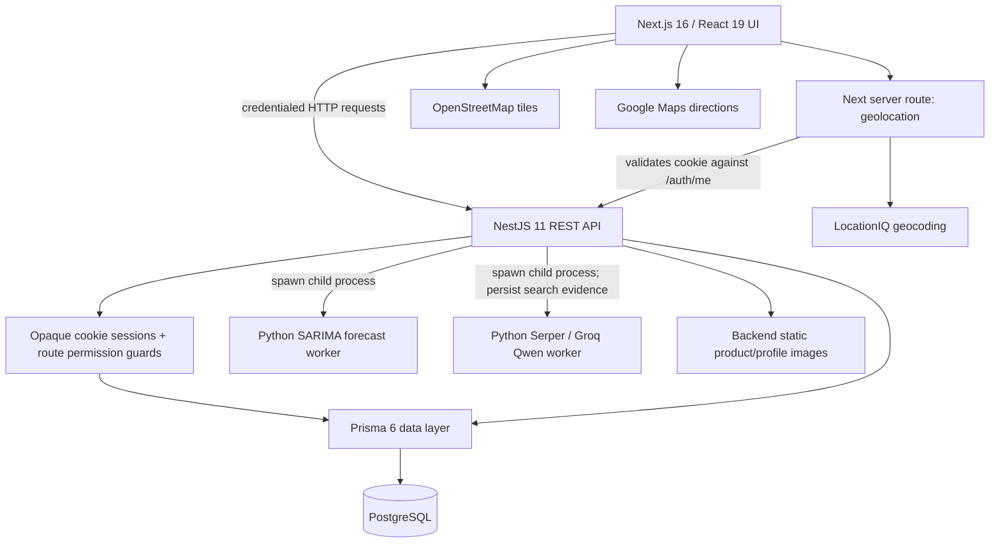
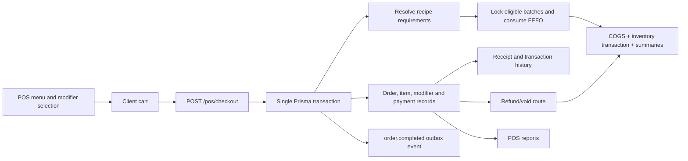

# System Audit Report — Café Salvacion Inventory Management System

**Audit date:** 9 October 2026  
**Repository reviewed:** workspace root (`ims-frontend`, `ims-backend`, `python`, `AI-Store Reco`)  
**Method:** static source/configuration review. No source files were changed; this report is the only new deliverable. Tests, builds, migrations, live database contents, and secret-bearing `.env` values were not executed or inspected.

## 1. Executive Summary

The repository contains a substantial, integrated inventory and POS application. The active stack is a Next.js App Router frontend, a modular NestJS REST API, PostgreSQL accessed through Prisma, and Python workers for demand forecasts and supplier search/ranking. Core stock receiving, batch tracking, FEFO consumption, sales, refunds, reports, user sessions, and server-side permission checks are present.

The implementation meets much of the inventory/POS/reporting target. The most material gaps are a missing explicit inventory adjustment workflow, no payment-gateway integration, a placeholder standalone Recommendations page, and geolocation that ranks from a hard-coded café origin using straight-line distance. Supplier search and forecasting rely on external providers and locally installed Python dependencies; operational reliability therefore depends on configuration and deployment packaging that is not documented by a backend environment template or CI/container configuration.

No critical vulnerability was confirmed by this static review. The highest-priority issues to address before production expansion are: distributed rate limiting for authentication and provider-backed location search; recovery of outbox work left in `PROCESSING` by a crash; permission scoping on two read endpoints; and confirming that tracked SQL dump files do not contain live credentials or personal data. These findings are detailed in §11 and §15.

### Target coverage

| Capability | Status | Evidence-based assessment |
|---|---|---|
| Inventory management | Implemented, with a gap | Raw materials, units, suppliers, batch receiving, FEFO deductions, waste, stock summaries, alerts, and transaction history exist. There is no adjustment endpoint; the inventory authorization spec explicitly asserts `/inventory/adjustments` returns 404. |
| POS and sales | Implemented | Cart, server-priced checkout, recorded payment methods, receipts/history, refunds/voids, and cash correction are represented in frontend and backend code. Payments are recorded manually; no gateway is integrated. |
| Supplier management | Implemented | Supplier CRUD includes address and coordinates; stock runs retain supplier association. No purchase-order/approval workflow is present. |
| AI recommendations | Partial/implemented in a narrower flow | Python worker performs provider-backed store-price discovery and Qwen-assisted ranking with a rule fallback. The dedicated `/admin/recommendations` page is a “coming next” placeholder. |
| Inventory forecasting | Implemented, operationally dependent | Python SARIMA forecasts material consumption and derives reorder suggestions from live stock plus CSV policy data; it has historical validation and warnings. Accuracy depends on history quality and freshness. |
| Geolocation | Partial | Leaflet map, LocationIQ search/reverse geocoding, stored supplier coordinates, and Google Maps links exist. Ranking origin is fixed in Python/UI; distances are straight-line rather than driving routes. |
| Reports and analytics | Implemented | Inventory and POS reporting endpoints cover sales, margin, waste, spend, availability risk, payments, refunds, product/staff performance, peak hours, and audit exceptions. |
| Role-based access control | Implemented, with gaps | Session guard plus route permissions, role editor, user-role assignment, and frontend permission gates exist. Two authenticated read routes lack a permission decorator; legacy role and additive permission systems coexist. |

## 2. Current Architecture

```mermaid
flowchart TD
  Browser[Next.js 16 / React 19 UI]
  NextRoute[Next server route: geolocation]
  API[NestJS 11 REST API]
  Auth[Opaque cookie sessions + route permission guards]
  Prisma[Prisma 6 data layer]
  DB[(PostgreSQL)]
  Forecast[Python SARIMA forecast worker]
  Search[Python Serper / Groq Qwen worker]
  Geo[LocationIQ geocoding]
  Tiles[OpenStreetMap tiles]
  Maps[Google Maps directions]
  Files[Backend static product/profile images]

  Browser -->|credentialed HTTP requests| API
  Browser --> NextRoute
  NextRoute -->|validates cookie against /auth/me| API
  NextRoute --> Geo
  Browser --> Tiles
  Browser --> Maps
  API --> Auth
  Auth --> Prisma
  API --> Prisma
  Prisma --> DB
  API -->|spawn child process| Forecast
  API -->|spawn child process; persist search evidence| Search
  API --> Files
```

The active application code is under `ims-frontend/src` and `ims-backend/src`. The current frontend routes are primarily in `src/app/(protected)` and render feature modules from `src/features`; legacy `/admin`, `/staff`, and `/manager` paths mostly redirect into those canonical pages. The API is a single Nest application with domain modules registered in `src/app.module.ts`. It has no global `/api` prefix or version prefix. `PrismaService` owns the PostgreSQL connection.

The Python model and store-search folders are runtime dependencies, not separate network services: Nest spawns local Python processes and exchanges JSON over stdin/stdout. Supplier search persists fetched evidence before invoking the ranking worker. Product/profile images are served from backend filesystem directories. Background outbox processing, snapshots, and forecast scheduling run inside the backend process.

Repository clutter includes dated design backups, temporary page skeletons, SQL dumps, generated output, and prior reports under `md files/`. Those materials are not part of the active request path and should not be mistaken for current implementation evidence. An older report also exists at `md files/SYSTEM_AUDIT_REPORT.md`; this requested report is written at the workspace root and leaves that file untouched.

## 3. Technology Stack

| Layer | Technologies found |
|---|---|
| Frontend | Next.js 16.2.1, React 19.2.4, TypeScript 5, App Router, strict TypeScript, Zustand 5 |
| UI and styling | Bootstrap 5.3, Tailwind CSS 4 utilities, CSS Modules, global CSS, Lucide and React Icons |
| Maps and exports | Leaflet 1.9 / OpenStreetMap tiles, jsPDF and jsPDF-AutoTable, `fflate` |
| Backend | NestJS 11, Express adapter, TypeScript 5.7, class-validator/class-transformer |
| Persistence | PostgreSQL; Prisma 6.19 client/CLI; 28 migration directories; 45 Prisma models and 16 enums |
| Authentication | bcrypt 6, opaque server-side sessions, HMAC token hashes; no JWT strategy is used |
| Python workers | Python, pandas, NumPy, statsmodels/SARIMAX, scikit-learn, holidays, SciPy; requests, python-dotenv and Groq for store search |
| External services | LocationIQ, OpenStreetMap tile server, Google Maps directions, Serper search API, Groq-hosted Qwen model, SMTP via Nodemailer |

The frontend uses CSS Modules plus global styles, Bootstrap, and Tailwind utility classes rather than one uniform styling system. Charts are implemented with SVG/components rather than a charting dependency. State uses focused Zustand stores; API requests are plain `fetch` wrappers and feature-specific clients rather than a larger query/cache framework.

Environment contracts are only partially documented. Backend startup requires `DATABASE_URL` and `SESSION_TOKEN_SECRET`; it supports `RESET_TOKEN_SECRET`, SMTP, cookie/CORS, proxy, rate-limit, background-job, and reset-token settings in `src/config/env.validation.ts`. Forecast/store Python paths and executables have additional process environment overrides. The frontend example lists `NEXT_PUBLIC_API_BASE_URL`, `SESSION_COOKIE_NAME`, and `LOCATIONIQ_API_KEY`, but its API URL is a development-tunnel host rather than a portable local default. No backend `.env.example` was found. Secret values from `.env` and `.env.local` were not read.

## 4. Frontend Audit

### Structure and routing

`ims-frontend/src/app` contains login, forgot/reset password, access-denied, canonical protected pages for dashboard, inventory, products, suppliers, POS, reports, forecasting, alerts, users, roles, and settings, plus legacy admin/staff/manager route adapters. `src/features` holds the active feature workspaces; `src/components` contains shared UI, auth, admin and staff POS components; `src/lib` contains API clients, DTO types, validation and routing policy; `src/store` holds auth/sidebar/inventory stores. TypeScript is strict and uses the `@/*` source alias.

`AuthBootstrap` restores a session by calling `/auth/me`; `AuthGuard` redirects unauthenticated users and `PermissionRoute` checks the current permission snapshot. The UI describes these checks as UX helpers; backend guards remain the security boundary. API requests include cookies (`credentials: "include"`) and use `NEXT_PUBLIC_API_BASE_URL`.

### Feature assessment

| Area | Implemented | Partial / missing / issues |
|---|---|---|
| Login and account | Login, logout, forgot/reset password, account editing, password change, profile picture | Browser guard is client-side; backend session validation protects APIs. Session snapshot is refreshed on focus. No MFA UI was found. |
| RBAC UI | Permission-based route/action visibility; role and user management screens | Legacy route registrations remain beside canonical routes. The separate Recommendations route is administrator-only and renders placeholder copy. |
| Inventory | Material list/detail, stock summaries, batches, near-expiry/low-stock views, stock-run creation, waste logging, transaction history, supplier spend and waste insights | No stock adjustment form/action is wired to a backend API. Several reporting/action pages remain implemented as secondary route adapters/workspaces. |
| Product catalog | Product/variant CRUD, images, recipes/modifiers, archive/restore, manual availability and ingredient usage | Product and raw-material inventory concepts are separate models; operators need clear vocabulary in UI. |
| POS | Product/menu browsing, configurators/modifiers, cart, payment modal, receipt, transaction history, void/refund and payment correction dialogs | Payment method selection only records CASH/GCASH/MAYA/CARD/OTHER; no processor authorization/settlement or reconciliation API exists. |
| Dashboard and reporting | Dashboard widgets; inventory and POS analytics; PDF/Excel-style exports | Reports depend on API aggregation and may return large data sets; no frontend error/observability platform was found in dependencies. |
| Forecast UI | Saved period selection/comparison, forecast ranges, MAPE note, recommendation and warning display | Model is raw-material daily use, not hourly demand or product sales. UI labels cannot compensate for stale/missing training history. |
| Supplier locations | Search, pin/drag map, reverse geocode, coordinate display, Google Maps link | Map search depends on LocationIQ key; tiles need network access. Starting coordinates are hard-coded. No browser current-location flow or driving-distance ranking. |

### Specific frontend findings

- `src/app/(protected)/layout.tsx` wraps canonical routes with both auth and permission gates. `src/lib/routing/routes.ts` explicitly maps legacy aliases and gives `/admin/recommendations` the legacy administrator policy.
- `src/lib/api.ts` shares only in-flight browser GETs and clears pending reads on mutations. Responses are not retained after completion. This is a deliberate small optimization, but loading/error/cache policy remains feature-local.
- `src/app/admin/recommendations/page.tsx` says the AI-driven recommendation/geolocation page is “coming next.” The actual supplier search is available from the inventory workflow through `StoreAvailabilityModal`, not this standalone page.
- `src/components/inventory/RecommendModal.tsx` contains hard-coded sample recommendation rows. The active canonical inventory workflow uses `src/components/admin/inventory/StoreAvailabilityModal.tsx`; the older mock modal should not be treated as live AI output.
- Product and profile images use backend static URLs. This adds filesystem persistence and proxy/cache configuration requirements to deployment.

## 5. Backend Audit

### Architecture and modules

Nest modules follow a controller/service/Prisma pattern. `main.ts` configures credentialed CORS for one frontend origin, proxy trust, security headers, origin-based CSRF middleware, static image routes, and a global validation pipe (`whitelist`, `forbidNonWhitelisted`, `transform`). Modules cover auth/RBAC, users, roles, catalog/recipes, inventory, stock runs, orders, availability, reports, alerts, settings, events/outbox, and forecasting.

Errors use Nest exceptions and the default exception layer. DTO validation is centralized; no OpenAPI/Swagger setup or API version prefix was found. There is no dedicated health/readiness endpoint: `GET /` is handled by `AppController` and is session-protected by the global auth guard.

### Module review

| Module | Existing implementation | Gaps / dependencies / notable behavior |
|---|---|---|
| Authentication | Login, logout, current-user snapshot, password-reset request/redeem/reset; bcrypt; DB sessions | SMTP is optional in config; IP throttles are in-memory per process. No MFA. |
| Users and roles | User lifecycle, session listing/revocation, activity, reset, permission role editor and assignment | Legacy `User.role` and additive `AccessRole` memberships coexist; role assignment endpoints remain legacy administrator-only. |
| Products/catalog/recipes | Categories, products, variants, modifiers, recipes, images, archive/delete safeguards, ingredient usage | `GET /categories` has session auth but no route permission. |
| Inventory | Materials, units, suppliers, summaries, batches, ledger, waste, FEFO, store search | No adjustment-write API. Python, Serper, Groq, and supplier coordinate data are needed for search. |
| Stock runs | Draft receiving, line editing, posting, supplier/price/expiry data and receiving ledger entry | Three delete routes call the same draft-delete service, creating redundant API aliases. |
| POS/orders | Idempotent checkout, pricing, discounts, modifiers, COGS, inventory depletion, payments, reversal, payment correction | No external payment processor. Checkout and inventory work are transactionally grouped; manual cash correction is cashier-scoped. |
| Reports | Inventory and POS summaries, risk, transaction and exception reports | All report methods use `reports.view`; request date/filter DTOs should be kept bounded as data grows. |
| Alerts | Low-stock/expiry alerts, acknowledge/dismiss/delete resolved | Alert generation relies on background event/snapshot processing. |
| Forecasting | Scheduled Python forecast runs, saved series, recommendation records, product/material filters | Requires compatible Python environment and local CSV history/policies; worker can run up to 30 minutes. |
| Geolocation | Next server route uses LocationIQ search/reverse geocoding; supplier stores lat/lon | Not a Nest controller; only session is checked, not a dedicated supplier permission or per-user quota. |

### API inventory

All Nest routes below inherit the global session guard unless marked **Public**. `@RequirePermission` routes also require the listed permission. DTO names refer to `ims-backend/src/**/dto`; the global validation pipe rejects non-whitelisted fields. Response summaries show controller envelopes; database impact names the primary Prisma models. The geolocation route is a Next.js server route, not a Nest endpoint.

#### Root, auth and account

| Method / endpoint | Authentication | Input | Output and database impact |
|---|---|---|---|
| `GET /` | Session | None | Service greeting string; no stated data mutation. Not a health contract. |
| `POST /auth/login` | Public | `LoginDto` (`email`, `password`) | Message and user/permission snapshot; creates `AuthSession`, updates login counters/timestamps, sets HttpOnly cookie. |
| `POST /auth/logout` | Session | Session cookie | Message; revokes matching `AuthSession`, clears cookie. |
| `GET /auth/me` | Session | Session cookie | Current user and permission snapshot; session validation updates last-seen/idle expiry. |
| `POST /auth/forgot-password` | Public | `ForgotPasswordDto` (`email`) | Enumeration-neutral message; invalidates previous reset tokens and creates `PasswordResetToken`; sends mail when configured. |
| `POST /auth/redeem-password-reset` | Public | `RedeemPasswordResetDto` (`token`) | Reset-token redemption details; validates reset token and attempt limits. |
| `POST /auth/reset-password` | Public | `ResetPasswordDto` (`token`, `newPassword`) | Success message; consumes token, changes password and revokes sessions. |
| `GET /settings/account` | Session (self) | Session identity | User profile; reads `User`. |
| `PATCH /settings/account` | Session (self) | `UpdateAccountSettingsDto`; optional multipart profile picture | Updated user and reauthentication flag; updates `User`, writes profile image; clears cookie if required. |
| `POST /settings/change-password` | Session (self) | `ChangePasswordDto` | Success/reauthentication response; updates password and revokes sessions, clears cookie. |

#### Catalog, product administration and availability

| Method / endpoint | Authentication / permission | Input | Output and database impact |
|---|---|---|---|
| `GET /categories` | Session; no permission decorator | None | Category list; reads `Category`. |
| `POST /categories` | `products.create` | `CreateCategoryDto` | Created category; writes `Category`. |
| `GET /products` | `products.view` | None | Product list; reads `Product`, category/variant data. |
| `GET /products/:id/variants` | `products.view` | Path `id` | Variants; reads `ProductVariant`. |
| `GET /pos/menu` | `pos.view` | None | Sellable menu/configuration; reads product, modifier, recipe and availability summaries. |
| `POST /admin/product-images` | `products.create` | Multipart image | Stored image URL; writes image file. |
| `POST /admin/product-images/replacement` | `products.edit` | Multipart replacement image | Replacement image URL; writes image file and performs cleanup. |
| `GET /admin/products` | `products.view` | `ListAdminProductsDto` query | Filtered/paged products and availability. |
| `GET /admin/products/:id` | `products.view` | Path `id` | Product detail. |
| `POST /admin/products` | `products.create` | `CreateProductDto` | Created product; writes `Product`/variants/configuration as service specifies. |
| `PATCH /admin/products/:id` | `products.edit` | `UpdateProductDto` | Updated product. |
| `PATCH /admin/products/:id/manual-availability` | `products.edit` | `SetManualAvailabilityDto` | Updated manual sellability and availability state/events. |
| `POST /admin/products/:id/archive` | `products.archive` | `ArchiveProductDto` | Archived product; writes archive metadata. |
| `POST /admin/products/:id/restore` | `products.restore` | Path `id` | Restored product. |
| `GET /admin/products/:id/delete-eligibility` | `products.view` | Path `id` | Eligibility/reasons; reads product/order history. |
| `DELETE /admin/products/:id` | `products.delete` | Path `id` | Deletion result; product service protects historical order references. |
| `POST /admin/products/:id/variants` | `products.create` | `CreateProductVariantDto` | Created variant. |
| `PATCH /admin/variants/:id` | `products.edit` | `UpdateProductVariantDto` | Updated variant. |
| `PATCH /admin/variants/:id/manual-availability` | `products.edit` | `SetManualAvailabilityDto` | Updated availability. |
| `DELETE /admin/variants/:id` | `products.delete` | Path `id` | Delete result subject to history constraints. |
| `GET /admin/variants/:id/recipe` | `products.view` | Path `id` | Recipe items; reads `VariantRecipeItem`. |
| `PUT /admin/variants/:id/recipe` | `products.edit` | `ReplaceVariantRecipeDto` | Replaced recipe; writes recipe rows. |
| `GET /admin/products/:id/ingredient-usage` | `products.view` | `GetProductIngredientUsageDto` query | Aggregated recipe usage. |
| `GET /admin/products/:id/orders/:orderId/ingredient-usage` | `products.view` | Path IDs | Historical order ingredient usage; reads order/ledger snapshots. |
| `GET /variants/:id/availability` | Session; no permission decorator | Path `id` | Sellability/availability summary; reads variant and stock summaries. |

#### Inventory, suppliers and stock receiving

| Method / endpoint | Authentication / permission | Input | Output and database impact |
|---|---|---|---|
| `GET /raw-materials/:id/store-availability` | `suppliers.searchAvailability` | Path `id` | Latest async search and persisted evidence; reads `StoreAvailabilitySearch/Result`. |
| `POST /raw-materials/:id/store-availability` | `suppliers.searchAvailability` | Path `id` | Starts a search; creates search row, then Python workers persist provider evidence/ranking asynchronously. |
| `GET /units` | `inventory.view` | None | `Unit` list. |
| `GET /raw-materials` | `inventory.view` | None | `RawMaterial` list with unit and summary. |
| `POST /raw-materials` | `inventory.create` | `CreateRawMaterialDto` | Creates material and zeroed summary. |
| `GET /raw-materials/:id` | `inventory.view` | Path `id` | Material detail and summary. |
| `PATCH /raw-materials/:id` | `inventory.edit` | `UpdateRawMaterialDto` | Updates material. |
| `DELETE /raw-materials/:id` | `inventory.archive` | Path `id` | Soft archive (`isActive=false`). |
| `POST /raw-materials/:id/unarchive` | `inventory.archive` | Path `id` | Reactivates material. |
| `DELETE /raw-materials/:id/permanent` | `inventory.archive` | Path `id` | Transactional deletion after recipe/draft safeguards; snapshots linked history before removing material. |
| `GET /raw-materials/:id/batches` | `inventory.view` | Path `id` | Stock batches and supplier/receiving details. |
| `GET /raw-materials/:id/transactions` | `inventory.view` | `ListInventoryTransactionsDto` query | Material ledger history. |
| `GET /stock-batches/:id/transactions` | `inventory.view` | `ListInventoryTransactionsDto` query | Batch ledger history. |
| `GET /suppliers` | `suppliers.view` | None | Supplier records. |
| `POST /suppliers` | `suppliers.create` | `CreateSupplierDto` | Creates supplier with optional coordinates/contact/address. |
| `PATCH /suppliers/:id` | `suppliers.edit` | `UpdateSupplierDto` | Updates supplier. |
| `DELETE /suppliers/:id` | `suppliers.delete` | Path `id` | Deletes supplier; FK behavior preserves stock/receiving history with null supplier references. |
| `GET /inventory/summary` | `inventory.view` | `ListInventorySummaryDto` query | On-hand/usable/value summaries; reads material/batches/summaries. |
| `GET /inventory/transactions` | `inventory.view` | `ListInventoryTransactionsDto` query | Filtered ledger rows. |
| `POST /inventory/waste` | `inventory.waste` | `CreateInventoryWasteDto` | Waste transaction; consumes stock and writes ledger. |
| `POST /stock-runs` | `stockRuns.create` | `CreateStockRunDto` | Creates draft run. |
| `PATCH /stock-runs/:id` | `stockRuns.edit` | `UpdateStockRunDto` | Updates draft metadata. |
| `POST /stock-runs/:id/items` | `stockRuns.edit` | `CreateStockRunItemDto` | Adds draft receiving line with quantity/cost/expiry/supplier. |
| `DELETE /stock-runs/:id/items/:itemId` | `stockRuns.edit` | Path IDs | Removes draft line. |
| `POST /stock-runs/drafts/:id/delete` | `stockRuns.delete` | Path `id` | Deletes draft; redundant alias. |
| `DELETE /stock-runs/:id/draft` | `stockRuns.delete` | Path `id` | Deletes draft; redundant alias. |
| `DELETE /stock-runs/:id` | `stockRuns.delete` | Path `id` | Also calls draft-delete behavior; redundant/ambiguous alias. |
| `POST /stock-runs/:id/post` | `stockRuns.post` | Path `id` and current user | Posts receiving transaction, creates `StockBatch` rows, updates summaries and ledger. |
| `GET /stock-runs` | `stockRuns.view` | `ListStockRunsDto` query | Run list. |
| `GET /stock-runs/:id` | `stockRuns.view` | Path `id` | Run detail, lines and posted batches. |

#### POS and orders

| Method / endpoint | Authentication / permission | Input | Output and database impact |
|---|---|---|---|
| `POST /pos/checkout` | `pos.checkout` | `CheckoutDto` (items, modifier selections, payments, discount, idempotency key) | Order/receipt details; atomically writes `Order`, items, modifiers, payments, FEFO batch depletion, COGS, inventory ledger, summaries and outbox event. |
| `PATCH /orders/:id/cash-payment` | `pos.checkout` | `UpdateCashPaymentDto` expected/current amount | Updated order payment; locks order row, restricts correction to original cashier and completed order, writes audit/outbox event. |
| `GET /orders` | `pos.orders.view` | `ListOrdersDto` query | Order history and associated items/payments/reversal. |
| `GET /orders/:id` | `pos.orders.view` | Path `id` | Full order/receipt record. |
| `POST /orders/:id/refund` | `pos.refund` | `ReverseOrderDto` and current user | Reversal result; writes `OrderReversal`, inventory reversal ledger and restores stock as applicable. |

#### Reporting and alerts

| Method / endpoint | Authentication / permission | Input | Output and database impact |
|---|---|---|---|
| `GET /reports/sales-overview` | `reports.view` | `ReportFiltersDto` | Sales totals/trends; reads orders/payments. |
| `GET /reports/variant-margin` | `reports.view` | `ReportFiltersDto` | Variant revenue/COGS margin; reads order snapshots. |
| `GET /reports/waste-summary` | `reports.view` | `ReportFiltersDto` | Waste totals; reads inventory ledger. |
| `GET /reports/stock-run-spend` | `reports.view` | `ReportFiltersDto` | Receiving cost; reads stock runs/items. |
| `GET /reports/inventory-health` | `reports.view` | `ReportFiltersDto` | Inventory health/expiry metrics; reads materials, batches, snapshots. |
| `GET /reports/inventory-kpi-summary` | `reports.view` | `ReportFiltersDto` | Inventory KPIs. |
| `GET /reports/inventory-availability-risk` | `reports.view` | `ReportFiltersDto` | Stockout/availability risk; reads availability events and inventory. |
| `GET /reports/pos-dashboard` | `reports.view` | `ReportFiltersDto` | POS dashboard aggregates. |
| `GET /reports/pos-transaction-history` | `reports.view` | `PosTransactionHistoryDto` | Filtered order history. |
| `GET /reports/pos-sales-analytics` | `reports.view` | `PosSalesAnalyticsDto` | Sales analytics. |
| `GET /reports/pos-payment-reports` | `reports.view` | `ReportFiltersDto` | Payment-method totals; reads `OrderPayment`. |
| `GET /reports/pos-refunds-voids` | `reports.view` | `PosRefundsVoidsDto` | Reversal history and totals. |
| `GET /reports/pos-product-performance` | `reports.view` | `PosProductPerformanceDto` | Product/variant performance. |
| `GET /reports/pos-staff-performance` | `reports.view` | `ReportFiltersDto` | Cashier performance. |
| `GET /reports/pos-peak-hours` | `reports.view` | `PosPeakHoursDto` | Hourly sales summary. |
| `GET /reports/pos-inventory-linked` | `reports.view` | `PosInventoryLinkedDto` | Sales-to-ingredient/stock linkage. |
| `GET /reports/pos-audit-exceptions` | `reports.view` | `PosAuditExceptionsDto` | Exception/anomaly rows for review. |
| `GET /alerts` | `alerts.view` | `ListAlertsDto` | Filtered alerts. |
| `GET /alerts/unread-count` | `alerts.view` | None | Count by alert state. |
| `POST /alerts/resolved/delete` | `alerts.dismiss` | `DeleteResolvedAlertsDto` (`ids`) | Deletes selected resolved alerts. |
| `POST /alerts/:id/acknowledge` | `alerts.acknowledge` | `UpdateAlertStateDto` and current user | Acknowledged alert; writes actor/time/note. |
| `POST /alerts/:id/dismiss` | `alerts.dismiss` | `UpdateAlertStateDto` and current user | Dismissed alert; writes actor/time/note. |

#### Users, role administration, forecasts and geolocation

| Method / endpoint | Authentication / permission | Input | Output and database impact |
|---|---|---|---|
| `GET /users` | `users.view` | `ListUsersDto` | Paged/filterable user list. |
| `GET /users/:id` | `users.view` | Path ID | User detail. |
| `POST /users` | `users.manage` plus legacy role safeguard | `CreateUserDto` | Creates account and initiates setup/reset mail. |
| `PATCH /users/:id` | `users.manage`; legacy administrator required for role change | `UpdateUserDto` | Updates identity/status/role under safeguards. |
| `POST /users/:id/suspend` | `users.manage` | Path ID/current actor | Suspends account and revokes access. |
| `POST /users/:id/reactivate` | `users.manage` | Path ID | Reactivates account. |
| `POST /users/:id/password-reset` | `users.manage` | Path ID | Issues a reset token/mail. |
| `GET /users/:id/sessions` | `users.view` | Path ID | Session metadata including user-agent/IP. |
| `DELETE /users/:id/sessions/:sessionId` | `users.sessions.revoke` | Path IDs | Revokes selected session. |
| `POST /users/:id/sessions/revoke-all` | `users.sessions.revoke` | Path ID | Revokes all user sessions. |
| `GET /users/:id/activity` | `users.view` | `ListUserActivityDto` query | User activity history. |
| `DELETE /users/:id` | `users.manage` | Path ID/current actor | Deletes user subject to safeguards; related attribution handling is service-specific. |
| `GET /users/:id/roles` | Legacy `ADMINISTRATOR` | Path ID | Role memberships/effective permission summary. |
| `POST /users/:id/roles` | Legacy `ADMINISTRATOR` | `AssignUserRoleDto` | Assigns memberships; writes `UserRole` and authorization audit. |
| `DELETE /users/:id/roles/:roleId` | Legacy `ADMINISTRATOR` | Path IDs | Removes membership; writes authorization audit. |
| `GET /roles` | Legacy `ADMINISTRATOR` | None | Access roles and grants. |
| `GET /roles/permissions` | Legacy `ADMINISTRATOR` | None | Code-supported permission catalog. |
| `POST /roles` | Legacy `ADMINISTRATOR` | `CreateRoleDto` | Creates role/grants and audit event. |
| `PATCH /roles/:id` | Legacy `ADMINISTRATOR` | `RoleIdDto`, `UpdateRoleDto` | Updates role/grants and revision/audit. |
| `DELETE /roles/:id` | Legacy `ADMINISTRATOR` | `RoleIdDto`, `DeleteRoleDto` (revision) | Deletes role if safeguards permit; audit. |
| `GET /forecasting/products` | `forecasting.view` | None | Product/material filter options. |
| `GET /forecasting/latest` | `forecasting.view` | `productId`, `runId` query | Latest/specified saved run, forecasts, notes and warnings. |
| `GET /forecasting/runs/:id` | `forecasting.view` | Path ID | Saved forecast run and series. |
| `GET /api/geolocation` (Next.js) | Valid session verified against backend `/auth/me`; no supplier permission/quota | `q` up to 300 chars, or valid `lat`/`lon` | LocationIQ search/reverse-geocode results; no application DB write. Returns 503 when key/session validation is unavailable. |

## 6. Database Audit

Prisma declares PostgreSQL in `ims-backend/prisma/schema.prisma`; there are 45 models and 16 enums. The 28 checked-in migration directories provide a historical path, but this audit did not connect to a database or run `prisma migrate status`, so live schema drift is unknown. Most entities use UUID primary keys, mapped snake_case table/column names, explicit foreign keys, and indexes. Money/quantity/cost fields generally use `Decimal`; normalized reference/join tables are used for units, product modifiers, recipes, permissions and role memberships. Immutable snapshots preserve order/product/material names and historical costs. Summary tables and JSON payloads are intentionally denormalized read/history structures.

The following table documents each Prisma model. `id` and routine creation/update timestamps are omitted from the field shorthand unless they carry domain meaning; foreign-key fields are listed where relevant.

| Entity | Purpose and persisted fields | Relationships | Issues / recommendation |
|---|---|---|---|
| `User` | Identity/auth: username, email, passwordHash, first/last/middle name, phone, picture URL, legacy role, account status, isActive, emailVerifiedAt, passwordChangedAt, lastLoginAt, failedLoginAttempts, lockedUntil | User roles, sessions, tokens, orders, stock runs, ledger actors, alerts and reversals | Dual legacy `role` plus `UserRole` grants needs explicit migration/consistency policy; `EmailVerificationToken` is not used by active source. |
| `AuthSession` | Hashed token, userId, created/last-seen/absolute/idle expiry, revokedAt/reason, IP and user-agent | Belongs to `User` | Retention/cleanup policy for expired session rows is not evident; define lifecycle cleanup. |
| `PasswordResetToken` | userId, tokenHash, request/expiry/used timestamps | Belongs to `User` | Expired/used-token cleanup is not evident; schedule retention cleanup. |
| `EmailVerificationToken` | userId, tokenHash, created/expiry/used timestamps | Belongs to `User` | No active service/controller use found; implement or remove from schema/migrations intentionally. |
| `Category` | name, parentId, sortOrder | Self-referential tree; products | Composite uniqueness on nullable `parentId` does not prevent duplicate top-level names in PostgreSQL; add an explicit root uniqueness strategy if roots must be unique. |
| `Product` | categoryId, name, enabled flag, image URL, archive time/actor/reason | Category, archiving user, variants, modifier groups | `onDelete: Restrict` preserves catalog links. Keep archive/restore and hard-delete policy aligned with history retention. |
| `ProductVariant` | productId, name, price, unique SKU, enabled flag | Product, recipes, orders, inventory lines, availability summaries/events | Price validity is application-level; maintain positive-price validation in DTO/service. |
| `ModifierGroup` | name, selection mode, default min/max, sort order, active | Modifiers and product associations | Selection min/max consistency depends on DTO/service validation. |
| `Modifier` | groupId, name, price adjustment, sort order, active | Group, order modifiers, recipe adjustments | Modifier name is unique within group; keep price/quantity bounds validated. |
| `ProductModifierGroup` | productId, modifierGroupId, min/max, required flag, quantity permission, order | Product and modifier group | Join table is normalized and unique per product/group. |
| `Unit` | code, name, dimension, conversion factor | Raw materials | Code/name are unique; unit dimensions and factor validity need continued validation. |
| `RawMaterial` | unitId, name, unique SKU, reorderPoint, active flag | Unit, recipes, stock runs/batches, ledger, summary, alerts, snapshots | Key relationships are explicit. Preserve unit-conversion safeguards when changing an existing material’s unit. |
| `StoreAvailabilitySearch` | rawMaterialId, material snapshot, product name, status, error, timestamps | Optional raw material and result rows | `status` is a free string; consider enum/check constraint and retention policy for provider evidence. |
| `StoreAvailabilityResult` | searchId, JSON provider/ranking payload | Search | Flexible evidence is useful, but version payload schema and limit retention/PII from third-party results. |
| `Supplier` | unique name, nullable lat/lon, address, contactInfo | Stock-run items/batches and alerts | Coordinates are nullable and no DB check enforces valid ranges or lat/lon pairing; validate consistently at API and persistence boundaries. |
| `VariantRecipeItem` | variantId, rawMaterialId, quantity | Variant and material | Unique per variant/material; conversion/unit consistency is service responsibility. |
| `ModifierRecipeAdjustment` | modifierId, rawMaterialId, quantityDelta | Modifier and material | Signed quantity is meaningful; enforce recipe totals do not become invalid. |
| `StockRun` | readable reference, name/status, creator, totalCost, notes, postedAt | Creator and run items | Status enum and unique reference protect lifecycle; draft-delete aliases should be consolidated at API level. |
| `StockRunItem` | runId, material/snapshot, supplier, quantity, costPerUnit, purchaseCost, price quantity/unit, expiry/received dates, note | Run, optional material/supplier, resulting batch | Historical snapshots preserve deleted material identity; validate cost/unit basis and received/expiry dates. |
| `StockBatch` | reference, material/snapshot, supplier/run item, initial/remaining quantities, cost, expiry and received time | Material/supplier/run item and ledger lines | FEFO queries lock and consume batches; DB-level nonnegative/check constraints should be kept in sync with custom migration SQL. |
| `InventoryTransaction` | type/source/sourceId, actor, reason, metadata/note, occurred/created/updated time, history deletion metadata | Optional user actor; transaction lines | Append-only semantics are mostly service-level; restrict destructive edits and retain actor/source audit. |
| `InventoryTransactionLine` | transactionId, material/snapshot, batch, variant/order item, quantityDelta, unitCostSnapshot, totalCostDelta | Transaction, batch, optional material/variant/order item | Snapshot and cost fields support audit; stockBatch relation uses `Restrict`, but nullable material IDs require snapshot use. |
| `RawMaterialInventorySummary` | materialId, on-hand/usable quantity, nearest expiry, active batch count | One-to-one material | Denormalized state must be rebuilt/reconciled against batches and ledger. |
| `StockoutEvent` | entity type/id, optional material/snapshot/variant, start/end, blocking context | Optional material/variant | Polymorphic `entityId` is not a foreign key; validate type/id pairing in service. |
| `VariantAvailabilityEvent` | variantId, before/after sellability/reason, available quantity, times | Variant (DB relation declared) | Event history is indexed; keep writes in same transaction as availability recomputation. |
| `InventoryDailySnapshot` | date, optional material/snapshot, on-hand/usable/value | Optional material | Unique(date, materialId) contains nullable material key; assess PostgreSQL NULL uniqueness and avoid null snapshots. |
| `VariantAvailabilitySummary` | variantId, stock/sellability flags, quantity, blocking reason | One-to-one variant | Denormalized; reconciliation path should be monitored. |
| `Order` | status, cashier, unique idempotency key, subtotal/discount/tax/total/COGS, discount identity fields, notes, completion time | Creator, items, payments, optional reversal | Transactional checkout and snapshots are strong; discount PII fields require least privilege/retention. |
| `OrderItem` | orderId, variant, quantity, unit/line prices and COGS, note, product/variant/SKU snapshots | Order, optional variant, modifiers and inventory lines | Snapshots preserve historical receipt details after catalog changes. |
| `OrderItemModifier` | itemId, modifierId/name snapshot, price adjustment, quantity, line total | Order item and modifier | Historical modifier name is snapshotted; source relation uses Restrict. |
| `OrderPayment` | orderId, method, amount, reference and received time | Order | Records tender only; it does not prove settlement by an external payment provider. |
| `OrderReversal` | unique orderId, actor, type/reason/note, amount, payment reference, metadata, occurredAt | Order and actor | One reversal per order is explicit; verify partial refund requirements before extending. |
| `Alert` | dedupe key, type/severity/state, title/message, material snapshot, batch/supplier/expiry/quantity, metadata, actor/state timestamps | Optional material/batch/supplier/users | Unique dedupe prevents repeated active keys; JSON and denormalized snapshots need version/retention policy. |
| `OutboxEvent` | aggregate/type/payload, status/attempts/availableAt/processedAt/error, timestamps | No FK by design | No lease/claimedAt recovery field; hard crash after claim can strand `PROCESSING` indefinitely (see §11). |
| `ForecastRun` | status, activeKey, start/end/history dates, sourceHash, warnings/error and completion times | Forecast series | Status is free text; custom SQL enforces some horizon rules, so protect those checks in future migrations. |
| `ForecastSeries` | runId, materialId, name, unit, JSON metadata | Run and points/recommendation | materialId is historical string rather than FK; document snapshot/deletion semantics. |
| `ForecastPoint` | seriesId, date, forecast, lower/upper 95% bounds | Series | Unique series/date; lower/forecast/upper bounds are constrained in SQL migrations. |
| `ForecastRecommendation` | seriesId, JSON recommendation | One-to-one series | JSON contract should be versioned and validated at read boundary. |
| `ForecastSettings` | singleton id, forecastDays, updatedAt | None | SQL check constrains singleton and horizon; those checks are outside Prisma schema syntax. |
| `AccessRole` | unique key/name, description, system/protected flags, revision, timestamps | Permissions and user memberships | Additive to legacy enum; role changes need revision/audit consistency. |
| `Permission` | unique key, module, label, description | Role-permission joins | Catalog is code-managed and key validation prevents arbitrary grants. |
| `RolePermission` | composite roleId/permissionId | Role and permission | Composite primary key prevents duplicate grants. |
| `UserRole` | composite userId/roleId, assignment time/actor | User, role, assigning user | Membership history is current-state only; audit-event table stores changes. |
| `AuthorizationAuditEvent` | actor/target IDs, action, before/after JSON, createdAt | Intentionally no FKs | Preserves historical IDs but requires service validation and retention controls. |
| `StockRunReferenceCounter` | date key and last number | None | Supports readable daily references; update logic should remain atomic. |

**Data-integrity assessment:** the schema is substantially normalized for transactional data, uses decimal arithmetic for stock and money, and adds useful unique keys/indexes/FKs. Main risks are several read-model summaries maintained by application jobs, free-string workflow statuses (`StoreAvailabilitySearch`, `ForecastRun`), a polymorphic stockout reference, nullable-coordinate validity, nullable-key uniqueness, and custom SQL checks not visible in the Prisma model. Migration history is present, but the live database’s migration state is unverified.

## 7. Authentication and Authorization Audit

Authentication uses a high-entropy opaque random cookie, not a client-side JWT. `AuthSession` stores an HMAC-SHA256 hash; validation checks revocation, absolute and idle expiry, active account state, and whether the password changed after session creation. Password hashes use bcrypt with 12 rounds. Cookies are HttpOnly, configurable Secure, SameSite=Lax by default, and path `/`. Login/reset responses are generic and password-reset token values are stored as hashes. Unsafe backend methods require matching Origin or Referer; CORS is credentialed and pinned to configured frontend origin.

The session, permission and legacy role guards are registered globally. Most business controllers explicitly declare permission keys; role/permission keys are code-managed. The frontend receives the effective grant snapshot and hides actions/routes accordingly, but the backend is authoritative.

**Authorization gaps:** `GET /categories` and `GET /variants/:id/availability` are session-protected but do not have `@RequirePermission`; the latter can expose availability data to any valid user regardless of `pos.view` or `inventory.view`. The Next `/api/geolocation` route validates that a session exists but does not check `suppliers.edit`/`suppliers.create` or impose a request quota. These are narrower than an unauthenticated API exposure, but they are genuine gaps against granular RBAC.

**Rate limiting:** `AuthThrottleService` uses an in-process `Map`. User lockout state is in the database, but per-IP login and reset quotas reset on process restart and are not coordinated across replicas. A horizontally scaled deployment can exceed the intended total limits. The geolocation proxy also has no app-level rate limit, leaving LocationIQ quota exposed to any authenticated account.

## 8. POS Workflow Audit

```mermaid
flowchart LR
  Menu[POS menu and modifier selection] --> Cart[Client cart]
  Cart --> Checkout[POST /pos/checkout]
  Checkout --> Tx[Single Prisma transaction]
  Tx --> Order[Order, item, modifier and payment records]
  Tx --> Recipe[Resolve recipe requirements]
  Recipe --> FEFO[Lock eligible batches and consume FEFO]
  FEFO --> Ledger[COGS + inventory transaction + summaries]
  Tx --> Outbox[order.completed outbox event]
  Order --> Receipt[Receipt and transaction history]
  Order --> Reverse[Refund/void route]
  Reverse --> Ledger
  Order --> Reports[POS reports]
```

Checkout is server-priced and idempotent (`Order.idempotencyKey` unique). It validates modifiers/discount details, calculates payment coverage, creates order/payment snapshots, resolves recipe ingredients, locks eligible non-expired batches in FEFO order, rejects insufficient stock, computes COGS, writes an inventory ledger transaction, refreshes availability summaries, and enqueues an outbox event inside the transaction. Receipts/history and reporting use persisted snapshots. Refund/void logic writes a reversal and compensating inventory history. Cash payment correction locks the order, checks expected old amount, and allows only the cashier who completed it.

This workflow is materially connected end to end. Remaining limitations: payment methods are records rather than external settlement; no gateway/refund reconciliation exists; `GET /variants/:id/availability` lacks granular permission; and the outbox recovery gap can affect asynchronous consumers after a process crash. Discount customer/ID details are stored on orders and should be visible only to appropriately authorized roles.

## 9. AI Audit

| Component | Purpose / technology | Status | Limitations |
|---|---|---|---|
| `python/SARIMA.py`, `forecast_bridge.py`, `InventoryRecommendation.py` | statsmodels SARIMAX/SARIMA, rolling validation, holiday regressors, forecasts and reorder calculations | Integrated with backend scheduled runs and forecast UI | Needs at least 60 daily observations per fitted material; reads CSV history and policy data, merges covered dates with completed POS ingredient consumption, uses live inventory stock. Daily/7-day material consumption is not hourly or product sales. History gap and fit warnings are persisted. |
| `AI-Store Reco/store_price.py` | Serper web search, regex/evidence parsing, Groq API with `qwen/qwen3.6-27b` for relevance/brand selection | Integrated as first worker phase; stores evidence and confidence/status | Online listing prices/availability may be stale or not branch-specific. Provider keys, network, and Python packages are required. |
| `AI-Store Reco/store_recommendation.py` | Rule-based distance/price scoring plus Qwen selection/reasoning among saved evidence; rule fallback | Integrated as second worker phase from inventory modal | Qwen selects among candidates constrained by the ranking/evidence code; it does not verify inventory. UI instructs staff to confirm before travel. Ranking origin is hard-coded; no learned/trained recommendation model. |
| `ims-frontend/src/app/admin/recommendations/page.tsx` | Standalone recommendations route | Not implemented; placeholder text says feature is coming | Do not report this page as a working AI dashboard. The integrated workflow is in inventory store availability. |

There is no standalone model-training service or in-repository recommendation training pipeline. The active AI functions are a time-series forecast and provider-grounded classification/ranking. Historical and current data provenance, warnings, confidence/status, and fallback behavior are partially recorded; routine accuracy monitoring and automatic evaluation over subsequent actuals are not evident in the UI/service contract.

## 10. Geolocation Audit

Supplier management stores optional latitude/longitude and address. `SupplierLocationPicker` uses Leaflet with OpenStreetMap tiles, supports location search and pin dragging, calls the Next server route for LocationIQ forward/reverse geocoding, and generates a Google Maps driving directions URL. Inventory availability search sends supplier coordinates to Python for Haversine straight-line distance.

The origin is fixed to `14.31452, 120.941044` in both the Python ranking module and the UI journey link. Users cannot configure the café origin or select their current location. The recommendation UI correctly describes the measured distance as straight-line and separately offers Google Maps directions; it is not a route-distance estimate. Missing coordinates yield unknown distance. Location search has a 300-character query cap, numeric coordinate bounds, timeout, no-store responses and an authenticated session check, but no app-level quota. Map tiles and third-party geocoding require network/provider availability.

## 11. Security Assessment

Severity describes potential impact from source evidence; no live deployment, production secrets, or database records were tested.

| Severity | Finding | Evidence and impact |
|---|---|---|
| Medium | Authentication throttles are process-local | `AuthThrottleService` stores counters in a `Map`; a restart or multiple backend replicas bypasses aggregate IP limits. Database account lockout provides a separate per-user control but not a distributed IP quota. |
| Medium | Outbox work can remain stuck in `PROCESSING` | `OutboxProcessorService` atomically claims `PENDING` rows and retries caught failures, but there is no lease/timeout recovery for a process that exits after claiming. Consumers may never receive the event. |
| Medium | Provider-backed geolocation has session-only access and no quota | `/api/geolocation` calls LocationIQ using a server key after `/auth/me` validation; any authenticated account can make repeated requests. This can exhaust provider limits/cost. |
| Low–Medium | Two read APIs omit route permissions | `GET /categories` and `GET /variants/:id/availability` require a session globally but not `products.view`, `pos.view`, or `inventory.view`. Scope is limited to catalog/availability reads. |
| Medium, verify contents | Tracked database dumps are present | `ims-backend/dump.sql` and `ims-backend/ims_db_dump.sql` are tracked. Their contents were not inspected. Confirm they are sanitized and contain no production PII, password hashes, session/reset data, or secrets before sharing/publishing the repository. |
| Low | RBAC has two sources of truth during migration | Legacy enum `User.role` remains in use beside `AccessRole`/`UserRole`; users/roles endpoints also use legacy Administrator gates. Misaligned role conversion or defaults can deny access or create unexpected overlap. |
| Low | Password reset and auth operational controls need deployment checks | Reset secret can default to the session secret; secure cookie defaults depend on `NODE_ENV`; SMTP is optional. Ensure production explicitly sets independent secrets, HTTPS/Secure cookies, trusted proxy settings and reliable SMTP. |

Positive controls observed: bcrypt storage; generic public reset response; HMAC-hashed opaque tokens; session revocation on password change/inactivation; permission checks at backend; DTO whitelisting; credentialed CORS constrained to one configured origin; origin checks on unsafe backend methods; security headers; static-file dotfile denial; and shell-free Python child-process invocation with bounded output/timeouts.

## 12. Testing Assessment

The repository contains 49 backend Jest unit/spec files, a backend E2E suite (`test/app.e2e-spec.ts`), 20 frontend CommonJS test files, and four standalone Python unit-test files across the forecast and store-search folders. Coverage includes authorization/RBAC, auth hardening, session lifecycle, inventory waste and snapshots, stock-run lifecycle, checkout/refund/cash correction, reporting, supplier validation, geolocation route behavior, frontend permissions, and API helpers.

The backend `package.json` defines Jest unit and E2E scripts plus coverage output, but no coverage threshold is configured. The frontend has test files but no `test` script in its `package.json`; they appear designed for Node's built-in test runner. Python tests have no root orchestration script. No CI workflow was found. Tests were not run for this audit, so the report describes test inventory and scope, not passing status or coverage.

Recommended missing cases: multi-instance rate limit behavior; outbox worker crash/restart recovery; permission-denied checks for category and variant availability reads; provider quota/error/credential-rotation checks; production worker packaging and dependency checks; property tests for unit conversion/decimal rounding; and forecast backtesting against later actual POS usage.

## 13. Technical Debt

1. **Legacy and canonical routes coexist.** Many old pages redirect to protected canonical URLs, while the standalone recommendation page remains only at a legacy route. Keep route policy and redirect tests aligned.
2. **Two authorization models coexist.** `User.role`/`@Roles` and database-backed access-role permissions are both active. Migration status should be documented and eventually converged.
3. **No API contract artifact.** There is no OpenAPI generation or versioned API prefix; frontend request types can drift from Nest DTOs.
4. **Runtime requires colocated Python code/data.** Forecast and store-search services rely on relative directories or manually configured overrides, Python executables and multiple requirements files.
5. **Runtime configuration lacks a backend sample.** Required environment keys and production-safe defaults are defined in code but not supplied in a backend `.env.example` or deployment guide.
6. **No standard CI/container definition found.** There are local launch/stop scripts and separate build scripts, but no repository Docker/Compose, deployment manifest or CI workflow.
7. **Custom SQL constraints require care.** Check constraints in migrations (forecast bounds/horizon/settings) are not expressed in the Prisma model; future schema changes need explicit migration review.
8. **Outbox lifecycle is incomplete after hard failure.** `PROCESSING` rows have no lease/claim timestamp recovery.
9. **Test invocation is fragmented.** Frontend and Python tests are not exposed through root/package scripts; no coverage threshold or CI run was found.
10. **Tracked dump and backup artifacts increase repository size and handling risk.** Keep sanitized fixtures separate from production backups; do not use a live dump as a development fixture.
11. **Some workflow statuses are free strings and search result payloads are JSON.** Version/validate state and payload contracts centrally.
12. **Backend lint script has a write side effect.** `npm run lint` invokes ESLint with `--fix`; use a non-fixing lint command in audit/CI contexts to avoid unreviewed source edits.

## 14. Missing Features Against the Target

| Target requirement | Current state |
|---|---|
| Explicit stock adjustment (count correction/reason/actor) | Missing API and UI write path. Ledger enum includes `ADJUSTMENT`, but the authorization spec confirms no adjustment endpoint. |
| Waste logging | Implemented as a separate audited ledger action. |
| Supplier purchasing workflow | Receiving through stock-run drafts/posting is implemented; purchase order creation/approval/status/payment is not evident. |
| Online payment processing | Missing. Payment types are recorded manually; no gateway SDK/webhook/reconciliation. |
| Standalone AI recommendation/analytics page | Missing; `/admin/recommendations` is placeholder. Store recommendations are embedded in inventory availability workflow. |
| Supplier route optimization | Missing; straight-line distance and a Google Maps directions link only. |
| User-configurable café/current origin | Missing; fixed coordinate constants in Python and UI. |
| Product-sales forecasting | Missing as a distinct forecast; current model forecasts raw-material consumption using ingredient history. |
| Email verification flow | Schema contains token model and user flag, but no active source flow found. |
| Production deployment automation/observability | No CI, container or deployment manifest, health endpoint, metrics/tracing, or backend environment template found. |
| Distributed auth/provider rate limiting | Missing; existing auth throttles are in-memory and geolocation route has no quota. |

## 15. Priority Fixes

| Priority | Action | Why / completion evidence |
|---|---|---|
| P1 | Confirm and sanitize tracked SQL dumps | Inspect `ims-backend/dump.sql` and `ims-backend/ims_db_dump.sql` in a controlled review; remove secrets/PII or replace with synthetic fixtures. |
| P1 | Move IP and provider quotas to a shared rate limiter | Preserve login/reset controls across restarts/replicas and bound LocationIQ usage by user/IP. |
| P1 | Add a recoverable outbox claim lease | Store claim time/worker identity, recover stale claims, and test crash/restart and duplicate delivery semantics. |
| P1 | Apply explicit permission policies to all protected reads | Add appropriate `products.view` and `pos.view`/`inventory.view` checks to category/availability reads; add denial tests. |
| P1 | Add an explicit inventory adjustment workflow or remove the advertised capability | Adjustment needs a reason code, actor, signed quantity, FEFO/batch handling, transaction ledger entry, summary refresh and authorization. |
| P2 | Make location origin configurable and define recommendation semantics | Store café coordinates in settings; distinguish straight-line from routed distance and ensure the displayed origin matches the ranking origin. |
| P2 | Publish an environment/deployment contract | Add backend environment template, Python/dependency setup, supported Node/Postgres versions, image storage persistence, HTTPS/proxy/CORS/cookie settings and migration procedure. |
| P2 | Add CI for non-mutating lint, type/build, unit and integration tests | Include Node frontend, Nest unit/E2E, Python workers, Prisma validation and migration checks; set coverage baselines. |
| P2 | Generate and version an API contract | Add OpenAPI or shared generated DTO types and stable route versioning before external clients depend on current paths. |
| P3 | Complete recommendation UI and monitor model quality | Either finish the standalone page or remove it from navigation; track forecast errors against subsequent POS actuals and provider result quality. |
| P3 | Define data retention and consistency jobs | Clean expired auth tokens/sessions and search evidence; reconcile inventory summaries and operational snapshots against ledger/batches. |

## 16. Recommended Roadmap

1. **Operational safety:** classify/sanitize dump artifacts; establish production secret/config handling; fix distributed quotas, outbox lease recovery, and missing route permissions.
2. **Inventory integrity:** implement the explicit adjustment action and test receiving/waste/checkout/refund/adjustment invariants and summary reconciliation against batch balances.
3. **Deployment repeatability:** create backend/frontend/Python setup documentation and CI; package Python workers/data deliberately; add health/readiness and persistent image storage configuration.
4. **Product completion:** decide the standalone recommendation page scope, configure the café origin, make straight-line/routed semantics clear, and add forecast backtesting/monitoring.
5. **Architecture cleanup:** converge legacy role and permission systems, retire redirect aliases after usage review, version the API contract, and define retention for sensitive and third-party data.

---

## Principal Source References

- Frontend configuration and API: `ims-frontend/package.json`, `ims-frontend/tsconfig.json`, `ims-frontend/src/app/layout.tsx`, `ims-frontend/src/app/(protected)/layout.tsx`, `ims-frontend/src/lib/api.ts`, `ims-frontend/src/lib/routing/routes.ts`.
- Backend bootstrap/auth: `ims-backend/src/main.ts`, `ims-backend/src/app.module.ts`, `ims-backend/src/config/env.validation.ts`, `ims-backend/src/auth/session.service.ts`, `ims-backend/src/auth/guards/session-auth.guard.ts`, `ims-backend/src/auth/guards/permissions.guard.ts`, `ims-backend/src/auth/csrf-origin.middleware.ts`.
- POS/inventory: `ims-backend/src/orders/orders.controller.ts`, `ims-backend/src/orders/orders.service.ts`, `ims-backend/src/inventory/fefo-allocator.service.ts`, `ims-backend/src/inventory/inventory-ledger.service.ts`, `ims-backend/src/inventory/inventory-authorization.spec.ts`, `ims-backend/src/stock-runs/stock-runs.service.ts`.
- Database: `ims-backend/prisma/schema.prisma`, `ims-backend/prisma/migrations/`.
- AI/geolocation: `ims-backend/src/forecasting/forecasting.service.ts`, `python/forecast_bridge.py`, `python/SARIMA.py`, `python/InventoryRecommendation.py`, `ims-backend/src/inventory/store-availability.service.ts`, `AI-Store Reco/store_price.py`, `AI-Store Reco/store_recommendation.py`, `ims-frontend/src/app/api/geolocation/route.ts`, `ims-frontend/src/components/admin/inventory/SupplierLocationPicker.tsx`, `ims-frontend/src/app/admin/recommendations/page.tsx`.
- Tests and operations: `ims-backend/package.json`, `ims-frontend/package.json`, `ims-backend/test/`, `ims-frontend/tests/`, `python/test_forecast_bridge.py`, `AI-Store Reco/test_store_recommendation.py`, `start-project.ps1`, `stop-project.ps1`, `.gitignore`.
